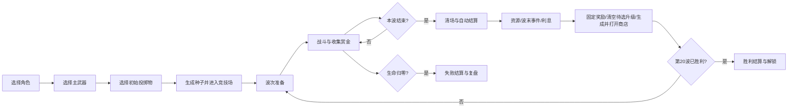

# 01｜核心循环与 20 波流程

- **版本**：v0.1
- **依赖**：`00_产品宪法.md`
- **影响系统**：波次、生成、奖励、商店、UI、存档、遥测

---

## 1. 目标

本文件定义一局游戏从开始到结束的完整状态机，包括：

- 开局选择；
- 战斗波次；
- 波次计时和清场；
- 升级结算；
- 商店与准备；
- 胜利、失败和重试；
- 20 波的教学、压力和构筑节奏。

本文件不详细定义单个怪物数值、武器数值和具体升级效果，它只规定这些系统在一局中的出现顺序和职责。

---

## 明确规则摘要

- 标准模式固定 20 波，第 20 波击败最终 Boss 后胜利；
- 流程顺序固定为：准备 → 战斗 → 清场 → 资源 → 波末事件 → 利息 → 固定奖励节点 → 清空待选升级 → 生成并打开商店；
- 战斗中只累计待升级次数，不弹出升级界面；
- 普通波计时结束后停止生成，但必须完成清场；
- 第 3 波解锁第二个投掷物槽；
- 未拾取赏金按 50% 自动结算；
- 固定种子在相同历史选择下必须重现波次、奖励和商店。

## 2. 核心循环

一局必须持续重复以下短循环：

> 进入战斗 → 解决当前压力 → 收集赏金 → 获得构筑选择 → 修补或强化 → 下一波出现更复杂的问题。

---

## 3. 开局流程

### 3.1 标准开局步骤

1. 选择角色；
2. 选择一把已解锁主武器；
3. 从已解锁投掷物中选择一个初始投掷物；
4. 第二个投掷物槽默认锁定，在第 3 波结算时解锁并三选一；
5. 选择难度；
6. 显示本局随机种子；
7. 进入竞技场，开始 5 秒安全准备；
8. 玩家主动点击或按键开始第 1 波。

### 3.2 为什么第二个投掷物第 3 波解锁

- 降低新玩家开局信息量；
- 让前两波专注枪械手感；
- 第 3 波首次出现远程敌人时，投掷物选择变得有意义；
- 形成第一处稳定的局内差异。

### 3.3 开局默认状态

| 项目 | 默认值 |
|---|---:|
| 生命 | 100% |
| 钱包 | 0 |
| 累计经验 | 0 |
| 待处理升级 | 0 |
| 主武器弹匣 | 满 |
| 投掷物充能 | 满 |
| 角色主动能力 | 可用 |
| 复活次数 | 0，教程模式可单独提供 |
| 暂停 | 允许 |

---

## 4. 波次状态机

每一波分为五个状态。

### 4.1 `PREPARE`：准备

- 世界暂停；
- 商店、升级和角色面板可查看；
- 玩家可以调整设置；
- 按“开始下一波”进入战斗；
- 玩家位置重置到最近安全点，但不强制回到地图中心；
- 投掷物充能按规则补满；
- 主武器自动补满弹匣；
- 清除仅持续一波的临时状态。

### 4.2 `ACTIVE`：持续生成

- 波次计时开始；
- `SpawnDirector` 按威胁预算持续生成敌人；
- 玩家战斗并收集赏金；
- 升级不会在战斗中弹窗，达到阈值后只累计“待处理升级”；
- 普通波计时结束后停止新增敌人。

### 4.3 `CLEANUP`：清场

- 停止生成普通敌人；
- 屏幕上保留敌人必须被清理；
- 超过清场软上限时，敌人逐渐失去生成增益，避免拖延；
- Boss 波没有独立计时结束，击败 Boss 才进入结算；
- 若玩家生命归零，立即进入失败。

建议普通波清场软上限为 20 秒。超过后：

- 普通敌人移动速度降低 10%；
- 不再生成支援类技能；
- 地图边缘生成指向剩余敌人的箭头；
- 不直接删除敌人，也不自动造成伤害。

### 4.4 `SETTLEMENT`：战斗结算

波末固定顺序处理：

1. 停止敌人 AI 与危险区域；
2. 清除敌方投射物；
3. **资源**：未拾取赏金按 50% 价值自动结算，并记录本波资源与遥测；
4. **波末事件**：基础波后恢复 8% 最大生命，处理角色与升级波末效果；
5. **利息**：按角色规则结算；
6. **固定奖励节点**：处理第 3、5、10、15、19、20 波的固定节点；
7. **清空待选升级**：依次处理全部 `pending_levelups`，直到归零；
8. **生成并打开商店**：前述步骤完成后才消费商店随机流并生成商品。

### 4.5 `SHOP`：商店

商店阶段顺序不可交换：

1. 接收结算阶段已生成的商店；
2. 玩家购买、治疗、刷新或锁定；
3. 玩家确认开始下一波。

这样保证“资源 → 波末事件 → 利息 → 固定奖励节点 → 清空待选升级 → 生成并打开商店”只有一套顺序，避免先看到商店再决定升级，也便于重放和固定种子回归。

---

## 5. 普通波结束规则

普通波必须同时满足：

- 计时归零；
- 当前主要敌人全部清除；
- 没有仍在执行的致命延迟攻击。

以下对象可以在波末直接清除：

- 不造成伤害的视觉残留；
- 已经失去宿主的弱小召唤物；
- 超出地图且无法返回的异常对象；
- 假收藏品等纯事件对象。

以下对象必须自然结束或明确取消：

- 已经出现预警的爆炸；
- 即将命中的狙击线；
- 玩家主动投出的燃烧区域；
- Boss 阶段技能。

原则：

> 玩家不能因为“波次已经结束”而被无提示伤害，也不能利用结算瞬间免疫一个已经看见的危险。

---

## 6. 胜利与失败

### 6.1 胜利

满足以下条件：

- 第 20 波最终 Boss 生命归零；
- 当前阶段的必杀演出结束；
- 玩家仍存活。

胜利结算展示：

- 角色、武器、投掷物；
- 关键升级与流派标签；
- 总伤害和伤害来源；
- 最高连杀；
- 负面天赋触发与反转次数；
- 各波受伤和死亡风险；
- 解锁内容；
- 随机种子与“使用同一种子重试”。

### 6.2 失败

生命归零立即失败。失败界面必须明确显示：

- 死亡波次；
- 最后一击来源；
- 死亡前 5 秒的主要危险；
- 本局最强三个伤害来源；
- 本局构筑尚缺少的能力标签，仅作为解释，不提供强制推荐；
- 同种子重试与新种子重开。

禁止只显示“你死了”而不给出可学习信息。

---

## 7. 20 波节奏表

> 时长为初始设计值。普通波计时结束后仍需清场。Boss 波使用软狂暴时间，不强制失败。

| 波次 | 主阶段 | 战斗时长 | 新问题或检验 | 固定事件 |
|---:|---|---:|---|---|
| 1 | 枪械入门 | 45 秒 | 移动、射击、换弹 | 只出现基础追踪怪 |
| 2 | 密度入门 | 45 秒 | 小怪群与弹匣效率 | 引入群体小怪 |
| 3 | 远程入门 | 50 秒 | 目标优先级、移动射击 | 解锁第二投掷物 |
| 4 | 冲锋入门 | 50 秒 | 观察前摇、横向躲避 | 引入冲锋怪 |
| 5 | 第一次精英 | 60 秒 | 单体输出和清杂平衡 | 固定精英奖励、首次合同出现 |
| 6 | 正面防御 | 55 秒 | 绕位或穿透 | 引入护盾怪 |
| 7 | 死亡后变化 | 55 秒 | 控制击杀位置 | 引入分裂怪 |
| 8 | 角色弱点 | 55 秒 | 朝向、背身与目标处理 | 引入背身诱饵怪 |
| 9 | 区域压力 | 60 秒 | 不能长期停留 | 引入封区怪 |
| 10 | 中期 Boss | 软狂暴 90 秒 | 单体、换弹、投掷物完整检验 | 首次小 Boss |
| 11 | 支援优先级 | 60 秒 | 后排支援必须优先处理 | 引入维修节点 |
| 12 | 狙击预警 | 60 秒 | 观察激光和路线 | 引入狙击怪 |
| 13 | 诱饵决策 | 60 秒 | 风险奖励与视线管理 | 引入收藏诱饵 |
| 14 | 复杂混合 | 60 秒 | 烟雾、近战和远程并存 | 引入烟幕猎犬或牵引怪 |
| 15 | 精英突击 | 70 秒 | 两种压力同时存在 | 双精英或小 Boss 变体、合同节点 |
| 16 | 成型检验 | 65 秒 | 构筑清场能力 | 高密度混编 |
| 17 | 长短距离夹击 | 65 秒 | 近身威胁与远程预警 | 狙击、冲锋、护盾混编 |
| 18 | 区域管理 | 65 秒 | 地面危险和支援叠加 | 封区、维修、爆破混编 |
| 19 | 最终预演 | 70 秒 | 全能力综合检查 | 高威胁混编，波末补给 |
| 20 | 最终 Boss | 软狂暴 180 秒 | 构筑完整验证 | 三阶段最终 Boss |

---

## 8. 波次奖励节点

| 节点 | 固定奖励 |
|---:|---|
| 每次升级 | 三选一升级 |
| 第 3 波 | 第二投掷物三选一 |
| 第 5 波 | 精英奖励，合同首次进入池 |
| 第 10 波 | 小 Boss 奖励：角色模块或武器异变至少一个 |
| 第 15 波 | 高价值奖励：稀有以上、可出现合同 |
| 第 19 波 | 免费治疗 20% 最大生命或领取 40 赏金，二选一 |
| 第 20 波 | 胜利解锁与统计，不再购物 |

第 19 波的选择用于让低血构筑和经济构筑都拥有合理决策：

- 治疗适合求稳；
- 赏金适合上帝、商店最后强化或低血合同。

---

## 9. 竞技场规则

### 9.1 基础结构

- 大于单屏，镜头跟随玩家；
- 边界存在，不做真正无限地图；
- 中央较开阔，外围提供绕行；
- 固定障碍数量少，且不会形成永久卡怪角；
- 四周设多个生成扇区；
- 地面设置动态事件插槽，但不改变主地形拓扑。

### 9.2 安全规则

- 敌人不得在玩家 420 像素内生成；
- 敌人不得在屏幕中心可见区域直接出现；
- 若所有合法点都不可用，降低本次生成数量，不强行贴脸生成；
- 危险区不得覆盖玩家当前位置后立即生效；
- 同时有效的高伤害预警数量有上限；
- 玩家被包围应主要来自走位和目标处理错误。

### 9.3 位置延续

波末不把玩家强制传送到中心，只进行轻量安全修正：

- 若玩家位于边界危险带，将其移动到最近安全点；
- 若玩家在临时地形内，将其移出；
- 否则保持位置。

这样保留空间策略，同时避免下一波开局即死。

---

## 10. 暂停、重试与随机种子

- 单人模式随时可暂停；
- 升级与商店状态下世界始终暂停；
- 每局生成一个可复制种子；
- 生成、奖励和商店使用分离的随机子流；
- 同种子重试应保持波次编队和奖励候选一致；
- 玩家实时操作不会改变后续商店随机序列；
- 完整战斗物理不承诺跨设备逐帧完全一致，但必须可重现关键生成和奖励。

---

## 11. 不包含的范围

- 波内随机剧情对话；
- 分叉地图选择；
- 限时商店；
- 多人准备倒计时；
- 波内弹出升级卡；
- 战斗中暂停后继续造成时间压力；
- 死亡后付费复活；
- 标准模式无限波次，无尽模式后续独立设计。

---

## 12. 数据字段

### 12.1 `RunConfig`

`RunConfig` 在一局开始后只读，仅拥有 seed、difficulty、character、weapon 与 starting throwables 的配置，不拥有任何随波次变化的状态。

| 字段 | 类型 | 说明 |
|---|---|---|
| `run_seed` | int | 本局主随机种子 |
| `difficulty_id` | StringName | 难度 |
| `character_id` | StringName | 角色 |
| `weapon_id` | StringName | 主武器 |
| `starting_throwable_ids` | Array[StringName] | 开局投掷物，不随运行时槽位变化 |

### 12.2 `RunState`

`RunState` 拥有 phase、wave、time、RNG streams、event sequence，以及对 child state 的引用。

| 字段 | 类型 | 说明 |
|---|---|---|
| `phase` | enum | PREPARE/ACTIVE/CLEANUP/SETTLEMENT/SHOP/END |
| `wave_index` | int | 当前波次，1～20 |
| `elapsed_combat_time` | float | 战斗时间 |
| `elapsed_total_time` | float | 含商店总时间 |
| `rng_streams` | Dictionary | 生成、奖励、商店等独立随机流 |
| `event_sequence` | int | 单调递增事件序号 |
| `economy_state` | EconomyState | 钱包、经验、等级与待选升级的唯一引用 |
| `upgrade_state` | UpgradeState | 升级、合同与叠层的唯一引用 |
| `throwable_state` | Resource | 运行时投掷物槽位与充能引用 |

`RunState` 不复制 `EconomyState` 或 `UpgradeState` 的字段；UI 和其他系统读取引用或派生 ViewModel。

### 12.3 `EconomyState`

`EconomyState` 拥有 wallet、experience、level 与 pending upgrade count。

### 12.4 `UpgradeState`

`UpgradeState` 拥有 acquired upgrades、contracts 与 stacks。

### 12.5 `WavePlan`

| 字段 | 类型 | 说明 |
|---|---|---|
| `wave_id` | StringName | 波次配置 ID |
| `duration_sec` | float | 普通波生成时长 |
| `soft_enrage_sec` | float | Boss 软狂暴 |
| `spawn_profile_id` | StringName | 生成权重 |
| `active_enemy_cap` | int | 同时存活上限 |
| `reward_node` | enum | 普通/精英/Boss/合同 |
| `new_enemy_ids` | Array[StringName] | 首次引入的敌人 |
| `special_rules` | Array[StringName] | 波次特殊规则 |
| `end_heal_ratio` | float | 波末基础治疗 |
| `cleanup_soft_limit_sec` | float | 清场软上限 |

---

## 13. 与其他系统的接口

- `WaveDirector` 向 `SpawnDirector` 提供波次、时间、预算和敌人池；
- `EconomySystem` 接收波末未拾取赏金并按 50% 折算；
- `RewardDirector` 根据待升级数量生成候选；
- `ShopSystem` 在升级完成后开放；
- `CharacterRuntime` 接收波开始、波结束事件；
- `ThrowableController` 在波开始补充充能；
- `TelemetryService` 记录每波生成、伤害、资源和死亡风险；
- `UI` 显示状态、计时、清场和结算顺序；
- `SaveSystem` 只保存局外进度，标准模式不要求中途存档续局；崩溃恢复可后续加入。

---

## 14. 可验证的完成标准

五波核心闭环必须达到：

- 玩家从选角进入第 1 波不超过三个主要界面；
- 波次状态不会重入或跳过；
- 计时结束后停止生成并可正常清场；
- 战斗中升级只累计，不弹窗；
- 波末按资源、波末事件、利息、固定奖励、待选升级、商店的固定顺序处理；
- 第 3 波正确解锁第二投掷物；
- 死亡界面能显示最后伤害来源；
- 固定种子可重现波次和奖励；
- 连玩三局不会出现无法进入下一波或残留敌人阻塞；
- 新玩家能在没有开发者讲解的情况下完成一局五波原型。

完整 20 波版本必须达到：

- 20 波均有独立教学或检验目的；
- 第 5、10、15、20 波形成明显强度节点；
- 没有单个普通波成为无解释的难度断层；
- 第 20 波胜利结算可稳定触发；
- 失败后能清楚识别主要原因。

---

## 15. 尚未验证的假设

1. 升级全部放到波末，不会让玩家觉得成长反馈太晚；
2. 普通波计时加清场比纯击杀制更适合构筑差异；
3. 未拾取赏金 50% 自动结算能兼顾拾取风险和减少挫败；
4. 第 3 波再开放第二投掷物不会让前两波过于单调；
5. 第 19 波治疗或赏金二选一不会形成固定最优；
6. 20 波的教学密度足够，但不会频繁引入新机制导致疲劳；
7. 软狂暴足以限制 Boss 拖延，不需要硬计时失败。
