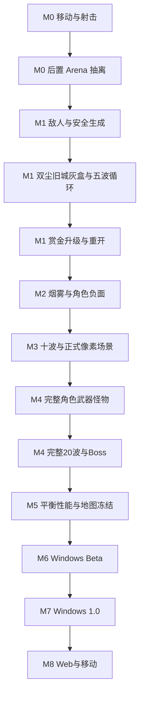

# 11｜开发里程碑

- **版本**：v0.2
- **日期**：2026-07-30
- **依赖**：全部设计文档，尤其是 `00_产品宪法.md`、`09_Godot技术架构.md`、`10_平衡测试规范.md`、`15_竞技场与刷怪空间系统.md`
- **原则**：按可验证闭环推进，不按内容数量推进

---

## 1. 统一编号

仓库内所有任务、分支、构建、遥测和素材阶段统一使用：

> **M0 射击玩具 → M1 五波闭环 → M2 角色与战术验证 → M3 十波垂直切片 → M4 二十波 Alpha → M5 内容完成与平衡 → M6 Windows Beta → M7 Windows 1.0 → M8 Web 与移动适配。**

旧文档中把“设计与工程基线”称为 M0、把“射击玩具”称为 M1 的口径停止使用。

核心推进原则：

1. 先证明射击本身好玩；
2. 再证明地图、敌人、生成和升级形成五波重玩闭环；
3. 再证明角色负面天赋、烟雾和多枪械构成独立卖点；
4. 最后扩展完整角色、怪物、波次和正式内容；
5. 当前阶段未通过，不得用更多地图、角色或美术掩盖结构问题。

## 2. 总览

| 阶段 | 名称 | 核心问题 | 竞技场范围 |
|---:|---|---|---|
| M0 | AK 射击玩具 | 移动、瞄准、射击、后坐力和换弹是否好玩 | 矩形测试竞技场 |
| M1 | 五波核心闭环 | 敌人、生成、地图、升级和重开是否形成循环 | 双尘旧城灰盒 |
| M2 | 角色与战术验证 | 角色负面、烟雾和站位是否成立 | 双尘旧城灰盒迭代 |
| M3 | 十波垂直切片 | 核心卖点是否达到试玩质量 | 双尘旧城首轮正式像素场景 |
| M4 | 二十波 Alpha | 全部首发系统能否完整运行 | 双尘旧城完整入口事件和 Boss |
| M5 | 内容完成与平衡 | 是否存在多条公平可通关路线 | 双尘旧城平衡冻结 |
| M6 | Windows Beta | 陌生玩家能否独立完成流程 | 首发地图正式完成 |
| M7 | Windows 1.0 | 是否满足发布质量与原创化边界 | 首发一张正式竞技场 |
| M8 | Web 与移动适配 | 跨平台是否保持核心体验 | 按性能档降级 |

赤瓦小镇和货运枢纽在 M0～M7 只保留设计附录，不进入首发必做清单；新竞技场在 1.0 后独立立项。

---

## 3. M0｜AK 射击玩具

### 核心问题

> 没有肉鸽升级、敌群和正式美术时，移动、瞄准、AK 射击、后坐力和换弹是否有乐趣？

### 范围

- 一个测试角色；
- WASD 移动和鼠标瞄准；
- AK 射线射击；
- 后坐力、移动散布和准星恢复；
- 30 发弹匣、无限备弹和换弹；
- 一个静止假人；
- 命中、击杀、枪口火焰、曳光和占位音效；
- FPS、随机种子和武器状态调试面板；
- 固定种子散布回归；
- 一个矩形灰盒竞技场。

### 禁止提前加入

敌人 AI、波次、升级、商店、正式角色与地图美术、角色天赋、投掷物和三地图实现。

### 退出条件

- 连续游玩 10 分钟无脚本错误；
- 目标机器保持稳定帧率；
- 玩家仅凭反馈能判断射击、命中、空仓和换弹；
- AK 短点射与长扫射手感明显不同；
- 相同输入和种子能重现散布序列；
- 自动测试覆盖弹匣、换弹、射速冷却和固定种子；
- 人工手感评审有明确记录。

### M0 后置工程工作包

M0 规则通过后、进入 M1 前，执行一次不改变玩法的 Arena 抽离：

1. 将竞技场绘制与边界从 `M0RunRoot` 和 `PlayerController` 中抽离；
2. 新建可替换 `Arena` 子场景；
3. Arena 向玩家提供战斗边界与出生位置；
4. 增加 `World` 碰撞层，使射线命中最近的墙体或目标；
5. 保持现有 `Player`、`TargetDummy`、`HUD` 路径与 M0 测试行为不变；
6. 不实现敌人、波次或正式地图。

该工作包是 M1 的工程进入条件，不占用新的里程碑编号。

---

## 4. M1｜五波核心闭环

### 核心问题

> 双尘旧城灰盒中的战斗、敌人、生成、升级与重开，是否形成“还想再试一局”的循环？

### 竞技场与生成范围

- 按 `15_竞技场与刷怪空间系统.md` 建立 `ArenaRoot` 契约；
- 实现双尘旧城灰盒，不接正式像素素材；
- 配置 8 个常规出生口、2 个特殊入口占位、1 个 Boss 入口占位；
- 每个常规入口具备屏幕外缓冲点、过渡通道和 `EntryGate`；
- 实现 `SpawnPortal`、`SpawnCandidateSelector` 和最小 `SpawnDirector`；
- 使用独立 `spawn_rng`；
- 实现安全距离、镜头中心避让、拥堵避让、连续入口惩罚和无合法点延后；
- 提供入口候选、评分和拒绝原因调试层。

### 战斗闭环范围

- 近战追击怪、快速怪、远程预警怪；
- Wave 1～5；
- 赏金拾取；
- 等级与三选一；
- 12～15 个基础升级；
- 死亡、结算与重新开始；
- 固定种子与本地遥测。

### 数据边界

- `WaveDef` 和 `WaveSpawnProfile` 决定生成内容、预算、配额和节奏；
- `ArenaDefinition` 和 `SpawnPortal` 决定可用空间和入口能力；
- `SpawnDirector` 组合两者，不硬编码地图 ID；
- 三张地图不能复制三份导演代码。

### 退出条件

- 玩家可完成五波并进入结算；
- 固定种子可重现敌人类型和入口选择；
- 任何生成都不贴脸、不进入镜头中心安全区；
- 玩家堵住一个入口时，系统能够换向；
- 缓冲区怪物进入战斗区前不能攻击；
- 三类敌人职责可辨认且高伤行为有预警；
- 测试者能说明死亡原因并愿意重开；
- 压力场景达到目标帧率；
- 自动测试覆盖入口过滤、固定种子、延后和 Arena 契约。

### 禁止提前加入

正式沙漠像素美术、赤瓦小镇和货运枢纽运行场景、五名正式角色、20 波、最终 Boss、动态破墙和复杂地形变化。

---

## 5. M2｜角色与战术验证

### 核心问题

> 尼尼的背身机制、大表哥的烟雾机制和双尘旧城的空间分区，是否证明游戏具有独立战术特色？

### 范围

- 尼尼和大表哥；
- AK、Deagle 或 AWP；
- 烟雾弹，可加入手雷作为对照；
- 背身诱饵、烟幕猎犬和远程锁定怪；
- 双尘旧城长街、隧道、中门和高台的灰盒职责差异；
- 烟雾区域、远程锁定延迟和至少 20 个升级；
- 区域停留、入口使用率和死亡方向遥测。

### 退出条件

- 尼尼负面可预警、可规避、可缓解、可反转；
- 大表哥烟雾有站位价值但不遮挡必要预警；
- 长街、隧道和中央区支持不同枪械与投掷物决策；
- 入口导演不会根据角色或构筑精准克制；
- 玩家能解释背身惩罚和烟雾收益；
- 固定种子能够重现重要入口与敌人序列；
- 高密度画面仍保持朝向、烟雾边界和攻击预警可读。

---

## 6. M3｜十波垂直切片

### 核心问题

> 十波内容、三类枪械、四种投掷物、角色差异和正式像素场景，是否达到可对外试玩质量？

### 范围

- Wave 1～10；
- 尼尼和大表哥；
- Deagle、AK、AWP；
- 手雷、烟雾、闪光、燃烧弹；
- 至少 8 种敌人和一个小 Boss；
- 20～25 个升级；
- 商店和第二投掷物槽；
- 第一版正式 HUD、音频和危险预警；
- 双尘旧城正式像素 Tile、墙体、入口、障碍和 Decal；
- 固定种子黄金回归。

正式地图素材必须在 M1 灰盒和 M2 烟雾空间验证通过后生产，并满足：

- 64×64 逻辑地块；
- 遵守 `14_像素美术Style_Bible.md`；
- 地面、墙体、障碍、入口、Decal 和装饰独立生产；
- 不把整张 AI 概念图直接作为关卡；
- 不复刻真实游戏地图的贴图、标记和物件布局。

### 退出条件

- 新玩家无需陪同可完成十波；
- 三把枪操作与构筑差异明显；
- 四种投掷物都有使用理由；
- 第 10 波 Boss 不废主流构筑；
- 至少两条构筑可完成切片；
- 双尘旧城有熟悉空间记忆但不是现有地图复刻；
- UI、地图、烟雾、敌人和预警在高密度下仍清晰；
- 目标硬件性能稳定；
- 盲测证明游戏具有独立卖点。

M3 通过后冻结 Arena 与 SpawnDirector 的职责边界，并确认首发只维护双尘旧城一张正式竞技场。

---

## 7. M4｜二十波 Alpha

### 范围

- 五名角色、五把武器和四种投掷物；
- 14 种基础怪、6 种精英词缀、3 种小 Boss 和最终 Boss；
- 47 个升级和完整 20 波；
- 商店、利息、难度 0～2、局外解锁、设置和存档；
- 完整遥测、黄金种子和内容验证器；
- 双尘旧城完整入口事件、小 Boss 入场和最终 Boss 入场；
- 必要事件插槽，但不加入复杂永久破坏系统。

### 退出条件

- 所有内容引用有效；
- 五角色和五武器均能完成一局并形成独立构筑；
- 20 波不存在流程阻断或长期预算积压；
- 最终 Boss 可击败且不会因入口或导航卡住；
- 难度 0 至少两条路线或角色可通关；
- 保存、解锁、设置和地图加载稳定；
- 压力场景达到性能目标；
- 严重崩溃和存档损坏为零。

Alpha 表示系统与内容完整，不代表发布质量。

---

## 8. M5｜内容完成与平衡

范围：难度 3～5、全组合测试、升级选择率、死亡分布、入口使用率、入口拒绝率、拥堵率、Boss、经济、教程、可访问性、性能和原创化审查。

退出条件：

- 没有所有构筑必选升级；
- 每角色至少两条通关路线；
- 普通波无异常死亡峰；
- 不存在长期最优守点或永久绕柱路线；
- 单个入口不会长期承担异常比例敌人；
- 可解释失败比例达标；
- 五把枪均有偏好群体；
- 黄金种子、性能、存档和 Arena 契约回归稳定。

---

## 9. M6｜Windows Beta

范围：完整正式美术音频、菜单设置、手柄、多分辨率、安装更新、崩溃日志、本地化框架、外部玩家测试、发布构建和素材来源清单。

准入：核心内容冻结、严重崩溃为零、存档迁移可测试、20 波稳定完成、地图无影响判断的占位资源、性能满足最低配置。

退出：陌生玩家无需陪同可完成流程；关键 Bug 有回归；发布构建可重复；资源原创化清单完整；设置和存档在重装及升级情况下安全。

---

## 10. M7｜Windows 1.0

发布门槛：

- 产品支柱均有证据成立；
- 20 波、五角色、五武器和四投掷物完整；
- 崩溃、存档损坏、无法通关和生成死锁为零；
- 发布版本不含调试作弊入口；
- 素材来源清晰，不使用真实队标、肖像、语音、官方地图资产或比赛素材；
- 双尘旧城通过原创竞技场审查；
- 版本号、更新说明和支持信息完整。

1.0 后优先修复、平衡、可访问性和性能，再分别评估赤瓦小镇、货运枢纽、新角色、新武器、无尽模式和每日种子。新竞技场必须复用 Arena 与 Spawn 契约。

---

## 11. M8｜Web 与移动适配

Web 重点：加载体积、内存、输入捕获、烟雾与场景装饰降级、活跃敌人和缓冲队列上限、存档与切后台。

手机需要重新设计双摇杆、自动射击、辅助瞄准、自动换弹、投掷物按钮、UI 安全区、触摸误操作、敌人与特效预算以及发热策略。

只有 Windows 核心平衡稳定、输入抽象完成、UI 使用 ViewModel、性能热点已知、数据与运行逻辑分离后，才进入正式适配。

---

## 12. 关键依赖路径

不能跳过：

- 没有 M0 手感，不做完整升级；
- 没有 Arena 抽离，不继续在 RunRoot 堆地图逻辑；
- 没有合法入口和固定种子测试，不做五波；
- 没有五波闭环，不做 20 波；
- 没有烟雾可读性，不扩大表哥内容；
- 没有灰盒验证，不批量制作正式地图素材；
- 没有输入抽象，不做手机。

---

## 13. Codex 工作包与完成定义

每个工作包必须写明：

- 单一可验证目标；
- 设计文档与章节；
- 允许和禁止修改的路径；
- 输入、输出、信号与数据边界；
- 正常路径、边界路径和固定种子测试；
- 可观察验收步骤；
- 实际运行命令和结果。

任何功能完成必须满足：

- 符合设计，数据字段完整；
- 不写死角色、地图或内容 ID；
- 错误有日志，UI/音频/VFX 有可理解反馈；
- 自动测试与黄金种子相关回归通过；
- 性能无明显退化；
- 文档和评审更新；
- 没有影响验收的占位项。

地图与刷怪还必须满足：

- Arena 契约验证通过；
- 每个入口从缓冲点连通到战斗区；
- 无合法入口时延后，不贴脸补预算；
- 调试层显示候选、拒绝原因和最终选择；
- 入口选择只消耗 `spawn_rng`；
- 不复制地图专属 `SpawnDirector`。

---

## 14. 版本、风险与范围

建议版本：M0 `0.0.1`、M1 `0.1.0`、M2 `0.2.0`、M3 `0.4.0`、M4 `0.6.0`、M5 `0.8.0`、M6 `0.9.0`、M7 `1.0.0`。

每次构建记录 Git 提交、内容清单、存档和遥测 schema、Godot 版本、平台、Arena ID、Run seed 和已知问题。

最早风险验证：

| 风险 | 最早阶段 | 消减方式 |
|---|---|---|
| 手动瞄准疲劳、枪械无差异 | M0 | 手感与固定种子测试 |
| Arena 逻辑硬编码 | M0 后置 | 抽离 Arena 契约 |
| 刷怪贴脸、入口堵塞、永久守点 | M1 | 缓冲区、安全过滤、换向和遥测 |
| 升级只是加数值 | M1 | 规则型引擎 |
| 角色负面太烦、烟雾遮挡 | M2 | 可预警、可处理、可反转和盲测 |
| 正式地图投入过早 | M1/M2 | 灰盒门槛和素材状态机 |
| 后期性能崩溃 | M1/M4 | 对象池、轻量缓冲状态和压力测试 |
| Boss 封杀流派 | M4/M5 | 无完全免疫 |
| 地图/IP 风险 | M3/M6 | 原创空间重构和来源审查 |

首发不包含多人、PvP、赛季、皮肤交易、真实赛事合作、多竞技场、剧情战役、无尽模式、MOD 工具或 Windows 核心未稳定前的正式手机开发。

---

## 15. 可验证的完成标准

- 仓库所有文档使用同一 M0～M8 编号；
- 每阶段有明确核心问题、范围和退出条件；
- 未通过阶段不会无条件扩内容；
- M0、M1、M2、M3 可分别独立构建和测试；
- M1 明确包含首张竞技场灰盒与安全生成；
- M3 前不批量制作正式地图素材；
- 首发只实现双尘旧城；
- Windows 1.0 前不启动正式手机开发；
- 发布准入包含原创化、存档、性能、Arena 契约和可访问性。
