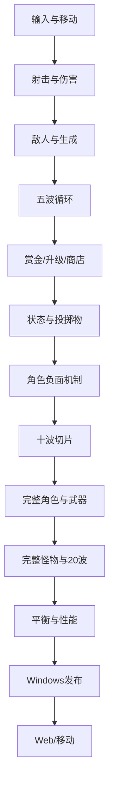

# 11｜开发里程碑

- **版本**：v0.1
- **依赖**：全部设计文档
- **原则**：按可验证闭环推进，不按内容数量推进

---

## 1. 目标

本文件定义从零开始开发《GOGO》的顺序、阶段产物、进入条件和退出条件。

核心原则：

> 先证明“射击本身好玩”，再证明“五波构筑闭环想重玩”，再证明“角色负面天赋可以玩”，最后才扩充到五角色和二十波。

任何阶段未通过验收，不应通过堆更多角色、怪物或美术掩盖问题。

---


## 明确规则摘要

- 以阶段验收门槛推进，不以“完成了多少内容”推进；
- M1 先验证射击，M2 验证五波循环，M3 验证角色负面与烟雾，之后才扩展完整内容；
- 当前阶段未通过，不得用新增角色、怪物或美术掩盖问题；
- 每个 Codex 工作包只实现一个可验证闭环；
- 每项功能完成必须包含数据、错误处理、测试、性能和文档；
- Windows 核心稳定前不启动正式 Web/手机适配；
- 多人、PvP、赛季和皮肤交易不进入首发路线图。

## 2. 里程碑总览

| 阶段 | 名称 | 核心问题 |
|---:|---|---|
| M0 | 设计与工程基线 | 团队是否对游戏和接口达成一致 |
| M1 | 灰盒战斗玩具 | 移动、瞄准、AK、换弹是否本身好玩 |
| M2 | 五波核心闭环 | 战斗、升级、商店是否让人想再玩一局 |
| M3 | 十波垂直切片 | 角色负面、烟雾和三类枪是否真正成立 |
| M4 | 二十波 Alpha | 全部首发系统能否完整运行 |
| M5 | 内容完成与平衡 | 是否有多条可通关路线且无明显断层 |
| M6 | Windows Beta | 是否达到陌生玩家可独立游玩的完成度 |
| M7 | Windows 1.0 | 是否满足发布质量和原创化边界 |
| M8 | Web 与移动适配 | 核心稳定后能否跨平台保持体验 |

---

# 3. M0｜设计与工程基线

## 3.1 范围

完成：

- 12 份设计文档；
- 全局术语；
- 内容 ID 命名；
- Godot 项目目录；
- 数据资源空结构；
- 输入动作；
- 内容验证器最小版本；
- 版本号和日志；
- Git 仓库与分支规则。

## 3.2 产物

- 可启动的空项目；
- `RunRoot` 空场景；
- `ContentDB` 能加载一份武器和敌人数据；
- 自动检查重复 ID 和缺失引用；
- 设计文档进入仓库；
- 开发任务模板。

## 3.3 退出条件

- 项目能在目标 Windows 环境启动；
- 新增数据资源不需要修改核心加载代码；
- 输入动作已抽象；
- 团队对第一版不做内容无争议；
- 文档与目录命名一致；
- 默认角色、武器、波次 ID 已确定。

## 3.4 禁止提前加入

- 正式角色美术；
- 47 个升级；
- 全部怪物；
- 商店复杂动画；
- Web 和手机导出；
- 多人联机。

---

# 4. M1｜灰盒战斗玩具

## 4.1 核心问题

> 没有肉鸽升级和正式美术时，移动、瞄准、射击、后坐力和换弹是否有乐趣？

## 4.2 范围

只实现：

- 一个测试角色；
- AK；
- WASD 和鼠标瞄准；
- 射线射击；
- 后坐力和准星；
- 弹匣和换弹；
- 训练靶兵、群蜂、抛射手；
- 一个灰盒竞技场；
- 生命、受伤和死亡；
- 基础枪声、命中和危险预警；
- 武器实验室；
- 性能 HUD。

## 4.3 任务顺序

1. 输入与移动；
2. 瞄准和枪口方向；
3. AK 数据与射击；
4. 射线命中；
5. 生命和伤害；
6. 后坐力与准星；
7. 弹匣与换弹；
8. 三种敌人；
9. 简单生成；
10. 音画反馈；
11. 压力测试。

## 4.4 退出条件

- AK 连射、停火恢复和换弹有明显节奏；
- 准星与真实散布一致；
- 三种敌人职责可辨认；
- 所有高伤行为有预警；
- 连续游玩测试无明显手指疲劳；
- 压力场景维持目标帧率；
- 测试者愿意继续打，而不是只说“系统能运行”。

## 4.5 失败后的处理

若射击不好玩，优先调整：

- 枪声；
- 命中停顿和反馈；
- 后坐力可视化；
- 敌人受击反应；
- 移动速度；
- 换弹时间；
- 敌人前摇。

不得通过加入大量升级掩盖基础手感。

---

# 5. M2｜五波核心闭环

## 5.1 核心问题

> 战斗结束后获得选择，再进入下一波，是否形成“还想再试一次”的循环？

## 5.2 范围

增加：

- Wave 1～5；
- 状态机 PREPARE/ACTIVE/CLEANUP/SETTLEMENT/SHOP；
- 赏金双记账；
- 等级与待升级；
- 三选一；
- 商店四槽；
- 刷新、锁定、治疗；
- 10～15 个升级；
- 手雷和烟雾；
- 冲锋桩；
- 第 5 波精英；
- 固定种子；
- 基础遥测；
- 失败复盘。

暂时只使用测试角色和 AK，可额外加入 Deagle 作为对照。

## 5.3 最小升级池建议

至少覆盖：

- 生命；
- 移动；
- 换弹；
- 伤害；
- 弹匣；
- 换弹冲击；
- 穿透；
- 低血应急；
- AK 前三发；
- AK 失控弹头；
- 一个合同。

## 5.4 退出条件

- 连续完成五波闭环；
- 波末顺序无错误；
- 固定种子可重现；
- 至少出现两种不同构筑；
- 第 5 波精英有压力但可解释；
- 测试者能独立购买、刷新和锁定；
- 多数测试者愿意立即再开；
- 没有严重经济死局；
- 未拾取折算与经验钱包可理解。

## 5.5 禁止提前加入

- 五名正式角色；
- 20 波；
- 最终 Boss；
- 完整局外成长；
- 正式剧情；
- 大量角色语音。

---

# 6. M3｜十波垂直切片

## 6.1 核心问题

> 角色负面天赋、烟雾和不同枪械能否证明这不是普通《土豆兄弟》换皮？

## 6.2 范围

角色：

- 尼尼；
- 大表哥。

武器：

- Deagle；
- AK；
- AWP。

投掷物：

- 手雷；
- 烟雾；
- 闪光；
- 燃烧弹。

敌人：

- 至少 8 种；
- 包含背身诱饵、护盾、封区；
- 一个小 Boss。

升级：

- 20～25 个；
- 包含尼尼和大表哥专属模块；
- 包含三把枪异变；
- 包含两个合同。

表现：

- 第一版正式 HUD；
- 第一版角色和敌人风格；
- 正式枪声方向；
- 烟雾可读性；
- 升级与商店卡片；
- 手柄基础支持。

## 6.3 为什么先做尼尼和大表哥

尼尼验证：

- 敌人朝向；
- 负面天赋；
- 精准与过量伤害；
- 负面反转。

大表哥验证：

- 烟雾区域；
- 投掷物；
- 站位规划；
- 视觉可读性。

两者能覆盖项目最有差异化、也最容易失败的机制。

## 6.4 退出条件

- 新玩家无需口头讲解可完成 10 波；
- 尼尼背影机制不是随机惩罚；
- 大表哥烟雾不遮挡；
- 三把枪操作差异明显；
- 四种投掷物都有使用理由；
- 第 10 波 Boss 不废任何主流派；
- 至少两条构筑可完成切片；
- UI、音频和预警在高密度下仍清晰；
- 目标硬件性能稳定；
- 盲测反馈证明游戏具有独立卖点。

## 6.5 设计冻结点

M3 通过后冻结：

- 单主武器制；
- 20 波标准结构；
- 赏金双记账；
- 角色负面原则；
- 烟雾基础规则；
- 战斗输入。

冻结后若要改变，必须走重大设计变更评审。

---

# 7. M4｜二十波 Alpha

## 7.1 范围

扩充到首发完整内容：

- 五名角色；
- 五把武器；
- 四种投掷物；
- 14 种基础怪物；
- 6 种精英词缀；
- 3 种小 Boss；
- 最终 Boss；
- 47 个升级；
- 完整 20 波；
- 商店与利息；
- 难度 0～2；
- 局外解锁；
- 设置与存档；
- 完整遥测；
- 黄金种子；
- 内容验证器。

## 7.2 开发顺序

1. 补齐 M4 所需数据结构；
2. 小洞大人；
3. 设备；
4. 上帝；
5. USP；
6. M4；
7. 其余怪物；
8. 小 Boss；
9. 最终 Boss；
10. 47 个升级；
11. 局外解锁；
12. 难度；
13. 全 20 波；
14. 性能与回归。

不建议先一次性写完 47 个升级再验证角色。

## 7.3 退出条件

- 所有内容引用有效；
- 五角色均能开始并完成一局；
- 五武器均有独立构筑；
- 47 升级进入正确池；
- 20 波不存在流程阻断；
- 最终 Boss 可击败；
- 难度 0 至少两条路线/角色可通关；
- 角色负面触发和反转可记录；
- 保存、解锁和设置稳定；
- 压力场景达到性能目标；
- 已知严重崩溃和存档损坏为零。

## 7.4 Alpha 的含义

Alpha 表示：

- 系统和内容已完整；
- 美术、音频、平衡仍可明显调整；
- 不代表可以对外正式发布；
- 不继续无计划增加角色和武器。

---

# 8. M5｜内容完成与平衡

## 8.1 核心问题

> 完整内容是否有多条可玩路线，而不是只有一组最优答案？

## 8.2 范围

- 难度 3～5；
- 全角色、武器和投掷物组合测试；
- 升级选择率与胜率；
- 波次死亡分布；
- Boss 调整；
- 商店与利息；
- 解锁节奏；
- 新手教程；
- 可访问性；
- 特效和音频限流；
- 性能热点；
- 原创化审查。

原则：

- 内容锁定后优先修质量；
- 除非发现结构缺口，不新增大系统；
- 新增升级必须替换或补足明确空缺。

## 8.3 退出条件

- 达到平衡目标区间；
- 没有所有构筑必选升级；
- 每角色至少两条通关路线；
- 普通波无异常死亡峰；
- 可解释失败比例达标；
- 五把枪均有玩家偏好群体；
- 经济策略不唯一；
- 教程后玩家可独立操作；
- 可访问性功能可用；
- 黄金种子全部通过；
- 性能和存档回归稳定。

---

# 9. M6｜Windows Beta

## 9.1 范围

- 完整正式美术；
- 完整音效与音乐；
- 菜单、设置、结算；
- 手柄完整支持；
- 多分辨率；
- 安装、更新和卸载测试；
- 崩溃日志；
- 本地化框架；
- 外部陌生玩家测试；
- 发布构建流程；
- 法务与素材来源清单。

## 9.2 Beta 准入

必须先满足：

- 核心内容冻结；
- 严重崩溃为零；
- 存档迁移可测试；
- 不存在占位资源影响判断；
- 20 波可稳定完成；
- 性能满足最低配置目标；
- 主要 UI 支持键鼠与手柄。

## 9.3 退出条件

- 陌生玩家无需开发者陪同可完成游戏流程；
- 关键 Bug 均有回归；
- 发布构建可重复生成；
- 资源授权与原创化清单完整；
- 本地化布局无严重溢出；
- 设置和存档在重装、升级情况下安全；
- 外部反馈不再指出核心流程理解问题。

---

# 10. M7｜Windows 1.0

## 10.1 发布门槛

- 产品支柱均有证据成立；
- 20 波完整；
- 五角色、五武器、四投掷物可用；
- 难度和解锁稳定；
- 崩溃、存档损坏、无法通关等阻断问题为零；
- 发布版本不含调试作弊入口；
- 诊断日志不包含敏感个人信息；
- 所有素材来源清晰；
- 不使用真实队标、肖像、语音和官方比赛素材；
- 商店、付费和网络功能若不存在，不保留误导入口；
- 版本号、更新说明和支持信息完整。

## 10.2 1.0 后原则

优先：

- 修复；
- 平衡；
- 可访问性；
- 性能；
- 玩家反馈中的结构缺口。

再考虑：

- 新角色；
- 新武器；
- 新竞技场；
- 无尽模式；
- 每日种子。

不立即进入多人联机。

---

# 11. M8｜Web 与移动适配

## 11.1 Web

重点：

- 加载体积；
- 内存；
- 浏览器输入捕获；
- 烟雾和粒子降级；
- 活跃敌人上限；
- 存档方式；
- 浏览器切后台暂停；
- 不同浏览器兼容。

## 11.2 手机

需要重新设计而非简单导出：

- 双摇杆；
- 自动射击选项；
- 辅助瞄准；
- 自动换弹；
- Q/E 与主动按钮布局；
- UI 安全区；
- 字体与卡片；
- 触摸误操作；
- 活跃敌人和特效预算；
- 电量与发热。

核心玩法代码不重写，但输入、UI 和质量档必须适配。

## 11.3 准入条件

只有当 Windows 版本：

- 核心平衡稳定；
- 输入抽象完成；
- UI 使用 ViewModel；
- 性能热点已知；
- 数据与运行逻辑分离；

才进入跨平台正式适配。

---

## 12. 关键依赖路径



不能跳过：

- 没有战斗手感，不做完整升级；
- 没有五波闭环，不做 20 波；
- 没有烟雾可读性，不扩大表哥内容；
- 没有固定种子和遥测，不做大规模平衡；
- 没有输入抽象，不做手机。

---

## 13. Codex 工作包模板

每个任务使用：

```markdown
# 任务名称

## 目标
只描述一个可验证结果。

## 设计依据
- 文档：
- 章节：
- 相关 ID：

## 允许修改
- res://...

## 禁止修改
- 不重构...
- 不新增...
- 不改变...

## 输入与输出
- 输入：
- 输出：
- 信号/接口：

## 实现约束
- 数据驱动：
- 固定随机：
- 对象池：
- 错误处理：

## 验收步骤
1.
2.
3.

## 自动测试
- 正常：
- 边界：
- 回归：

## 完成定义
- 代码：
- 数据：
- 测试：
- 文档：
```

一个工作包尽量只覆盖一个系统闭环。

错误示例：

> 完成五角色、所有武器、20 波和商店。

正确示例：

> 根据 `02` 实现 AK 的射速、后坐力、弹匣和换弹，并在武器实验室提供三个自动验收场景。

---

## 14. Definition of Done

任何功能完成必须满足：

- 符合设计文档；
- 数据字段完整；
- 不写死角色或内容 ID；
- 正常路径可用；
- 边界路径有处理；
- 错误有日志；
- UI 有可理解反馈；
- 音频/VFX 有占位或正式反馈；
- 自动测试通过；
- 黄金种子相关回归通过；
- 性能无明显退化；
- 文档更新；
- 代码评审完成；
- 没有遗留 `TODO` 影响该功能验收。

“画面上看起来能用”不等于完成。

---

## 15. 版本与变更管理

建议版本：

| 阶段 | 示例版本 |
|---|---|
| M1 | 0.0.1 |
| M2 | 0.1.0 |
| M3 | 0.2.0 |
| M4 | 0.5.0 |
| M5 | 0.7.0 |
| M6 | 0.9.0 |
| M7 | 1.0.0 |

每次构建记录：

- Git 提交；
- 内容清单版本；
- 存档 schema；
- 遥测 schema；
- Godot 版本；
- 平台；
- 已知问题。

---

## 16. 主要风险与消减顺序

| 风险 | 最早验证阶段 | 消减方式 |
|---|---|---|
| 手动瞄准疲劳 | M1 | 按住射击、准星、瞄准辅助 |
| 枪械无差异 | M1/M3 | 操作节奏与异变 |
| 升级只是加数值 | M2 | 先做规则型引擎 |
| 角色负面太烦 | M3 | 可预警、主动处理、反转 |
| 烟雾遮挡 | M3 | 轮廓、透明度、盲测 |
| 内容量失控 | 全程 | 阶段禁入清单 |
| 后期性能崩溃 | M1/M4 | 对象池、压力场景 |
| 经济唯一解 | M4/M5 | 收益上限、花钱与存钱对照 |
| Boss 封杀流派 | M4/M5 | 无完全免疫 |
| 真人/IP 风险 | M0/M6 | 原创化、素材清单 |

---

## 17. 不包含的范围

本路线图不安排：

- 多人联机；
- PvP；
- 赛季系统；
- 皮肤交易；
- 真实电竞赛事合作；
- 首发多竞技场；
- 首发剧情战役；
- 首发无尽模式；
- 首发 MOD 工具；
- Windows 核心未稳定前的正式手机开发。

这些内容需要 1.0 后独立立项和设计文档。

---

## 18. 数据字段

### 18.1 `MilestoneRecord`

| 字段 | 类型 | 说明 |
|---|---|---|
| `milestone_id` | StringName | M0～M8 |
| `status` | enum | NOT_STARTED/ACTIVE/BLOCKED/PASSED |
| `entry_criteria` | Array[String] | 进入条件 |
| `exit_criteria` | Array[String] | 退出条件 |
| `required_features` | Array[StringName] | 功能 |
| `required_tests` | Array[StringName] | 测试 |
| `blocked_by` | Array[StringName] | 依赖 |
| `build_version` | String | 验收构建 |
| `review_record` | String | 评审记录 |

### 18.2 `WorkPackage`

| 字段 | 类型 | 说明 |
|---|---|---|
| `task_id` | String | 任务 |
| `design_refs` | Array[String] | 文档章节 |
| `allowed_paths` | Array[String] | 允许修改 |
| `forbidden_paths` | Array[String] | 禁止修改 |
| `acceptance_steps` | Array[String] | 验收 |
| `test_ids` | Array[StringName] | 测试 |
| `owner` | String | 负责人 |
| `reviewer` | String | 评审 |
| `status` | enum | 状态 |
| `result_build` | String | 结果构建 |

---

## 19. 与其他系统的接口

- `00` 提供产品不可破坏原则；
- `01～08` 提供阶段功能；
- `09` 提供工程实现边界；
- `10` 提供阶段验收数据；
- Git 与构建系统提供版本；
- 内容验证器提供完整性结果；
- 黄金种子提供回归；
- 评审记录决定阶段是否通过。

---

## 20. 可验证的完成标准

- 每个阶段有明确核心问题；
- 每个阶段有进入和退出条件；
- 未通过阶段不会无条件扩内容；
- M1、M2、M3 能分别独立构建和测试；
- Codex 任务可拆成单闭环；
- 每项完成定义包含测试和文档；
- 关键风险在最早阶段验证；
- Windows 1.0 前不启动正式手机开发；
- 发布准入包含原创化、存档、性能与可访问性；
- 路线图不依赖模糊的“做完所有内容”。

---

## 21. 尚未验证的假设

1. 当前阶段拆分足以控制单人或小团队开发复杂度；
2. M3 的尼尼和大表哥能够代表最关键差异化风险；
3. 20～25 个升级足以完成十波垂直切片；
4. 内容完整后再集中平衡不会过晚，因为早期已有持续遥测；
5. Windows 首发再移植是最有效路线；
6. Codex 按工作包执行能保持架构边界；
7. 首发不做多人和多地图不会削弱核心吸引力；
8. 完成定义和黄金种子能显著减少迭代回归。
