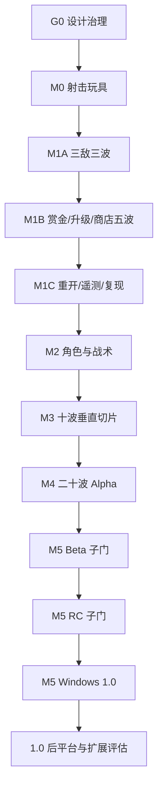

# 11｜开发里程碑

- **版本**：v0.2
- **日期**：2026-07-30
- **依赖**：全部权威设计文档
- **原则**：按可验证闭环推进，不按内容数量推进

---

## 1. 目标

本文件定义《GOGO》从设计治理到 Windows 1.0 的唯一阶段编号、进入条件、产物和退出条件。

核心原则：

> 先完成 G0 权威治理；保持 M0 射击玩具可回归；再按 M1A、M1B、M1C 证明五波闭环；随后验证角色与战术、十波切片和二十波 Alpha；最终在 M5 内完成平衡与 Windows 发布。

任何阶段未通过验收，不应通过堆更多角色、怪物或美术掩盖问题。

---

## 明确规则摘要

- 唯一阶段编号为 G0、M0、M1、M2、M3、M4、M5；
- M1 固定拆为 M1A 三敌三波、M1B 赏金/升级/商店五波、M1C 重开/遥测/复现；
- Beta、RC、1.0 是 M5 内部发布子门，不另占里程碑编号；
- Windows 1.0 通过后，才根据数据评估 Web、Android、iOS 与扩展内容；
- 当前阶段未通过，不得用新增角色、怪物或美术掩盖问题；
- 每个 Codex 工作包只实现一个可验证闭环；
- 每项功能完成必须包含数据、错误处理、测试、性能、证据和文档；
- 多人、PvP、赛季和皮肤交易不进入首发路线图。

## 2. 里程碑总览

| 阶段 | 名称 | 核心问题 |
|---|---|---|
| G0 | 设计治理 | 权威文档、R2、ID、状态所有权、manifest 和校验门禁是否一致且可审计 |
| M0 | 射击玩具 | 当前 AK 移动、瞄准、射击、命中、换弹是否本身好玩且可复现 |
| M1 | 五波闭环 | 三敌三波、赏金/升级/商店五波、重开/遥测/复现是否逐门成立 |
| M2 | 角色与战术 | 尼尼背身机制、大表哥烟雾与组合玩法是否公平且可读 |
| M3 | 十波垂直切片 | 三枪、四投掷物、八敌人、小 Boss 和升级子集是否形成可试玩切片 |
| M4 | 二十波 Alpha | 五角色、五枪、完整 20 波、Boss、剩余内容与 A5 正式素材是否完整运行 |
| M5 | 平衡与 Windows 发布 | 性能、平衡、可用性、发布权利和 Windows 包是否依次通过 Beta/RC/1.0 子门 |
| 1.0 后 | 平台与扩展评估 | 是否有数据支持 Web、Android、iOS 或扩展内容的独立立项 |

---

# 3. G0｜设计治理

## 3.1 核心问题

> 后续实现是否只有一套可机器验证、可追溯、不会假报完整内容已就绪的权威契约？

## 3.2 范围

- 统一 G0～M5 里程碑；
- 落地 R2 窄范围政策及 M5 人工发布门；
- 统一 canonical gameplay ID 与显示名边界；
- 明确 `RunConfig`、`RunState`、`EconomyState`、`UpgradeState` 的状态所有权；
- 建立设计文档 manifest、正式素材 manifest 和稳定参考；
- 建立“小洞大人”Markdown 设计卡；
- 实现 `ContentValidator` 的 G0 与完整目录两类报告；
- 保留现有 M0 实现和用户未提交改动。

## 3.3 退出条件

- 所有权威文档使用本文件的阶段含义；
- 历史合集被标记为历史快照，不参与现行规则裁决；
- R2 适用范围、可保留项、必须去除项和人工发布门无冲突；
- gameplay ID、素材 ID 和显示名各自职责明确；
- manifest 枚举、字段、哈希和文件状态可以自动校验；
- 稳定参考与设计卡可追溯；
- G0 必需数据门通过，同时未把尚不存在的完整生产目录假报为就绪；
- 未生成 C0 图片，未实现 M1 内容。

## 3.4 禁止提前加入

- C0 图片生成；
- M1 敌人、升级、商店和五波实现；
- 新的生产玩法目录；
- 为未来 Resource 重复维护一份数据真相；
- 未经证据支持的 M0 验收记录。

---

# 4. M0｜射击玩具

## 4.1 核心问题

> 没有肉鸽升级和正式美术时，移动、瞄准、AK 射击、后坐力和换弹是否有乐趣？

## 4.2 已有范围

- 玩家移动；
- 鼠标瞄准；
- AK 射击；
- 射线命中与静止假人；
- 后坐力与准星恢复；
- 弹匣与换弹；
- 命中、击杀、枪口火焰和音效占位；
- FPS、种子和武器状态调试信息；
- 自动测试与 Windows 手工清单。

## 4.3 退出条件

- AK 连射、停火恢复和换弹有明显节奏；
- 准星与真实散布一致；
- 玩家仅凭反馈能判断射击、命中、空仓和换弹；
- 相同输入和种子能重现散布序列；
- 自动测试通过；
- Windows 手工清单有可追溯记录；
- 样本报告满足 `10_平衡测试规范.md` 的 M0 门槛。

## 4.4 证据边界

规格获批时的历史快照为“M0 自动工程验收已通过，但手工清单尚未勾选”。用户随后报告 Windows 验收完成；阶段记录只接受实际存在的测试者报告、硬件、build、日期、原始结果和 Review 元数据，不从口头或书面摘要反推缺失证据。

---

# 5. M1｜五波闭环

## 5.1 M1A｜三敌三波

范围：

- 近战追击怪；
- 快速怪；
- 远程预警怪；
- Wave 1～3；
- 基础生成安全规则；
- 战斗阶段切换；
- 第 3 波开始的低频通用背身/诱饵机会。

退出条件：

- 三种敌人职责仅看行为和预警即可区分；
- 连续完成三波；
- 屏幕外生成、安全距离与危险预警有效；
- 固定种子能复现生成顺序；
- 不依赖角色硬编码制造职责。

## 5.2 M1B｜赏金/升级/商店五波

范围：

- Wave 1～5；
- 赏金双记账；
- 等级和三选一；
- 最小升级子集；
- 四槽商店、刷新、锁定和治疗；
- 波末事件与固定奖励节点；
- 手雷和测试期默认烟雾；
- 第 5 波精英。

退出条件：

- 连续完成五波闭环；
- 波末结算严格遵循权威顺序；
- 经济、待选升级和商店没有状态重复所有权；
- 至少出现两种不同构筑；
- 新玩家能独立购买、刷新和锁定；
- 没有严重经济死局。

## 5.3 M1C｜重开/遥测/复现

范围：

- 死亡与结算；
- 重新开始；
- 最小遥测；
- 固定种子与事件序号；
- 失败原因摘要；
- 可重复的自动与人工验收包。

退出条件：

- 同一 build、配置、seed 能复现关键流程；
- 重开不残留上一局可变状态；
- 测试报告记录 build、硬件、日期、玩家经验和原始结果；
- 至少 10 名首次玩家完成样本；
- 至少 60% 表示愿意立即再开一局；
- M1A、M1B 的回归保持通过。

## 5.4 M1 总门

M1A、M1B、M1C 必须全部通过，M1 才能记为 `PASSED`。任何子门的通过都不能替代另两个子门的证据。

---

# 6. M2｜角色与战术

## 6.1 核心问题

> 角色负面天赋和烟雾能否同时做到可预警、可规避、可缓解、可反转，并在高密度战斗中保持可读？

## 6.2 范围

角色：

- 尼尼；
- 大表哥。

武器与投掷物：

- Deagle；
- AK；
- 手雷；
- 烟雾。

敌人与机制：

- 背身诱饵；
- 烟幕猎犬；
- 第 8/13 波强化专属职责；
- 烟雾区域、远程锁定延迟和战术区域；
- 尼尼与大表哥的专属模块子集。

## 6.3 退出条件

- 尼尼背影机制不被盲测玩家描述为随机惩罚；
- 大表哥烟雾不遮挡角色、敌人或高危预警；
- 烟雾测试期默认可用，大表哥正式解锁不依赖自身烟雾能力；
- 角色负面均有操作处理和构筑反转；
- 至少 12 名盲测玩家完成角色与武器分配记录；
- 组合验证证明角色逻辑不依赖敌人代码中的具体角色 ID。

---

# 7. M3｜十波垂直切片

## 7.1 核心问题

> 三枪、四投掷物、八类敌人、小 Boss 和升级子集能否形成具有独立卖点的十波可试玩切片？

## 7.2 范围

- Deagle、AK、AWP；
- 手雷、烟雾、闪光、燃烧弹；
- 至少 8 种敌人；
- 第 10 波小 Boss；
- 20～25 个升级子集；
- 第一版正式 HUD、商店和设置；
- 固定种子回归；
- A4 正式素材；
- 性能与可访问性基础档。

## 7.3 退出条件

- 新玩家无需开发者口头讲解可完成十波；
- 三把枪仅凭操作和反馈即可区分；
- 四种投掷物都有使用理由；
- 第 10 波小 Boss 不废任何主流派；
- 至少两条构筑可完成切片；
- UI、音频与预警在高密度下仍清晰；
- 至少 12 名盲测玩家完成角色和武器分配记录；
- 目标硬件性能稳定；
- 盲测反馈证明游戏具有独立卖点。

## 7.4 设计冻结点

M3 通过后冻结：

- 单主武器制；
- 20 波标准结构；
- 赏金双记账；
- 角色负面原则；
- 烟雾基础规则；
- 战斗输入。

冻结后若要改变，必须走重大设计变更评审。

---

# 8. M4｜二十波 Alpha

## 8.1 范围

- 五名角色；
- 五把武器；
- 四种投掷物；
- 14 种基础怪物；
- 6 种精英词缀；
- 3 种小 Boss；
- 最终 Boss；
- 47 个升级；
- 完整 20 波；
- 商店、利息与局外解锁；
- 设置、存档和完整遥测；
- 黄金种子；
- A5 正式素材；
- 完整内容目录校验。

## 8.2 开发顺序

1. 补齐 M4 所需数据结构；
2. 小洞大人；
3. 设备；
4. 上帝；
5. USP；
6. M4 武器；
7. 其余怪物与精英；
8. 小 Boss 和最终 Boss；
9. 分批补齐 47 个升级；
10. 局外解锁和难度；
11. 全 20 波；
12. A5 正式素材；
13. 性能、存档和黄金种子回归。

不允许先一次性写完 47 个升级再验证角色，也不允许在 M4 入口门前把“小洞大人”A5 素材推进出 `planned`。

## 8.3 退出条件

- 所有 gameplay ID 唯一且引用有效；
- 五角色均能开始并完成一局；
- 五武器均有独立构筑；
- 47 个升级进入正确池；
- 20 波不存在流程阻断；
- 最终 Boss 可击败；
- 解锁依赖图无环；
- 保存、解锁和设置稳定；
- 至少 50 局有效完整数据，五名角色均有样本；
- 压力场景达到性能目标；
- 已知严重崩溃和存档损坏为零；
- 完整内容目录达到就绪状态。

## 8.4 Alpha 的含义

Alpha 表示系统和内容完整，美术、音频和平衡仍可调整；它不等于可正式发布，也不授权继续无计划增加角色和武器。

---

# 9. M5｜平衡与 Windows 发布

## 9.1 核心问题

> 完整内容是否公平、可理解、可访问、性能稳定、权利清晰，并能以可复现流程生成 Windows 发布包？

## 9.2 范围

- 难度与角色/武器组合平衡；
- 升级选择率、胜率和波次死亡分布；
- Boss、商店、利息和解锁节奏；
- 新手教程与可访问性；
- 特效、音频和性能限流；
- 存档迁移、崩溃恢复和诊断日志；
- 多分辨率与键鼠/手柄；
- 完整正式美术、音效与音乐；
- 安装、更新和卸载测试；
- 本地化框架；
- 外部陌生玩家测试；
- 发布构建流程；
- 素材来源、R2 肖像权与第三方权利人工审查。

## 9.3 Beta 子门

- 核心内容冻结；
- 严重崩溃和存档损坏为零；
- 20 波可稳定完成；
- 不存在影响判断的占位资源；
- 主要 UI 支持键鼠与手柄；
- 最低配置达到性能目标；
- 陌生玩家无需开发者陪同可完成流程；
- 外部反馈不再指出核心流程理解问题。

## 9.4 RC 子门

- 发布构建可重复生成；
- 所有阻断和高优先级 Bug 有回归；
- 存档迁移、重装和升级路径安全；
- 本地化布局无严重溢出；
- 安装、更新、卸载和崩溃日志流程通过；
- 素材来源清单完整；
- 每个 R2 角色完成肖像权、第三方权利、地区和平台人工审查；
- 不包含调试作弊入口或敏感个人信息。

## 9.5 1.0 子门

- 产品支柱均有实测证据；
- 五角色、五武器、四投掷物和 20 波完整；
- 多条构筑路线达到平衡目标；
- 可解释失败、可访问性和性能达标；
- 发布版本、更新说明和支持信息完整；
- Windows 发布包签署最终人工决定；
- 所有 R2 发布决定有 reviewer、日期、build 和结论，且不把 R2 本身视为授权依据。

## 9.6 1.0 后

优先处理修复、平衡、可访问性、性能和玩家反馈中的结构缺口。只有获得数据支持时，才分别评估 Web、Android、iOS、新角色、新武器、新竞技场、无尽模式或每日种子；多人联机不自动进入下一阶段。

---

## 10. 关键依赖路径



不能跳过：

- 没有 G0 权威契约，不扩生产数据和 C0；
- 没有 M0 战斗手感，不做完整升级；
- 没有 M1A/M1B/M1C 全部门，不做 20 波；
- 没有烟雾可读性，不扩大表哥内容；
- 没有固定种子和遥测，不做大规模平衡；
- 没有 M4 完整目录，不进入发布子门；
- 没有 Windows 1.0，不正式适配其他平台。

---

## 11. Codex 工作包模板

每个任务使用：

```markdown
# 任务名称

## 目标
只描述一个可验证结果。

## 设计依据
- 文档：
- 章节：
- 相关 ID：

## 允许修改
- res://...

## 禁止修改
- 不重构...
- 不新增...
- 不改变...

## 输入与输出
- 输入：
- 输出：
- 信号/接口：

## 实现约束
- 数据驱动：
- 固定随机：
- 错误处理：

## 验收步骤
1.
2.
3.

## 自动测试
- 正常：
- 边界：
- 回归：

## 完成定义
- 代码：
- 数据：
- 测试：
- 文档：
- 证据：
```

一个工作包只覆盖一个系统闭环。错误示例是“完成五角色、所有武器、20 波和商店”；正确示例是“根据 `02` 实现 AK 射速、后坐力、弹匣和换弹，并提供可重复验收”。

---

## 12. Definition of Done

任何功能完成必须满足：

- 符合权威设计文档；
- 数据字段完整且只有一个运行时所有者；
- 不写死显示名或具体角色判断；
- 正常路径可用；
- 边界路径有处理；
- 错误有日志；
- UI 有可理解反馈；
- 音频/VFX 有占位或正式反馈；
- 与阶段相称的自动测试通过；
- 相关固定种子回归通过；
- 性能无明显退化；
- 文档更新；
- Review 记录 build、硬件、日期、测试者/玩家经验和原始结果；
- 没有遗留事项影响该功能验收。

“画面上看起来能用”、单次口头报告或缺少元数据的结论都不等于阶段完成。

---

## 13. 版本与变更管理

建议版本：

| 阶段 | 示例版本 |
|---|---|
| G0 | 0.0.0-g0 |
| M0 | 0.0.1 |
| M1A | 0.1.0-a |
| M1B | 0.1.0-b |
| M1C | 0.1.0 |
| M2 | 0.2.0 |
| M3 | 0.3.0 |
| M4 | 0.5.0 |
| M5 Beta | 0.9.0 |
| M5 RC | 1.0.0-rc.N |
| M5 1.0 | 1.0.0 |

每次构建记录：

- Git 提交；
- 内容清单版本；
- 存档 schema；
- 遥测 schema；
- Godot 版本；
- 平台；
- build 标识；
- 硬件；
- 已知问题；
- Review 记录。

---

## 14. 主要风险与消减顺序

| 风险 | 最早验证阶段 | 消减方式 |
|---|---|---|
| 权威文档或内容状态分叉 | G0 | manifest、哈希、profile 化校验与单一所有权 |
| R2 越界或被误当授权 | G0/M5 | 窄范围条款、去标识、来源记录与 M5 人工门 |
| 手动瞄准疲劳 | M0 | 按住射击、准星、反馈与样本测试 |
| 枪械无差异 | M0/M3 | 操作节奏、固定种子与异变 |
| 升级只是加数值 | M1B | 先做规则型引擎 |
| 角色负面太烦 | M2 | 可预警、主动处理、反转与盲测 |
| 烟雾遮挡 | M2 | 轮廓、透明度和可读性盲测 |
| 内容量失控 | 全程 | 阶段禁入清单 |
| 后期性能崩溃 | M1A/M4 | 对象池、压力场景和 P0 上限 |
| 经济唯一解 | M1B/M4/M5 | 收益上限、花钱与存钱对照 |
| Boss 封杀流派 | M3/M4/M5 | 无完全免疫、固定种子与分流派样本 |
| 发布证据或权利记录缺失 | M5 | build/硬件/Review 元数据与人工签署 |

---

## 15. 不包含的范围

首发路线不安排：

- 多人联机；
- PvP；
- 赛季系统；
- 皮肤交易；
- 真实电竞赛事合作；
- 多竞技场；
- 剧情战役；
- 无尽模式；
- MOD 工具；
- Windows 1.0 前的正式 Web、Android 或 iOS 开发。

这些内容只能在 1.0 后独立立项和评审。

---

## 16. 数据字段

### 16.1 `MilestoneRecord`

| 字段 | 类型 | 说明 |
|---|---|---|
| `milestone_id` | StringName | 只能为 `G0`、`M0`、`M1`、`M1A`、`M1B`、`M1C`、`M2`、`M3`、`M4`、`M5`；Beta/RC/1.0 写入 `release_gate` |
| `release_gate` | StringName | 仅 M5 使用：`none/beta/rc/1_0` |
| `status` | enum | `NOT_STARTED/ACTIVE/BLOCKED/PASSED` |
| `entry_criteria` | Array[String] | 进入条件 |
| `exit_criteria` | Array[String] | 退出条件 |
| `required_features` | Array[StringName] | 功能 |
| `required_tests` | Array[StringName] | 测试 |
| `blocked_by` | Array[StringName] | 依赖 |
| `build_version` | String | 验收 build |
| `hardware` | String | 验收硬件 |
| `review_record` | String | Review 记录 |

### 16.2 `WorkPackage`

| 字段 | 类型 | 说明 |
|---|---|---|
| `task_id` | String | 任务 |
| `design_refs` | Array[String] | 文档章节 |
| `allowed_paths` | Array[String] | 允许修改 |
| `forbidden_paths` | Array[String] | 禁止修改 |
| `acceptance_steps` | Array[String] | 验收 |
| `test_ids` | Array[StringName] | 测试 |
| `owner` | String | 负责人 |
| `reviewer` | String | 评审 |
| `status` | enum | 状态 |
| `result_build` | String | 结果 build |

---

## 17. 与其他系统的接口

- `00` 提供产品不可破坏原则与 R2 发布边界；
- `01～08` 提供阶段功能；
- `09` 提供工程实现边界；
- `10` 提供阶段验收数据与样本门槛；
- Git 与构建系统提供版本；
- 内容验证器分别提供当前门禁与完整目录结果；
- 固定种子提供回归；
- Review 记录决定阶段是否通过。

---

## 18. 可验证的完成标准

- 阶段总览与标题只使用 G0～M5 的唯一含义；
- M1A、M1B、M1C 各有独立范围与退出条件；
- 依赖图、版本表、风险表和 `MilestoneRecord.milestone_id` 与总览一致；
- 每个阶段有明确核心问题、进入依据和退出条件；
- 未通过阶段不会无条件扩内容；
- Codex 任务可拆成单闭环；
- 每项完成定义包含测试、文档和原始证据；
- 关键风险在最早阶段验证；
- Beta、RC、1.0 只作为 M5 子门；
- Windows 1.0 前不启动正式 Web、Android 或 iOS 开发；
- 发布准入包含 R2/素材权利、存档、性能与可访问性人工审查；
- 路线图不依赖模糊的“做完所有内容”。

---

## 19. 尚未验证的假设

1. 当前阶段拆分足以控制单人或小团队开发复杂度；
2. M1A/M1B/M1C 能比一次性五波实现更早暴露风险；
3. M2 的尼尼和大表哥能够代表最关键差异化风险；
4. 20～25 个升级足以完成十波垂直切片；
5. 内容完整后集中平衡不会过晚，因为早期已有持续遥测；
6. Windows 首发再评估其他平台是最有效路线；
7. Codex 按工作包执行能保持架构边界；
8. 完成定义、固定种子与原始证据能显著减少迭代回归。
