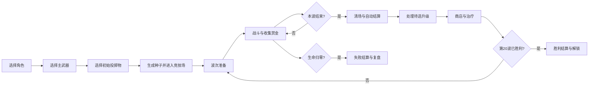
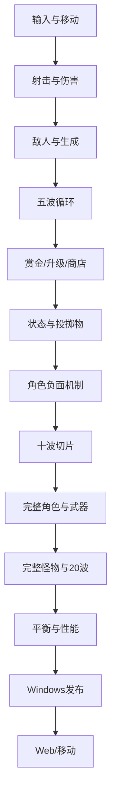

# 《GOGO》完整设计文档合集 v0.1

> 本文件由独立设计文档合并生成；实际维护请优先修改分文件。


<!-- FILE: README_设计文档索引.md -->

# 《GOGO》设计文档包 v0.1

- **项目代号**：GOGO
- **文档版本**：v0.1
- **日期**：2026-07-29
- **定位**：俯视角、手动瞄准、固定竞技场、20 波生存、角色怪癖驱动构筑的动作肉鸽
- **首发目标**：Windows 单机版
- **开发引擎**：Godot 4.x（以项目采用的稳定版本为准）
- **状态**：可用于原型开发与第一轮平衡验证的设计基线

> 本文档包不是“所有数值已经最终平衡”的承诺。标注为“初始值”的内容用于建立可运行原型，必须通过 `10_平衡测试规范.md` 中的流程迭代。

---

## 1. 阅读顺序

| 顺序 | 文档 | 作用 |
|---:|---|---|
| 1 | `00_产品宪法.md` | 决定这款游戏是什么、为什么好玩、哪些内容坚决不做 |
| 2 | `01_核心循环与20波流程.md` | 定义一局从选角到击败最终 Boss 的完整流程 |
| 3 | `02_战斗与枪械系统.md` | 定义移动、瞄准、射击、后坐力、换弹与五把枪 |
| 4 | `03_投掷物与状态系统.md` | 定义烟雾、闪光、手雷、燃烧弹及通用状态规则 |
| 5 | `04_角色与流派设计.md` | 定义五名首发角色、正负天赋、主动能力和三条构筑路线 |
| 6 | `05_技能与奖励池.md` | 定义首发 47 个升级、标签、冲突、保底与奖励生成 |
| 7 | `06_怪物与波次设计.md` | 定义怪物职责、精英词缀、Boss 和 20 波编队 |
| 8 | `07_经济与局外成长.md` | 定义赏金、经验、商店、存钱、解锁与难度 |
| 9 | `08_UI美术音频规范.md` | 定义 HUD、预警、特效、美术边界和声音优先级 |
| 10 | `09_Godot技术架构.md` | 定义数据结构、节点职责、事件流、存档、性能与测试接口 |
| 11 | `10_平衡测试规范.md` | 定义如何判断“好玩、公平、可通关且可重复游玩” |
| 12 | `11_开发里程碑.md` | 定义从灰盒玩具到 Windows 1.0 的开发顺序与阶段门槛 |

---

## 2. 全局统一口径

以下约定在全部文档中具有最高优先级：

1. **肉鸽构筑是主体，战术射击是操作语言，电竞梗是角色题材。**
2. 第一版采用**单主武器制**，不做六武器同时自动攻击。
3. 玩家使用 WASD 移动、鼠标手动瞄准，按住左键按武器射速持续开火。
4. 每局 20 波；普通波限时生存并清场，Boss 波以击杀目标结束。
5. 玩家携带一把主武器和两个投掷物槽位。
6. 枪械首发：USP、Deagle、AK、M4、AWP。名称与外观均视为原型标识，商业发布前单独审查。
7. 角色首发：尼尼、小洞大人、设备、上帝、大表哥。角色必须采用原创外观、经历、台词和队伍设定。
8. 固定大竞技场、镜头跟随玩家，不做多房间探索和随机迷宫。
9. 角色负面天赋必须满足：**可预警、可规避、可构筑缓解、可后期反转**。
10. 局外成长主要解锁内容宽度，不提供大量永久伤害或生命碾压。
11. 一切“最终数值”都要以遥测、盲测和固定种子回归结果为依据。

---

## 3. 文档冲突处理

当不同文档存在冲突时，按以下顺序处理：

1. `00_产品宪法.md`
2. 后编号文档中的专门规则优先于前编号文档中的概述
3. 已通过平衡评审并记录版本号的调整优先
4. 未经记录的临时代码行为不构成设计规则

任何会改变产品支柱、20 波结构、单主武器制或角色负面天赋原则的改动，都需要先更新 `00_产品宪法.md`，再修改其他文档。

---

## 4. 版本记录模板

每份文档后续更新时，在顶部追加：

| 版本 | 日期 | 修改人 | 修改内容 | 影响系统 |
|---|---|---|---|---|
| v0.2 | YYYY-MM-DD | 姓名 | 示例：调整烟雾持续时间 | 投掷物、角色、怪物 |

---

## 5. 给 Codex 的使用方式

不要把整个文档包一次性要求 Codex 全部实现。每次任务只选择一个可验证闭环，例如：

- 实现 `WeaponDef` 数据资源和 AK 的射击、后坐力、换弹；
- 实现 Wave 1～3 的 `WaveDirector` 与生成安全规则；
- 实现烟雾区域、远程锁定延迟和大表哥被动；
- 实现三选一候选池的标签相关性与两次未出现后的保底；
- 实现一组固定种子回归测试。

每个开发任务都必须引用对应文档章节，并写明：

- 允许修改的目录；
- 禁止顺手重构的范围；
- 可观察的验收步骤；
- 失败时需要保留的日志；
- 数据配置与代码逻辑的边界。


<!-- FILE: 00_产品宪法.md -->

# 00｜产品宪法

- **版本**：v0.1
- **状态**：设计基线
- **上游输入**：项目创意与既有讨论
- **下游约束**：其余所有设计、代码、美术、音频与平衡文档

---

## 1. 目标

本文件回答五个根本问题：

1. 《GOGO》到底是什么游戏；
2. 玩家为什么愿意重复游玩；
3. 哪些体验必须被优先保护；
4. 哪些内容第一版明确不做；
5. 当不同系统发生冲突时，如何做取舍。

本文件不是内容清单，而是项目的最高设计约束。任何新增功能都必须证明自己服务至少一个产品支柱，并且没有明显破坏其他支柱。

---

## 2. 一句话产品定义

> 《GOGO》是一款俯视角手动瞄准动作肉鸽：玩家选择一名拥有正负天赋的原创电竞角色，携带一把主武器和两种投掷物，在固定大竞技场中完成 20 波生存，通过后坐力、换弹、烟雾、弱点与敌人行为获得战术射击感，并通过升级、商店、存钱和角色专属模块形成每局不同的构筑。

---

## 3. 产品边界

| 维度 | 基线 |
|---|---|
| 核心类型 | 竞技场生存动作肉鸽 |
| 视角 | 2D 俯视角或 2D 伪三维 |
| 操作 | WASD 移动、鼠标瞄准、手动射击 |
| 模式 | 单人 PvE |
| 单局结构 | 20 波，最终 Boss |
| 单局目标时长 | 约 25～30 分钟，允许因购物和构筑思考而浮动 |
| 地图 | 单个大竞技场，镜头跟随，存在边界但不做探索房间 |
| 装备 | 一把主武器、两个投掷物槽位、一个角色主动能力 |
| 首发角色 | 尼尼、小洞大人、设备、上帝、大表哥 |
| 首发枪械 | USP、Deagle、AK、M4、AWP |
| 首发投掷物 | 手雷、烟雾、闪光、燃烧弹 |
| 首发平台 | Windows |
| 后续平台 | Web、Android、iOS，核心稳定后再适配 |
| 商业边界 | 不使用真实队标、队服、肖像、语音、比赛素材和官方 UI |

---

## 4. 玩家核心幻想

玩家不是在扮演“完全无缺点的超级战士”，而是在扮演一名有明显习惯、怪癖和短板的枪手。

一局中的理想心理变化是：

1. **前期：我知道这个角色哪里难用。**
2. **中期：我找到了一种绕开或利用缺点的方法。**
3. **后期：原本的缺点变成了我的构筑发动机。**

因此角色设计不能只是“正面加成 + 数值减益”。负面天赋必须进入敌人行为、玩家操作和升级选择，最终形成可学习的玩法。

---

## 5. 四个产品支柱

### 5.1 枪械必须改变操作方式

五把枪不能只是不同 DPS。

- USP：稳定、连续命中、弱点标记；
- Deagle：射击节奏、准星恢复、过量伤害；
- AK：高输出、后坐力管理、失控转收益；
- M4：稳定连射、连续命中、压制控制；
- AWP：激光预瞄、蓄力、贯穿、长换弹窗口。

验收问题：

> 遮住武器名字，仅通过操作和反馈，玩家能否辨认正在使用哪一类枪？

### 5.2 构筑必须改变规则，而不只是堆数值

基础属性用于修补短板，关键升级必须改变行为，例如：

- 最后一发产生裁决；
- 过量伤害弹跳；
- 高后坐力转化为弹道宽度和穿透；
- 烟雾结束时爆炸；
- 低血时进入残局协议；
- 假收藏品反向伤害敌人。

验收问题：

> 玩家在第 10 波时，能否用一句话说出“我这局是什么流派”？

### 5.3 角色缺点必须可玩、可学、可反转

所有负面天赋必须满足四条：

1. 触发前有清晰视觉或 UI 提示；
2. 玩家可以通过走位、瞄准、投掷物或目标优先级规避；
3. 至少一个通用升级和一个角色专属模块可以缓解；
4. 至少一条后期路线能把缺点转成收益。

禁止：

- 随机让子弹失效；
- 强制夺取鼠标或角色控制；
- 没有提示地降低属性；
- 只针对某角色生成无法处理的专属怪物。

### 5.4 敌人制造问题，而不是封杀构筑

敌人负责提出问题：

- 谁在压缩空间；
- 谁必须优先击杀；
- 哪个方向不能久留；
- 什么时候不适合换弹；
- 是否值得冒险拾取奖励。

敌人不能通过完全免疫燃烧、暴击、穿透、烟雾等方式废掉一整条构筑。Boss 可以降低硬控制持续时间，但不能让核心系统无效。

---

## 6. 一局的情绪曲线

| 阶段 | 波次 | 目标体验 |
|---|---:|---|
| 建立手感 | 1～4 | 理解枪械、移动、换弹与基础敌人 |
| 第一次成形 | 5～9 | 获得首个关键引擎，开始看见流派 |
| 中期检验 | 10 | 小 Boss 检查单体、走位和资源使用 |
| 构筑扩张 | 11～14 | 两到三个系统开始联动 |
| 强度突破 | 15～19 | 玩家感觉构筑“开始不讲道理”，但仍需正确操作 |
| 最终验证 | 20 | Boss 检验完整构筑，不强行克制强项 |

失败后应让玩家产生：

> “我知道刚才为什么死，而且下一局想换一种做法。”

而不是：

> “系统突然刷了一个专门克制我的东西。”

---

## 7. 明确规则

### 7.1 战斗规则

- 玩家拥有一把主武器，不做随时切换多个枪械。
- 枪械使用无限备弹，弹匣与换弹构成战斗节奏。
- 武器使用射线判定与可见曳光，不依赖高速物理子弹碰撞。
- 按住左键即可按射速连续开火，包括半自动武器；半自动感由低射速、后坐力和音画节奏体现。
- 玩家可以移动中换弹；投掷物和主动能力不打断换弹。
- 普通敌人尽量使用攻击前摇，而不是无提示的纯接触伤害。

### 7.2 构筑规则

- 局内升级由三选一、商店和固定节点奖励共同组成。
- 奖励采用受控随机，不完全定向，也不完全随机。
- 当前角色、武器、已有标签会提高相关升级权重。
- 连续两次奖励未出现相关候选时，下次至少出现一个相关候选。
- 高风险合同总持有上限为 2。
- 不允许出现已失效、前置条件不满足或明确冲突的候选。

### 7.3 资源规则

- 敌人掉落“赏金”。
- 收集赏金同时增加累计经验和可消费钱包。
- 花钱不会降低已经获得的等级进度。
- 波次结束后统一处理升级，再进入商店。
- 局外成长以内容解锁为主，不以永久数值碾压为主。

### 7.4 地图规则

- 第一版只做一个正式竞技场。
- 地图基础几何稳定，变化来自刷怪方向、临时危险区、烟雾和事件插槽。
- 地形不能形成永久无脑绕柱点。
- 屏幕外生成、玩家安全距离和危险预警是硬规则。

---

## 8. 不包含的范围

第一版不做：

- 多房间探索、分叉路线和随机迷宫；
- 多人联机、PvP、排行榜赛季；
- 六把武器同时自动攻击；
- 复杂背包、装备格、武器掉地切换；
- 枪械皮肤交易、开箱和真实经济；
- 大量剧情对话、真人传记和比赛复刻；
- 真实职业选手肖像、真实队伍标志、赞助商与解说音频；
- 动态难度根据玩家当前构筑强行加血；
- 大量永久伤害、生命、暴击等账号成长；
- 为 20 波分别制作 20 种只出现一次的怪物；
- 第一版同时维护 Windows、Web 和手机三套正式版本。

---

## 9. 设计决策优先级

当两个方案冲突时，按以下顺序选择：

1. **操作可读性**
2. **角色与武器的独特玩法**
3. **构筑决策质量**
4. **公平性与可解释失败**
5. **性能与跨平台可维护性**
6. **内容数量**
7. **梗的还原程度**

示例：

- 如果更浓的烟雾更“真实”，但遮住敌人，则选择更透明的烟雾；
- 如果真人梗要求强制抢夺控制权，但会让玩家烦躁，则改成可规避的状态机制；
- 如果增加第三把同时攻击的武器会让画面混乱，则保持单主武器制。

---

## 10. 全局术语

| 术语 | 定义 |
|---|---|
| 一局 / Run | 从选角开始，到死亡或击败第 20 波 Boss 结束 |
| 波次 / Wave | 一段战斗及其结算单位 |
| 赏金 | 敌人掉落资源，同时计入累计经验和钱包 |
| 累计经验 | 本局累计获得的赏金总量，不因消费减少 |
| 钱包 | 当前可用于购物、刷新和角色能力的赏金余额 |
| 标签 | 描述角色、武器、升级和状态关系的统一关键词 |
| 模块 | 角色专属升级 |
| 异变 | 改变具体武器行为的升级 |
| 引擎 | 能持续触发并支撑流派的通用升级 |
| 合同 | 收益高、代价明确、持有数量受限的升级 |
| 弱点命中 | 击中敌人高亮弱点区域或满足弱点时机，不要求像 FPS 一样点击极小头部 |
| 过量伤害 | 最终一击超过目标剩余生命的部分 |
| 背身状态 | 敌人朝向与玩家相反且进入可识别状态，不等同于所有普通背对 |
| 战术区域 | 烟雾或角色能力创建、可触发区域增益的地面区域 |

---

## 11. 数据字段

本文件对应全局 `ProductConfig`，至少包含：

| 字段 | 类型 | 示例 | 说明 |
|---|---|---|---|
| `product_version` | String | `0.1.0` | 设计与存档版本 |
| `wave_count` | int | `20` | 标准模式固定波数 |
| `weapon_slots` | int | `1` | 主武器槽 |
| `throwable_slots` | int | `2` | 投掷物槽 |
| `max_contracts` | int | `2` | 合同持有上限 |
| `base_character_id` | StringName | `char_nini` | 默认测试角色 |
| `default_weapon_id` | StringName | `wpn_ak` | 灰盒默认武器 |
| `first_release_platform` | String | `windows` | 首发平台 |
| `content_manifest_version` | int | `1` | 内容清单兼容版本 |
| `telemetry_schema_version` | int | `1` | 遥测字段版本 |

---

## 12. 与其他系统的接口

| 下游文档 | 本文件提供的约束 |
|---|---|
| 核心循环 | 20 波、单局目标、固定竞技场、结算顺序 |
| 战斗枪械 | 单主武器、手动瞄准、无限备弹、换弹节奏 |
| 投掷物状态 | 两个槽位、烟雾可读性、状态不可完全免疫 |
| 角色 | 正负天赋和可反转原则 |
| 技能池 | 受控随机、标签、合同上限 |
| 怪物波次 | 提问题而非封杀、生成公平性 |
| 经济成长 | 赏金双记账、内容型局外成长 |
| UI 美术音频 | 信息优先于写实、原创化边界 |
| 技术架构 | 数据驱动、固定种子、平台抽象 |
| 平衡测试 | 所有支柱都必须有可观察指标 |
| 开发里程碑 | 先验证操作与五波闭环，再扩内容 |

---

## 13. 可验证的完成标准

本产品宪法通过评审的标准：

- 团队成员能用同一句话描述游戏；
- 团队对“第一版不做什么”没有歧义；
- 每个首发角色都能指出一个正面机制、一个负面机制和一种反转方式；
- 每把首发枪都能说明其独立操作节奏；
- 所有后续文档与本文件不存在结构性冲突；
- 新功能评审时能明确判断其服务哪个产品支柱；
- 不依赖真实选手肖像和真实比赛素材，游戏仍能成立。

---

## 14. 尚未验证的假设

1. 手动瞄准与大量敌人同时存在时不会造成过度疲劳；
2. 单主武器制仍能提供足够的局内变化；
3. 约 25～30 分钟的标准单局适合目标玩家；
4. 玩家愿意接受角色负面天赋，而不是只选择纯正收益角色；
5. 烟雾在俯视角中既能形成战术，又不会影响辨识；
6. 同一赏金同时承担经验和钱包，不会让玩家难以理解；
7. 五把枪、五名角色、47 个升级足以支撑首发重玩性；
8. 原创角色即使脱离电竞梗，也有独立吸引力。

这些假设必须在灰盒、五波闭环和十波垂直切片阶段逐项验证。


<!-- FILE: 01_核心循环与20波流程.md -->

# 01｜核心循环与 20 波流程

- **版本**：v0.1
- **依赖**：`00_产品宪法.md`
- **影响系统**：波次、生成、奖励、商店、UI、存档、遥测

---

## 1. 目标

本文件定义一局游戏从开始到结束的完整状态机，包括：

- 开局选择；
- 战斗波次；
- 波次计时和清场；
- 升级结算；
- 商店与准备；
- 胜利、失败和重试；
- 20 波的教学、压力和构筑节奏。

本文件不详细定义单个怪物数值、武器数值和具体升级效果，它只规定这些系统在一局中的出现顺序和职责。

---


## 明确规则摘要

- 标准模式固定 20 波，第 20 波击败最终 Boss 后胜利；
- 流程顺序固定为：准备 → 战斗 → 清场 → 结算 → 升级 → 商店；
- 战斗中只累计待升级次数，不弹出升级界面；
- 普通波计时结束后停止生成，但必须完成清场；
- 第 3 波解锁第二个投掷物槽；
- 未拾取赏金按 50% 自动结算；
- 固定种子在相同历史选择下必须重现波次、奖励和商店。

## 2. 核心循环



一局必须持续重复以下短循环：

> 进入战斗 → 解决当前压力 → 收集赏金 → 获得构筑选择 → 修补或强化 → 下一波出现更复杂的问题。

---

## 3. 开局流程

### 3.1 标准开局步骤

1. 选择角色；
2. 选择一把已解锁主武器；
3. 从已解锁投掷物中选择一个初始投掷物；
4. 第二个投掷物槽默认锁定，在第 3 波结算时解锁并三选一；
5. 选择难度；
6. 显示本局随机种子；
7. 进入竞技场，开始 5 秒安全准备；
8. 玩家主动点击或按键开始第 1 波。

### 3.2 为什么第二个投掷物第 3 波解锁

- 降低新玩家开局信息量；
- 让前两波专注枪械手感；
- 第 3 波首次出现远程敌人时，投掷物选择变得有意义；
- 形成第一处稳定的局内差异。

### 3.3 开局默认状态

| 项目 | 默认值 |
|---|---:|
| 生命 | 100% |
| 钱包 | 0 |
| 累计经验 | 0 |
| 待处理升级 | 0 |
| 主武器弹匣 | 满 |
| 投掷物充能 | 满 |
| 角色主动能力 | 可用 |
| 复活次数 | 0，教程模式可单独提供 |
| 暂停 | 允许 |

---

## 4. 波次状态机

每一波分为五个状态。

### 4.1 `PREPARE`：准备

- 世界暂停；
- 商店、升级和角色面板可查看；
- 玩家可以调整设置；
- 按“开始下一波”进入战斗；
- 玩家位置重置到最近安全点，但不强制回到地图中心；
- 投掷物充能按规则补满；
- 主武器自动补满弹匣；
- 清除仅持续一波的临时状态。

### 4.2 `ACTIVE`：持续生成

- 波次计时开始；
- `SpawnDirector` 按威胁预算持续生成敌人；
- 玩家战斗并收集赏金；
- 升级不会在战斗中弹窗，达到阈值后只累计“待处理升级”；
- 普通波计时结束后停止新增敌人。

### 4.3 `CLEANUP`：清场

- 停止生成普通敌人；
- 屏幕上保留敌人必须被清理；
- 超过清场软上限时，敌人逐渐失去生成增益，避免拖延；
- Boss 波没有独立计时结束，击败 Boss 才进入结算；
- 若玩家生命归零，立即进入失败。

建议普通波清场软上限为 20 秒。超过后：

- 普通敌人移动速度降低 10%；
- 不再生成支援类技能；
- 地图边缘生成指向剩余敌人的箭头；
- 不直接删除敌人，也不自动造成伤害。

### 4.4 `SETTLEMENT`：战斗结算

按固定顺序处理：

1. 停止敌人 AI 与危险区域；
2. 清除敌方投射物；
3. 未拾取赏金按 50% 价值自动结算；
4. 记录本波遥测；
5. 基础波后恢复 8% 最大生命；
6. 处理角色与升级的波末效果；
7. 计算普通利息；
8. 生成升级候选；
9. 进入升级选择。

### 4.5 `SHOP`：升级和商店

结算顺序不可交换：

1. 依次处理所有待选升级；
2. 第 3 波先处理第二投掷物选择；
3. 打开商店；
4. 玩家购买、治疗、刷新或锁定；
5. 玩家确认开始下一波。

这样可以避免“先看到商店再决定升级”造成信息优势不一致，也便于重放和固定种子回归。

---

## 5. 普通波结束规则

普通波必须同时满足：

- 计时归零；
- 当前主要敌人全部清除；
- 没有仍在执行的致命延迟攻击。

以下对象可以在波末直接清除：

- 不造成伤害的视觉残留；
- 已经失去宿主的弱小召唤物；
- 超出地图且无法返回的异常对象；
- 假收藏品等纯事件对象。

以下对象必须自然结束或明确取消：

- 已经出现预警的爆炸；
- 即将命中的狙击线；
- 玩家主动投出的燃烧区域；
- Boss 阶段技能。

原则：

> 玩家不能因为“波次已经结束”而被无提示伤害，也不能利用结算瞬间免疫一个已经看见的危险。

---

## 6. 胜利与失败

### 6.1 胜利

满足以下条件：

- 第 20 波最终 Boss 生命归零；
- 当前阶段的必杀演出结束；
- 玩家仍存活。

胜利结算展示：

- 角色、武器、投掷物；
- 关键升级与流派标签；
- 总伤害和伤害来源；
- 最高连杀；
- 负面天赋触发与反转次数；
- 各波受伤和死亡风险；
- 解锁内容；
- 随机种子与“使用同一种子重试”。

### 6.2 失败

生命归零立即失败。失败界面必须明确显示：

- 死亡波次；
- 最后一击来源；
- 死亡前 5 秒的主要危险；
- 本局最强三个伤害来源；
- 本局构筑尚缺少的能力标签，仅作为解释，不提供强制推荐；
- 同种子重试与新种子重开。

禁止只显示“你死了”而不给出可学习信息。

---

## 7. 20 波节奏表

> 时长为初始设计值。普通波计时结束后仍需清场。Boss 波使用软狂暴时间，不强制失败。

| 波次 | 主阶段 | 战斗时长 | 新问题或检验 | 固定事件 |
|---:|---|---:|---|---|
| 1 | 枪械入门 | 45 秒 | 移动、射击、换弹 | 只出现基础追踪怪 |
| 2 | 密度入门 | 45 秒 | 小怪群与弹匣效率 | 引入群体小怪 |
| 3 | 远程入门 | 50 秒 | 目标优先级、移动射击 | 解锁第二投掷物 |
| 4 | 冲锋入门 | 50 秒 | 观察前摇、横向躲避 | 引入冲锋怪 |
| 5 | 第一次精英 | 60 秒 | 单体输出和清杂平衡 | 固定精英奖励、首次合同出现 |
| 6 | 正面防御 | 55 秒 | 绕位或穿透 | 引入护盾怪 |
| 7 | 死亡后变化 | 55 秒 | 控制击杀位置 | 引入分裂怪 |
| 8 | 角色弱点 | 55 秒 | 朝向、背身与目标处理 | 引入背身诱饵怪 |
| 9 | 区域压力 | 60 秒 | 不能长期停留 | 引入封区怪 |
| 10 | 中期 Boss | 软狂暴 90 秒 | 单体、换弹、投掷物完整检验 | 首次小 Boss |
| 11 | 支援优先级 | 60 秒 | 后排支援必须优先处理 | 引入维修节点 |
| 12 | 狙击预警 | 60 秒 | 观察激光和路线 | 引入狙击怪 |
| 13 | 诱饵决策 | 60 秒 | 风险奖励与视线管理 | 引入收藏诱饵 |
| 14 | 复杂混合 | 60 秒 | 烟雾、近战和远程并存 | 引入烟幕猎犬或牵引怪 |
| 15 | 精英突击 | 70 秒 | 两种压力同时存在 | 双精英或小 Boss 变体、合同节点 |
| 16 | 成型检验 | 65 秒 | 构筑清场能力 | 高密度混编 |
| 17 | 长短距离夹击 | 65 秒 | 近身威胁与远程预警 | 狙击、冲锋、护盾混编 |
| 18 | 区域管理 | 65 秒 | 地面危险和支援叠加 | 封区、维修、爆破混编 |
| 19 | 最终预演 | 70 秒 | 全能力综合检查 | 高威胁混编，波末补给 |
| 20 | 最终 Boss | 软狂暴 180 秒 | 构筑完整验证 | 三阶段最终 Boss |

---

## 8. 波次奖励节点

| 节点 | 固定奖励 |
|---:|---|
| 每次升级 | 三选一升级 |
| 第 3 波 | 第二投掷物三选一 |
| 第 5 波 | 精英奖励，合同首次进入池 |
| 第 10 波 | 小 Boss 奖励：角色模块或武器异变至少一个 |
| 第 15 波 | 高价值奖励：稀有以上、可出现合同 |
| 第 19 波 | 免费治疗 20% 最大生命或领取 40 赏金，二选一 |
| 第 20 波 | 胜利解锁与统计，不再购物 |

第 19 波的选择用于让低血构筑和经济构筑都拥有合理决策：

- 治疗适合求稳；
- 赏金适合上帝、商店最后强化或低血合同。

---

## 9. 竞技场规则

### 9.1 基础结构

- 大于单屏，镜头跟随玩家；
- 边界存在，不做真正无限地图；
- 中央较开阔，外围提供绕行；
- 固定障碍数量少，且不会形成永久卡怪角；
- 四周设多个生成扇区；
- 地面设置动态事件插槽，但不改变主地形拓扑。

### 9.2 安全规则

- 敌人不得在玩家 420 像素内生成；
- 敌人不得在屏幕中心可见区域直接出现；
- 若所有合法点都不可用，降低本次生成数量，不强行贴脸生成；
- 危险区不得覆盖玩家当前位置后立即生效；
- 同时有效的高伤害预警数量有上限；
- 玩家被包围应主要来自走位和目标处理错误。

### 9.3 位置延续

波末不把玩家强制传送到中心，只进行轻量安全修正：

- 若玩家位于边界危险带，将其移动到最近安全点；
- 若玩家在临时地形内，将其移出；
- 否则保持位置。

这样保留空间策略，同时避免下一波开局即死。

---

## 10. 暂停、重试与随机种子

- 单人模式随时可暂停；
- 升级与商店状态下世界始终暂停；
- 每局生成一个可复制种子；
- 生成、奖励和商店使用分离的随机子流；
- 同种子重试应保持波次编队和奖励候选一致；
- 玩家实时操作不会改变后续商店随机序列；
- 完整战斗物理不承诺跨设备逐帧完全一致，但必须可重现关键生成和奖励。

---

## 11. 不包含的范围

- 波内随机剧情对话；
- 分叉地图选择；
- 限时商店；
- 多人准备倒计时；
- 波内弹出升级卡；
- 战斗中暂停后继续造成时间压力；
- 死亡后付费复活；
- 标准模式无限波次，无尽模式后续独立设计。

---

## 12. 数据字段

### 12.1 `RunConfig`

| 字段 | 类型 | 说明 |
|---|---|---|
| `run_seed` | int | 本局主随机种子 |
| `difficulty_id` | StringName | 难度 |
| `character_id` | StringName | 角色 |
| `weapon_id` | StringName | 主武器 |
| `throwable_ids` | Array[StringName] | 两个投掷物槽 |
| `wave_index` | int | 当前波次，1～20 |
| `run_state` | enum | PREPARE/ACTIVE/CLEANUP/SETTLEMENT/SHOP/END |
| `wallet` | int | 当前可消费赏金 |
| `lifetime_bounty` | int | 本局累计赏金 |
| `pending_levelups` | int | 待处理升级数量 |
| `active_contracts` | Array[StringName] | 当前合同 |
| `elapsed_combat_time` | float | 战斗时间 |
| `elapsed_total_time` | float | 含商店总时间 |

### 12.2 `WavePlan`

| 字段 | 类型 | 说明 |
|---|---|---|
| `wave_id` | StringName | 波次配置 ID |
| `duration_sec` | float | 普通波生成时长 |
| `soft_enrage_sec` | float | Boss 软狂暴 |
| `spawn_profile_id` | StringName | 生成权重 |
| `active_enemy_cap` | int | 同时存活上限 |
| `reward_node` | enum | 普通/精英/Boss/合同 |
| `new_enemy_ids` | Array[StringName] | 首次引入的敌人 |
| `special_rules` | Array[StringName] | 波次特殊规则 |
| `end_heal_ratio` | float | 波末基础治疗 |
| `cleanup_soft_limit_sec` | float | 清场软上限 |

---

## 13. 与其他系统的接口

- `WaveDirector` 向 `SpawnDirector` 提供波次、时间、预算和敌人池；
- `EconomySystem` 接收波末未拾取赏金并按 50% 折算；
- `RewardDirector` 根据待升级数量生成候选；
- `ShopSystem` 在升级完成后开放；
- `CharacterRuntime` 接收波开始、波结束事件；
- `ThrowableController` 在波开始补充充能；
- `TelemetryService` 记录每波生成、伤害、资源和死亡风险；
- `UI` 显示状态、计时、清场和结算顺序；
- `SaveSystem` 只保存局外进度，标准模式不要求中途存档续局；崩溃恢复可后续加入。

---

## 14. 可验证的完成标准

五波核心闭环必须达到：

- 玩家从选角进入第 1 波不超过三个主要界面；
- 波次状态不会重入或跳过；
- 计时结束后停止生成并可正常清场；
- 战斗中升级只累计，不弹窗；
- 波末按固定顺序处理资源、升级、商店；
- 第 3 波正确解锁第二投掷物；
- 死亡界面能显示最后伤害来源；
- 固定种子可重现波次和奖励；
- 连玩三局不会出现无法进入下一波或残留敌人阻塞；
- 新玩家能在没有开发者讲解的情况下完成一局五波原型。

完整 20 波版本必须达到：

- 20 波均有独立教学或检验目的；
- 第 5、10、15、20 波形成明显强度节点；
- 没有单个普通波成为无解释的难度断层；
- 第 20 波胜利结算可稳定触发；
- 失败后能清楚识别主要原因。

---

## 15. 尚未验证的假设

1. 升级全部放到波末，不会让玩家觉得成长反馈太晚；
2. 普通波计时加清场比纯击杀制更适合构筑差异；
3. 未拾取赏金 50% 自动结算能兼顾拾取风险和减少挫败；
4. 第 3 波再开放第二投掷物不会让前两波过于单调；
5. 第 19 波治疗或赏金二选一不会形成固定最优；
6. 20 波的教学密度足够，但不会频繁引入新机制导致疲劳；
7. 软狂暴足以限制 Boss 拖延，不需要硬计时失败。


<!-- FILE: 02_战斗与枪械系统.md -->

# 02｜战斗与枪械系统

- **版本**：v0.1
- **依赖**：`00_产品宪法.md`、`01_核心循环与20波流程.md`
- **影响系统**：角色、技能、怪物、UI、音频、技术架构、平衡

---

## 1. 目标

本文件定义玩家每秒都在使用的基础操作：

- 移动和瞄准；
- 射击与命中；
- 后坐力、散布和稳定；
- 弱点、暴击、穿透、过量伤害；
- 弹匣与换弹；
- 五把首发枪的差异；
- 伤害结算的统一顺序。

最重要的目标不是还原真实枪械，而是让每把枪产生不同的操作节奏和构筑方向。

---


## 明确规则摘要

- 玩家只携带一把主武器，WASD 移动、鼠标手动瞄准；
- 五把枪均使用射线命中与可见曳光，投掷物使用飞行轨迹；
- 备弹无限，弹匣、后坐力和换弹构成战斗节奏；
- 按住左键按武器射速持续开火，半自动感由射速和后坐力表达；
- 准星、激光与真实判定必须一致；
- 伤害统一经过弱点/暴击、穿透、护甲和目标修正管线；
- 枪械差异必须体现在操作与构筑，不只体现在 DPS。

## 2. 操作映射

| 行为 | 键鼠默认 | 说明 |
|---|---|---|
| 移动 | WASD | 八方向模拟输入，归一化速度 |
| 瞄准 | 鼠标位置 | 枪口朝向鼠标世界坐标 |
| 射击 | 鼠标左键 | 按住后按武器射速连续触发 |
| 角色主动能力 | 鼠标右键 | 每个角色一个主动能力 |
| 换弹 | R | 弹匣未满时可启动 |
| 投掷物 1 | Q | 按下后立即投向鼠标；可选按住预览 |
| 投掷物 2 | E | 同上 |
| 构筑面板 | Tab | 战斗中只查看，不修改 |
| 暂停 | Esc | 单人模式暂停 |

辅助选项：

- 空仓自动换弹；
- 按住或切换式持续射击；
- 投掷物轨迹预览开关；
- 轻度瞄准吸附，仅作用于弱点附近，不自动转身；
- 屏幕震动强度；
- 伤害数字开关。

---

## 3. 玩家基础战斗属性

以下为灰盒原型初始值。

| 属性 | 初始值 | 说明 |
|---|---:|---|
| 最大生命 | 100 | 归零失败 |
| 移动速度 | 300 px/s | 参考分辨率下的设计值 |
| 护甲 | 0 | 正值减伤，负值增伤 |
| 暴击率 | 5% | 部分弱点与技能独立计算 |
| 暴击倍率 | 1.75 倍 | 可被技能修改 |
| 拾取半径 | 96 px | 赏金自动吸附 |
| 受击无敌 | 0.35 秒 | 防止重叠瞬间多段伤害 |
| 基础击退抗性 | 0 | 角色与技能可增加 |
| 基础弱点倍率 | 由武器定义 | 不同武器不同 |
| 生命恢复 | 0/秒 | 基础不自动恢复 |

---

## 4. 射击判定

### 4.1 枪械采用射线判定

USP、Deagle、AK、M4、AWP 均使用即时射线命中，画面生成短寿命曳光。

原因：

- 避免高速子弹穿透碰撞体；
- 便于精确实现穿透、弹跳和弱点；
- 同屏大量射击时性能稳定；
- 固定种子回归更容易；
- 仍可通过曳光、枪口火焰和命中延迟模拟弹道感。

投掷物仍使用真实飞行轨迹。

### 4.2 命中流程

每次有效射击按以下顺序：

1. 检查射速冷却；
2. 检查弹匣；
3. 读取当前瞄准方向；
4. 计算后坐力偏移和散布角；
5. 生成射线；
6. 收集按距离排序的碰撞目标；
7. 判断弱点、护盾、穿透和特殊标签；
8. 计算伤害；
9. 触发命中、击杀、过量伤害事件；
10. 扣除弹药并增加后坐力；
11. 播放音画反馈。

禁止让视觉曳光与真实判定方向明显不一致。

---

## 5. 后坐力与散布

### 5.1 两个独立概念

- **散布**：子弹在准星锥形范围内的随机偏差；
- **后坐力**：连续射击累积的枪线偏移和散布放大。

玩家 UI 显示：

- 准星开合代表散布；
- 枪线轻微偏转代表后坐力方向；
- AK 与 M4 的偏转模式不同；
- AWP 使用激光稳定度，不使用普通准星开合。

### 5.2 后坐力值

每把枪拥有 0～100 的后坐力值：

- 射击增加后坐力；
- 停止射击后按恢复速度下降；
- 移动会提高最低散布，但不会直接增加后坐力；
- 换弹期间后坐力继续恢复；
- “稳定状态”定义为后坐力小于 20。

建议计算：

```text
最终散布角 =
基础散布
× 移动修正
× (1 + 后坐力值 / 100 × 后坐力散布系数)
× 状态修正
```

### 5.3 可控而非惩罚

- 不采用需要背诵的固定 FPS 压枪图；
- 后坐力偏移必须在枪线或准星中可见；
- AK 的高后坐力可以通过升级转为收益；
- M4 强调稳定连续命中；
- Deagle 强调等待恢复；
- AWP 强调保持激光稳定。

---

## 6. 换弹规则

- 无限备弹；
- 弹匣未满可手动换弹；
- 空仓可按设置自动换弹；
- 换弹时允许移动；
- 投掷物和角色主动能力不打断换弹；
- 若弹匣仍有子弹，按射击可取消换弹，取消不获得新子弹；
- 空仓换弹不能通过射击取消；
- 受击不打断换弹；
- 控制效果可以延缓但不重置换弹；
- 换弹完成触发统一 `reload_completed` 事件；
- 部分升级根据“本次实际补充子弹数量”计算效果。

换弹时间修正采用乘法，并设置下限：

```text
最终换弹时间 = 基础换弹时间 × 所有换弹时间倍率
最低不小于基础值的 35%
```

---

## 7. 伤害模型

### 7.1 伤害结算顺序

```text
基础伤害
→ 加法伤害增益
→ 武器/角色/距离乘区
→ 弱点或暴击倍率
→ 穿透序号修正
→ 敌人护甲
→ 敌人受到伤害修正
→ 最终取整
```

建议公式：

```text
raw = base_damage × (1 + additive_damage)
raw *= weapon_multiplier
raw *= conditional_multipliers
raw *= weakpoint_or_crit_multiplier
raw *= penetration_multiplier
final = apply_armor(raw, target_armor)
final *= target_incoming_damage_multiplier
```

同一次命中若同时满足弱点和暴击：

- 基础规则只取较高倍率；
- 特殊升级可以允许两者相乘；
- 避免前期伤害爆炸和理解困难。

### 7.2 护甲

正护甲：

```text
伤害倍率 = 100 / (100 + 护甲)
```

负护甲：

```text
伤害倍率 = 2 - 100 / (100 - 护甲)
```

护甲建议限制在 -50～200，防止异常数值。

### 7.3 弱点

弱点不是极小头部像素，而是：

- 敌人明确高亮的核心区域；
- 某动作前摇中短暂暴露的区域；
- 闪光、标记或角色能力制造的弱点窗口。

弱点必须满足：

- 颜色和轮廓清晰；
- 鼠标玩家能主动瞄准；
- 手柄和触屏拥有适度辅助；
- 体型较小的怪物可直接把全身视为普通命中，不强制精确点击。

### 7.4 过量伤害

```text
过量伤害 = 最终一击伤害 - 目标命中前剩余生命
```

仅当目标死亡时产生，可被 Deagle、尼尼和部分升级利用。

### 7.5 穿透

- 穿透数表示子弹在首个目标后还能命中几个目标；
- 默认每次穿透伤害衰减 20%；
- AWP 默认穿透 3；
- 护盾和特殊障碍可消耗额外穿透次数；
- `贯穿计分` 等升级可逆转衰减或产生增幅。

---

## 8. 五把首发枪

> 以下均为原型初始值，需通过固定种子与真人测试调整。

| 属性 | USP | Deagle | AK | M4 | AWP |
|---|---:|---:|---:|---:|---:|
| 类型 | 手枪 | 手枪 | 步枪 | 步枪 | 狙击 |
| 单发伤害 | 18 | 58 | 24 | 20 | 175 |
| 射速 | 4.5 发/秒 | 1.5 发/秒 | 8.5 发/秒 | 9.2 发/秒 | 0.70 发/秒 |
| 弹匣 | 12 | 7 | 30 | 30 | 5 |
| 换弹 | 1.25 秒 | 1.75 秒 | 2.20 秒 | 2.00 秒 | 2.70 秒 |
| 基础散布 | 1.2° | 0.8° | 1.4° | 1.1° | 0.15° |
| 移动散布增加 | +0.6° | +1.0° | +1.3° | +0.9° | 稳定度下降 |
| 单发后坐力 | 8 | 34 | 9 | 6 | 100 后重置 |
| 后坐力恢复 | 55/秒 | 85/秒 | 38/秒 | 52/秒 | 激光恢复 0.55 秒 |
| 弱点倍率 | 1.60 | 2.00 | 1.50 | 1.50 | 2.20 |
| 默认穿透 | 0 | 0 | 0 | 0 | 3 |
| 有效射程 | 1300 px | 1500 px | 1400 px | 1400 px | 2200 px |

### 8.1 USP：稳定弱点流

操作承诺：

- 允许持续移动射击；
- 后坐力低；
- 连续命中容易；
- 单发爆发不高，但能稳定触发标记和弱点引擎。

主要构筑标签：

`手枪`、`精准`、`连续命中`、`标记`、`空仓`

不应成为：

- 比 Deagle 更强的一发流；
- 比 M4 更强的无脑持续输出；
- 纯新手武器而没有后期上限。

### 8.2 Deagle：节奏与过量伤害

操作承诺：

- 射击后需要短暂恢复；
- 单发声音、屏幕反馈和击杀感最强；
- 对低血目标产生大量过量伤害；
- 适合尼尼的精准与背身反转路线。

主要标签：

`手枪`、`单发`、`过量伤害`、`暴击`、`最后一发`

### 8.3 AK：高输出与后坐力管理

操作承诺：

- 前几发较准；
- 连射后后坐力迅速上升；
- 玩家可选择停火恢复，或通过构筑把高后坐力转成收益；
- 适合小洞大人的进攻和连杀路线。

主要标签：

`步枪`、`连射`、`后坐力`、`穿透`、`击杀链`

### 8.4 M4：稳定压制

操作承诺：

- 连射稳定；
- 单发伤害低于 AK；
- 更容易维持连续命中；
- 适合标记、减速、烟雾堡垒和大表哥。

主要标签：

`步枪`、`连续命中`、`压制`、`控制`、`烟雾`

### 8.5 AWP：激光、蓄力与贯穿

- 不做右键开镜；
- 持续显示激光；
- 激光指向真实判定方向；
- 移动和快速转向会降低稳定度；
- 停稳后可触发蓄力升级；
- 射击后激光中断 0.55 秒；
- 默认贯穿 3 个目标；
- 近距离容错低，但不附加人为最短射程惩罚。

主要标签：

`狙击`、`单发`、`激光`、`蓄力`、`穿透`、`换弹`

---

## 9. 枪械反馈规范

每把枪必须具有独立反馈组合：

| 反馈 | USP | Deagle | AK | M4 | AWP |
|---|---|---|---|---|---|
| 枪声 | 短、清晰 | 低频重击 | 粗糙连续 | 紧密连续 | 极强单发 |
| 枪口火焰 | 小 | 大 | 中高 | 中 | 长线冲击 |
| 屏幕震动 | 极低 | 中 | 低持续 | 极低持续 | 中高 |
| 准星变化 | 轻微 | 明显开合 | 快速膨胀 | 缓慢膨胀 | 激光断续 |
| 命中反馈 | 连续点击 | 重击与过量提示 | 密集伤害 | 压制层数 | 穿透计数 |

屏幕震动必须可关闭，不能用大幅镜头晃动代替枪械手感。

---

## 10. 不包含的范围

- 真实弹药储备和拾取；
- 武器耐久；
- 蹲下、趴下、跳跃；
- 右键开镜；
- 武器切换与副武器；
- 真实弹道下坠；
- 复杂命中部位伤残；
- 玩家友军伤害；
- 隐藏后坐力数值；
- 每把枪十几种配件槽。

---

## 11. 数据字段

### 11.1 `WeaponDef`

| 字段 | 类型 | 说明 |
|---|---|---|
| `id` | StringName | 唯一 ID |
| `display_name` | String | 显示名 |
| `weapon_tags` | Array[StringName] | 手枪、步枪、狙击等 |
| `fire_mode` | enum | SEMI/AUTO |
| `base_damage` | float | 基础伤害 |
| `shots_per_sec` | float | 射速 |
| `magazine_size` | int | 弹匣 |
| `reload_sec` | float | 换弹 |
| `base_spread_deg` | float | 基础散布 |
| `move_spread_deg` | float | 移动增加 |
| `recoil_per_shot` | float | 单发后坐力 |
| `recoil_recovery_per_sec` | float | 恢复 |
| `recoil_pattern_id` | StringName | 偏移模式 |
| `weakpoint_multiplier` | float | 弱点倍率 |
| `crit_multiplier` | float | 暴击倍率覆盖值 |
| `pierce_count` | int | 默认穿透 |
| `pierce_decay` | float | 每次穿透衰减 |
| `max_range_px` | float | 射程 |
| `hitscan_width_px` | float | 射线宽度 |
| `audio_profile_id` | StringName | 音频配置 |
| `vfx_profile_id` | StringName | 特效配置 |

### 11.2 `WeaponRuntime`

| 字段 | 类型 | 说明 |
|---|---|---|
| `ammo_in_mag` | int | 当前弹药 |
| `recoil_value` | float | 0～100 |
| `fire_cooldown` | float | 射速冷却 |
| `reload_progress` | float | 换弹进度 |
| `is_reloading` | bool | 是否换弹 |
| `stable_time` | float | 连续稳定时间 |
| `consecutive_hits` | int | 连续命中 |
| `last_target_id` | int | 连续命中目标 |
| `shots_fired_this_mag` | int | 本弹匣发数 |
| `kills_this_mag` | int | 本弹匣击杀 |
| `temporary_modifiers` | Dictionary | 局内升级运行修正 |

---

## 12. 与其他系统的接口

- `CharacterRuntime` 提供角色伤害、后坐力、弱点和主动能力修正；
- `UpgradeSystem` 通过统一 Modifier 与 EffectExecutor 修改武器，不直接改脚本常量；
- `StatusSystem` 提供暴露、燃烧、烟雾等目标状态；
- `EnemyRuntime` 提供护甲、弱点碰撞体、盾牌和受击事件；
- `UI` 读取弹匣、换弹、后坐力和 AWP 激光稳定度；
- `AudioSystem` 读取武器事件而非轮询状态；
- `TelemetryService` 记录射击数、命中数、弱点、过量伤害、换弹中受伤等；
- `BalanceHarness` 可在不加载完整美术的情况下运行 DPS 与穿透测试。

---

## 13. 可验证的完成标准

灰盒战斗玩具通过标准：

- 五把枪仅凭操作能明显区分；
- 射线判定、曳光与激光方向一致；
- 按住左键不会超出武器射速；
- 移动、后坐力和恢复会正确改变散布；
- 换弹可取消规则稳定，无重复加弹；
- AWP 穿透按目标顺序结算；
- 过量伤害值可被正确记录；
- 护甲公式在边界值不产生负伤害或异常；
- 60 FPS 下连续射击不会造成明显卡顿；
- 玩家能理解自己为什么打偏，而不是感觉随机失灵。

十波垂直切片通过标准：

- 至少三把枪各有一条可识别构筑；
- 没有一把枪在所有测试场景都占优；
- 半自动按住射击不会造成手指疲劳；
- 后坐力升级会改变操作，而不是只改面板；
- 枪声和命中反馈足以在混战中辨认关键事件。

---

## 14. 尚未验证的假设

1. 射线判定仍能提供足够的“子弹感”；
2. 按住左键的半自动不会削弱 Deagle 的节奏；
3. 无限备弹不会让换弹和弹匣升级失去意义；
4. 弱点区域在大量敌人中仍清晰可见；
5. AWP 激光不会与敌方狙击激光混淆；
6. AK 的可视后坐力足够让玩家主动控枪；
7. M4 的稳定优势不会简单等同于“更容易但更无聊”；
8. 同时存在弱点与暴击时默认取较高倍率，玩家能够理解。


<!-- FILE: 03_投掷物与状态系统.md -->

# 03｜投掷物与状态系统

- **版本**：v0.1
- **依赖**：`00_产品宪法.md`、`01_核心循环与20波流程.md`、`02_战斗与枪械系统.md`
- **影响系统**：角色、技能、怪物、UI、特效、音频、性能

---

## 1. 目标

本文件定义：

- 两个投掷物槽的使用和补充；
- 手雷、烟雾、闪光、燃烧弹的基础功能；
- 轨迹、爆炸和区域效果；
- 状态分类、叠加、刷新、抵抗和清除；
- 烟雾在俯视角中的可读性；
- Boss 不完全免疫控制的统一规则。

投掷物的职责不是补充四种伤害按钮，而是提供四种不同决策：

- 手雷：现在清除一片；
- 烟雾：把一块区域变成对我有利；
- 闪光：打断并制造弱点窗口；
- 燃烧弹：限制路线并持续消耗。

---


## 明确规则摘要

- 玩家最多携带两个投掷物槽；
- 投掷物按“每波充能”管理，波内不靠等待自然恢复；
- 手雷负责瞬间清场，烟雾负责战术区域，闪光负责打断与暴露，燃烧弹负责封路与持续伤害；
- 烟雾不遮住玩家、敌人轮廓和危险预警；
- 玩家不会被闪光白屏；
- Boss 对硬控制采用转换或缩短，不完全免疫；
- 所有状态使用统一叠加、刷新、移除和事件规则。

## 2. 槽位与充能

- 玩家拥有两个投掷物槽；
- 开局选择一个，第 3 波解锁第二个；
- 两个槽可以选择相同类型，默认内容池允许重复，但 UI 必须提示；
- 每种投掷物有独立最大充能；
- 每波开始补满至最大充能；
- 未使用充能不跨波额外累积；
- 局内升级可以增加最大充能或波内返还；
- 战斗中不使用时间自然冷却恢复，避免玩家拖时间等技能。

这一规则让投掷物成为“每波战术预算”，而不是无限循环技能。

---

## 3. 投掷操作

默认：

- 按 Q/E 立即投向鼠标世界位置；
- 目标距离超过最大投掷距离时，落点限制在最大距离；
- 可在设置中启用“按住显示轨迹、松开投掷”；
- 投掷期间玩家仍可移动；
- 投掷不打断换弹；
- 同一输入只消耗一次充能；
- 投掷物落点必须显示短暂地面标识。

轨迹必须考虑：

- 地图边界；
- 固定障碍；
- 是否允许越过低矮障碍；
- 落点不可到达时的最近合法位置。

第一版统一允许四种投掷物越过低矮障碍，不做复杂弹道高度差。

---

## 4. 四种投掷物基础数值

> 初始值用于灰盒和首轮平衡。

| 属性 | 手雷 | 烟雾 | 闪光 | 燃烧弹 |
|---|---:|---:|---:|---:|
| 基础最大充能 | 1 | 1 | 1 | 1 |
| 最大投掷距离 | 720 px | 700 px | 720 px | 680 px |
| 生效延迟 | 0.90 秒 | 0.60 秒 | 0.70 秒 | 0.50 秒 |
| 效果半径 | 180 px | 230 px | 260 px | 190 px |
| 基础持续 | 瞬间 | 7.0 秒 | 1.2 秒控制 | 6.0 秒 |
| 基础伤害 | 中心 90 / 边缘 45 | 0 | 0 | 18/秒 |
| 主要标签 | 爆炸、击退、破甲 | 烟雾、区域、保护 | 控制、暴露、打断 | 燃烧、区域、持续伤害 |

---

## 5. 手雷

### 5.1 基础行为

- 落地后 0.9 秒爆炸；
- 中心伤害高，边缘线性衰减；
- 对普通敌人产生击退；
- 对护盾正面造成额外 50% 盾值伤害；
- 可打断冲锋准备和支援施法；
- 不伤害玩家。

### 5.2 设计用途

- 处理小怪群；
- 在换弹窗口制造安全空间；
- 破坏护盾阵型；
- 引爆爆破球；
- 与聚怪、烟雾爆炸和过量伤害组合。

### 5.3 禁止行为

- 不允许无限连锁眩晕 Boss；
- 不做真实碎片随机方向导致不可解释伤害；
- 不把中心点做成必须像素级精准才能有效。

---

## 6. 烟雾

### 6.1 基础行为

烟雾生成半透明战术区域，基础持续 7 秒。

敌方远程单位对烟内玩家：

- 锁定时间增加 60%；
- 射击散布增加 35%；
- 已经完成预警的攻击不会被立刻取消；
- 不会完全失去玩家，避免 AI 发呆。

玩家与敌人在烟内：

- 始终显示轮廓；
- 地面危险边界仍可见；
- 玩家自己的准星、激光和曳光不被遮挡；
- 多个烟雾重叠时不继续增加遮挡浓度。

### 6.2 烟雾叠加

- 同来源烟雾重叠：持续时间取较长者，不叠加远程减益；
- 不同来源烟雾重叠：区域标签同时存在，但相同数值效果取最高值；
- 大表哥的角色增益可以叠加在基础烟雾规则上；
- 烟雾结束时统一触发 `area_expired`，供爆烟升级使用。

### 6.3 烟雾与敌人

- 远程敌人受影响；
- 近战敌人仍能进入烟雾；
- 烟幕猎犬在烟中获得轻微追踪优势，但不会免疫玩家烟中增益；
- Boss 的锁定时间修正减半，但仍有效。

### 6.4 可读性硬规则

- 默认视觉不透明度不超过 35%；
- 角色轮廓优先级高于烟雾；
- 烟雾边界有细线；
- 敌方狙击激光在烟内仍可见，但亮度降低；
- 色盲模式不依赖单一绿色或灰色表达。

---

## 7. 闪光

### 7.1 基础行为

普通敌人受到：

- 1.2 秒眩晕；
- 打断当前蓄力和冲锋；
- 强制转向混乱；
- 3 秒“暴露”状态，受到伤害 +15%。

精英敌人：

- 眩晕持续 60%；
- 暴露完整持续。

Boss：

- 不进入完全眩晕；
- 当前蓄力延后 0.4 秒；
- 暴露持续 1.5 秒，受到伤害 +8%。

### 7.2 玩家反馈

闪光不让玩家屏幕变白。反馈通过：

- 敌人头顶闪光图标；
- 轮廓短暂高亮；
- 动作停止；
- 弱点区域出现；
- 清晰的打断声音。

---

## 8. 燃烧弹

### 8.1 基础行为

- 落地生成持续 6 秒的燃烧区域；
- 每 0.5 秒造成一次伤害；
- 敌人离开区域后保留 2 秒燃烧状态；
- 同一来源的地面燃烧不重复叠加伤害，刷新持续；
- 不同来源最多叠加 3 层燃烧；
- 对玩家无伤害，但视觉必须避免误判。

### 8.2 设计用途

- 封锁狭窄路线；
- 处理慢速高血怪；
- 配合聚怪和分裂怪；
- 触发暴击回火、燃尽扩散；
- 迫使玩家决定“现在烧群怪还是留给精英”。

---

## 9. 状态分类

| 类型 | 定义 | 示例 |
|---|---|---|
| `BUFF` | 对目标有利的持续修正 | 热手、烟中堡垒 |
| `DEBUFF` | 对目标不利的持续修正 | 暴露、减速 |
| `DOT` | 持续伤害 | 燃烧 |
| `HARD_CC` | 阻止行动 | 眩晕 |
| `SOFT_CC` | 限制但不完全阻止 | 减速、牵引 |
| `AREA_TAG` | 由区域提供的上下文 | 在烟中、在火区 |
| `BEHAVIOR_TAG` | 描述 AI 或朝向状态 | 背身、蓄力、诱饵可见 |
| `MARK` | 可被系统消耗的层数 | 弱点标记、收藏层数 |
| `SHIELD` | 先于生命承受伤害 | 临时护盾 |

---

## 10. 状态叠加规则

每个 `StatusDef` 必须选择一种叠加模式。

| 模式 | 规则 | 适用 |
|---|---|---|
| `UNIQUE_REFRESH` | 不增加层数，刷新持续 | 暴露、烟中 |
| `STACK_ADD` | 增加层数并有上限 | 燃烧、标记 |
| `STRONGEST_ONLY` | 同类只取数值最高 | 减速、远程散布 |
| `INDEPENDENT_SOURCE` | 不同来源分别计时 | 部分持续伤害 |
| `REPLACE_IF_STRONGER` | 新效果更强才替换 | 护盾、临时加速 |
| `CONSUMABLE_MARK` | 达层数后被事件消耗 | 弱点追猎 |

统一限制：

- 移速减慢总上限 60%；
- 玩家换弹减速总上限 65%；
- 普通敌人硬控连续保护 0.5 秒；
- Boss 硬控转换为延后或打断，不完全冻结；
- 同一帧重复应用状态必须合并，避免多次事件风暴。

---

## 11. 关键状态定义

| 状态 | 基础规则 | 清除方式 |
|---|---|---|
| `burning` | 持续伤害，最多 3 层 | 时间结束、特殊净化 |
| `flashed` | 普通敌人眩晕 | 时间结束 |
| `exposed` | 受到伤害增加 | 时间结束 |
| `slowed` | 取最高减速值 | 时间结束或离开区域 |
| `staggered` | 短暂打断，不等于眩晕 | 动画结束 |
| `in_smoke` | 区域标签 | 离开区域 |
| `marked` | 层数标记 | 达条件被消耗 |
| `back_facing` | 敌人进入明确背身行为 | 转向、闪光、角色能力 |
| `lure_visible` | 诱饵处于角色视野 | 遮挡、摧毁、鉴定 |
| `shielded` | 先吸收伤害或减伤 | 盾值归零、绕后 |
| `invulnerable` | 短时无敌，仅阶段切换 | 时间或动画结束 |

---

## 12. 状态事件接口

统一事件：

```text
status_requested
status_applied
status_refreshed
status_stack_changed
status_resisted
status_removed
area_entered
area_exited
area_expired
hard_cc_converted
```

任何技能不得绕过状态系统直接在目标脚本中写死计时器。

---

## 13. 不包含的范围

- 玩家被闪光白屏；
- 真实烟雾遮挡到看不见敌人；
- 毒、冰冻、电击等更多元素；
- 投掷物库存和跨局消耗；
- 友军伤害；
- 投掷物落地拾回；
- 复杂反弹物理；
- Boss 对核心状态完全免疫；
- 状态无限叠层；
- 战斗中自然冷却无限恢复投掷物。

---

## 14. 数据字段

### 14.1 `ThrowableDef`

| 字段 | 类型 | 说明 |
|---|---|---|
| `id` | StringName | 唯一 ID |
| `display_name` | String | 显示名 |
| `tags` | Array[StringName] | 爆炸、烟雾等 |
| `max_charges` | int | 基础最大充能 |
| `throw_range_px` | float | 最大距离 |
| `travel_speed` | float | 飞行速度 |
| `fuse_sec` | float | 生效延迟 |
| `effect_radius_px` | float | 半径 |
| `base_damage` | float | 基础伤害 |
| `duration_sec` | float | 区域或控制持续 |
| `status_payloads` | Array[Resource] | 应用状态 |
| `area_effect_id` | StringName | 区域配置 |
| `vfx_profile_id` | StringName | 特效 |
| `audio_profile_id` | StringName | 音频 |

### 14.2 `StatusDef`

| 字段 | 类型 | 说明 |
|---|---|---|
| `id` | StringName | 状态 ID |
| `category` | enum | BUFF/DEBUFF/DOT 等 |
| `stack_mode` | enum | 叠加模式 |
| `max_stacks` | int | 最大层数 |
| `base_duration_sec` | float | 持续 |
| `tick_interval_sec` | float | DOT 间隔 |
| `magnitude` | float | 主数值 |
| `boss_conversion_id` | StringName | Boss 转换规则 |
| `dispel_tags` | Array[StringName] | 可清除标签 |
| `ui_priority` | int | HUD 优先级 |
| `vfx_profile_id` | StringName | 视觉 |
| `audio_on_apply` | StringName | 施加声音 |

### 14.3 `AreaEffectDef`

| 字段 | 类型 | 说明 |
|---|---|---|
| `shape` | enum | CIRCLE/CONE/RECT |
| `radius_px` | float | 半径 |
| `duration_sec` | float | 持续 |
| `tick_interval_sec` | float | 更新间隔 |
| `ally_statuses` | Array | 对玩家作用 |
| `enemy_statuses` | Array | 对敌作用 |
| `overlap_policy` | enum | 重叠规则 |
| `max_instances_per_owner` | int | 单来源上限 |

---

## 15. 与其他系统的接口

- `ThrowableController` 管理槽位、充能与投掷；
- `ProjectileArc` 只负责飞行和落点，不直接写伤害逻辑；
- `AreaEffectSystem` 管理烟雾和火区；
- `StatusSystem` 管理所有持续状态；
- `EnemyAI` 读取状态标签调整行为；
- `CharacterRuntime` 读取 `in_smoke`、`lure_visible` 等上下文；
- `UpgradeSystem` 修改 `ThrowableDef` 的运行参数或监听状态事件；
- `UI` 显示充能、轨迹、区域边界和高优先级状态；
- `TelemetryService` 记录命中敌人数、控制时间、烟中时间和充能浪费。

---

## 16. 可验证的完成标准

- 两个槽位独立消费和补充；
- 投掷不打断换弹；
- 落点限制和边界处理无异常；
- 手雷伤害随距离衰减；
- 烟雾确实延长敌方锁定并增加散布；
- 烟雾内玩家和危险预警仍清晰；
- 闪光可打断普通敌人，Boss 转换规则正确；
- 燃烧叠层、刷新和扩散不重复无限触发；
- 状态移除后所有属性恢复；
- 同类减速、烟雾和伤害区重叠符合规则；
- 高密度场景下区域检测不造成明显性能下降；
- 大表哥不依赖写死角色判断即可从烟雾标签获得增益。

---

## 17. 尚未验证的假设

1. 每波补满充能比时间冷却更适合 20 波节奏；
2. 每槽基础只有 1 次不会导致玩家舍不得使用；
3. 烟雾 35% 不透明度既有氛围又不影响阅读；
4. 闪光转化为敌人控制而非玩家白屏能保留主题感；
5. Boss 使用控制转换而非免疫不会被无限打断；
6. 燃烧区域对大量敌人的持续检测可满足性能预算；
7. 两个相同投掷物槽不会成为明显最优；
8. 投掷物不打断换弹不会让换弹窗口过于安全。


<!-- FILE: 04_角色与流派设计.md -->

# 04｜角色与流派设计

- **版本**：v0.1
- **依赖**：`00_产品宪法.md`、`02_战斗与枪械系统.md`、`03_投掷物与状态系统.md`
- **影响系统**：技能池、怪物行为、UI、音频、局外解锁、遥测

---

## 1. 目标

本文件定义五名首发角色：

- 尼尼；
- 小洞大人；
- 设备；
- 上帝；
- 大表哥。

每名角色都必须拥有：

1. 一句清晰的玩法承诺；
2. 一个持续生效的核心天赋；
3. 一个可预警、可规避的负面天赋；
4. 一个右键主动能力；
5. 三条构筑路线；
6. 三个首发角色专属模块，每个模块锚定一条路线；
7. 与武器、投掷物和敌人状态的明确接口。

首发版本每名角色先提供三个专属模块，而不是每条路线四个模块。路线的完整构筑由角色模块、武器异变和通用引擎共同完成，避免首发内容量失控。

---


## 明确规则摘要

- 每名角色必须具备核心天赋、负面天赋、主动能力和三条路线；
- 负面天赋必须可预警、可操作规避、可升级缓解并可后期反转；
- 首发每名角色只做三个专属模块，完整路线由通用引擎和武器异变补足；
- 推荐武器提高相关性，但不禁止非推荐武器；
- 怪物只提供通用行为标签，不在 AI 中判断具体角色 ID；
- 不使用随机吞弹、强制移动或抢夺准星表达角色缺点；
- 角色外观、背景、语音和队伍设定全部原创。

## 2. 统一角色模板

### 2.1 设计字段

| 字段 | 说明 |
|---|---|
| 核心幻想 | 玩家为什么选择这个角色 |
| 操作节奏 | 玩家每几秒关注什么 |
| 核心天赋 | 正面规则变化 |
| 负面天赋 | 敌人如何利用角色短板 |
| 主动能力 | 玩家主动处理短板或创造爆发窗口 |
| 偏好标签 | 奖励系统提高权重，但不强制绑定 |
| 三条路线 | 至少两条能稳定通关，一条可高风险高收益 |
| 反挫败机制 | 防止负面天赋变成随机惩罚 |
| 遥测指标 | 判断角色是否成立 |

### 2.2 角色基础原则

- 不锁死武器，除非角色机制无法脱离该武器成立；
- 偏好武器通过标签权重、被动和模块形成，而不是直接禁止其他武器；
- 负面天赋不允许随机使攻击无效；
- 主动能力至少能处理一次角色负面机制；
- 每名角色的 UI 只增加一个主要专属计量条；
- 角色之间不能只靠“伤害 +10%”区分；
- 角色台词、造型、背景和队伍均为原创，不复制真人。

---

## 3. 角色总览

| 角色 | 难度 | 核心关键词 | 推荐武器 | 推荐投掷物 | 负面压力 |
|---|---:|---|---|---|---|
| 尼尼 | 中 | 稳定枪线、弱点、过量伤害 | Deagle、USP、AWP | 闪光、手雷 | 背身敌人干扰精准 |
| 小洞大人 | 中高 | 连杀、冲锋、高后坐力 | AK、M4 | 手雷、燃烧弹 | 长时间无击杀进入焦躁 |
| 设备 | 高 | 激光、贯穿、收藏鉴定 | AWP、Deagle | 闪光、烟雾 | 可见诱饵积累心动干扰 |
| 上帝 | 高 | 存钱、残局、风险预算 | AWP、Deagle、M4 | 烟雾、闪光 | 钱包低于储备线时手紧 |
| 大表哥 | 中 | 烟雾、区域、投掷物轮转 | M4、AK | 烟雾固定 + 任意 | 离开战术区域后火力下降 |

“推荐”只影响默认选择和奖励相关性，不构成使用限制。

---

# 4. 尼尼

## 4.1 核心幻想

> 等待正确的一瞬，用一发高质量射击结束问题；当敌人故意背身干扰时，通过转向、闪光或构筑把尴尬变成收益。

## 4.2 初始修正

- 弱点伤害 +15%；
- 半自动武器稳定时间累计速度 +20%；
- 自动武器无额外惩罚；
- 推荐初始武器：Deagle。

## 4.3 核心天赋：`冷静枪线`

当后坐力低于 20，并保持稳定 0.35 秒后，下一发获得：

- 弱点伤害 +30%；
- 过量伤害 +25%；
- 命中后消耗“冷静”；
- 未命中同样消耗，避免无成本试射；
- UI 准星出现短暂内圈与声音提示。

该天赋适用于所有枪，但低射速武器更容易利用。

## 4.4 负面天赋：`背影心魔`

当射线的首个主要目标处于 `back_facing` 状态时：

- 本次射击后坐力增加 +35%；
- 该目标弱点区域有效宽度减少 20%；
- 准星边缘出现背影警告；
- 不直接修改随机命中结果，不让子弹凭空消失。

规避方法：

- 绕位等待敌人转身；
- 使用闪光打断并改变朝向；
- 使用主动能力；
- 优先处理制造背身状态的敌人；
- 获取 `NIN_03 背影回敬` 完成反转。

## 4.5 主动能力：`转身！`

- 冷却：14 秒；
- 作用：向鼠标方向释放 70°、520 px 的锥形指令；
- 普通敌人：强制面向玩家 2.5 秒，并暴露 2 秒；
- 精英：强制转向 1.2 秒；
- Boss：不强制转向，但暴露 1 秒；
- 立即清空尼尼当前后坐力；
- 不造成基础伤害。

该能力既用于处理负面天赋，也可制造弱点爆发窗口。

## 4.6 三条构筑路线

### A. 一发定音

核心标签：

`单发`、`稳定`、`弱点`、`最后一发`

典型组合：

- `NIN_01 冷静呼吸`
- `WPN_DEAGLE_02 七发誓约`
- `WPN_AWP_02 激光蓄能`
- `CON_03 单弹信仰`

玩法：

- 主动停火让枪线稳定；
- 观察弱点或 Boss 前摇；
- 用少量高质量射击完成击杀。

风险：

- 面对密集小怪时清场不足；
- 错失一发的代价较高。

### B. 过量连锁

核心标签：

`过量伤害`、`弹跳`、`爆炸`、`清杂`

典型组合：

- `NIN_02 过量回声`
- `WPN_DEAGLE_01 过量弹跳`
- `ENG_01 弱点追猎`
- 手雷聚集后的单发清场

玩法：

- 故意优先击杀低血目标；
- 把多余伤害传向后排；
- 让高单发武器具备群体能力。

### C. 背影反制

核心标签：

`背身`、`暴击`、`闪光`、`转向`

典型组合：

- `NIN_03 背影回敬`
- 闪光
- `ENG_05 暴击回火`
- `转身！`

玩法：

- 不再回避背身敌人；
- 主动等待其进入背身状态；
- 将原本的精准惩罚变成暴击与暴露窗口。

## 4.7 专属模块

| ID | 名称 | 效果 | 路线 |
|---|---|---|---|
| `NIN_01` | 冷静呼吸 | 稳定所需时间由 0.35 秒降至 0.20 秒；冷静射击的弱点加成提高至 +45% | 一发定音 |
| `NIN_02` | 过量回声 | 过量伤害的 60% 传递给 420 px 内最近目标，最多 2 次，每次传递衰减 25% | 过量连锁 |
| `NIN_03` | 背影回敬 | 移除背影心魔的后坐力与弱点宽度惩罚；对 `back_facing` 目标暴击率 +25% | 背影反制 |

## 4.8 反挫败规则

- 背身状态必须有清晰轮廓和方向箭头；
- 只有明确进入 `back_facing` 的敌人才触发，普通转身动画不触发；
- 每波同时存在的背身诱饵怪数量受上限控制；
- 主动能力冷却足以处理关键波次；
- 角色不会因为背身状态随机空枪。

## 4.9 关键遥测

- 冷静射击触发率与命中率；
- 对背身目标射击次数；
- 主动能力改变朝向的敌人数；
- 过量伤害占比；
- 三个专属模块的选择率和胜率；
- 背影心魔导致的后坐力增量；
- 玩家是否在第 8 波后明显减少无处理的背身射击。

---

# 5. 小洞大人

## 5.1 核心幻想

> 越打越快、越杀越凶；主动冲进高风险位置维持连杀，用高后坐力换取压倒性的火力。

## 5.2 初始修正

- 移动速度 +5%；
- 击杀后 0.5 秒内拾取半径 +40%；
- 护甲 -5；
- 推荐初始武器：AK。

## 5.3 核心天赋：`热手`

击杀普通敌人，或在 2.5 秒内对精英/Boss 造成其最大生命 15% 的伤害，获得 1 层热手：

- 每层移动速度 +3%；
- 每层射速 +4%；
- 最大 6 层；
- 新增层数刷新全部持续时间；
- 持续 4 秒；
- 击杀由持续伤害完成时同样生效，但每 0.3 秒最多增加一层。

## 5.4 负面天赋：`空窗焦躁`

若 6 秒内没有：

- 击杀敌人；或
- 对精英/Boss 完成一次 15% 最大生命的有效伤害段，

则：

- 失去全部热手；
- 进入焦躁，后坐力获得量 +20%；
- 焦躁持续到下一次击杀或有效 Boss 伤害段；
- UI 热手条闪烁并给出声音预警。

焦躁不会直接扣血，也不会降低基础伤害。

## 5.5 主动能力：`破门`

- 冷却：12 秒；
- 向鼠标方向突进 240 px；
- 突进过程穿过普通敌人但不穿越墙体；
- 立即获得 3 层热手；
- 补充当前弹匣最大容量的 25%，向上取整；
- 突进后 0.4 秒获得 40% 击退抗性；
- 不提供完全无敌，仅免疫普通碰撞阻挡。

## 5.6 三条构筑路线

### A. 连杀引擎

标签：

`击杀链`、`射速`、`移动`、`收集`

组合：

- `DON_01 开局即战`
- `ENG_09 收集磁场`
- AK 或 M4
- 手雷清除密集小怪

目标是持续刷新热手，形成高机动扫场。

### B. 贴脸统治

标签：

`近距离`、`冲锋`、`高风险`、`爆炸`

组合：

- `DON_02 贴脸统治`
- `破门`
- 手雷或燃烧弹
- `CON_01 玻璃枪管`

通过主动冲入危险区域换取高爆发，失误代价高。

### C. 失控火线

标签：

`后坐力`、`穿透`、`连射`

组合：

- `DON_03 失控火线`
- `WPN_AK_01 失控弹头`
- `ENG_04 穿透增幅`
- 扩容弹匣

不再频繁停火恢复，而是让高后坐力成为弹道宽度与穿透来源。

## 5.7 专属模块

| ID | 名称 | 效果 | 路线 |
|---|---|---|---|
| `DON_01` | 开局即战 | 每波开始获得 3 层热手；热手上限 +2 | 连杀引擎 |
| `DON_02` | 贴脸统治 | 对 220 px 内敌人造成伤害 +30%；受到伤害 +10% | 贴脸统治 |
| `DON_03` | 失控火线 | 每 20 点后坐力使射线宽度 +8%、穿透后伤害 +6%；后坐力≥80 时穿透 +1 | 失控火线 |

## 5.8 反挫败规则

- Boss 战通过“有效伤害段”维持热手，不要求持续刷小怪；
- 焦躁只提高后坐力，不直接削掉所有输出；
- 焦躁触发前 1 秒给出预警；
- 热手层数和剩余时间始终可见；
- 突进落点必须合法，不能把玩家卡进障碍。

## 5.9 关键遥测

- 热手平均层数和满层占比；
- 焦躁每波触发次数；
- 破门后 2 秒内的击杀与受伤；
- 近距离伤害占比；
- 高后坐力时间占比；
- 因贴脸受到的额外伤害；
- 是否存在必须选择 `DON_01` 才能正常游玩的情况。

---

# 6. 设备

## 6.1 核心幻想

> 使用激光和贯穿寻找完美枪线，同时被战场上的收藏诱饵吸引；通过鉴定真假，把诱惑变成长期成长。

## 6.2 初始修正

- AWP 激光稳定恢复速度 +15%；
- 穿透伤害衰减减少 10 个百分点；
- 移动速度 -5%；
- 推荐初始武器：AWP。

## 6.3 核心天赋：`鉴赏`

当满足任一条件时获得 1 层收藏：

- 首次鉴定一个真实收藏品；
- 每波第一次用一发子弹贯穿击杀至少 2 个敌人；
- 击败精英或 Boss 后拾取其固定收藏品。

每层收藏：

- 武器伤害 +1.5%；
- 最大 12 层；
- 收藏层数持续整局；
- 超过上限的真实收藏品转化为 12 赏金。

## 6.4 负面天赋：`心动诱饵`

收藏诱饵进入设备的可见视线后，心动值开始累积：

- 4 秒从 0 增至 100；
- 离开视线后每秒下降 40；
- 摧毁、收集或鉴定诱饵后清零；
- 达到 100 时进入 5 秒“分心”：
  - 换弹时间 +25%；
  - AWP 激光蓄力速度 -30%；
  - 准星显示诱饵干扰；
- 分心期间同一诱饵不能再次触发。

系统不改变玩家移动方向、不吸走准星、不自动购买任何物品。

## 6.5 主动能力：`鉴定`

- 冷却：18 秒；
- 持续显示所有诱饵真假 5 秒；
- 真实诱饵立即可远程收集；
- 假诱饵转为对敌爆炸物：
  - 半径 180 px；
  - 伤害 80；
  - 眩晕普通敌人 0.6 秒；
- 清除当前心动值和分心；
- 没有诱饵时使用，仍可让激光立即完全稳定一次，避免空技能。

## 6.6 诱饵的全角色意义

诱饵不是只服务设备的专属怪物机制：

- 假诱饵会强化附近敌人 10% 速度，所有角色都有理由摧毁；
- 真实诱饵被任何角色拾取时给予 20 赏金；
- 设备额外获得收藏层并承担心动负面；
- 其他角色不会出现心动计量。

## 6.7 三条构筑路线

### A. 贯穿狙击

标签：

`AWP`、`激光`、`穿透`、`蓄力`

组合：

- `DEV_01 镜中藏品`
- `WPN_AWP_01 贯穿计分`
- `WPN_AWP_02 激光蓄能`
- 烟雾创造安全瞄准区

### B. 套装收藏

标签：

`收藏`、`成长`、`精英`、`经济`

组合：

- `DEV_02 成套收藏`
- `ENG_07 危险工资`
- 精英奖励
- 通过高收藏层获得后期强度。

### C. 假货清仓

标签：

`诱饵`、`爆炸`、`控制`

组合：

- `DEV_03 假货清仓`
- 手雷
- `鉴定`
- 主动把假诱饵留在怪群附近再引爆。

## 6.8 专属模块

| ID | 名称 | 效果 | 路线 |
|---|---|---|---|
| `DEV_01` | 镜中藏品 | 每波首次完成“一发贯穿击杀 2 个敌人”时额外获得 1 层收藏，并使该发贯穿衰减归零 | 贯穿狙击 |
| `DEV_02` | 成套收藏 | 每 3 层收藏获得 +1 穿透与 -4% 换弹时间；最多计算 4 组 | 套装收藏 |
| `DEV_03` | 假货清仓 | 假诱饵爆炸伤害 +100%、半径 +25%；每引爆一个假诱饵返还“鉴定”4 秒冷却 | 假货清仓 |

## 6.9 反挫败规则

- 诱饵真假在鉴定后必须绝对明确；
- 诱饵不生成在玩家脚下；
- 同时可见诱饵数量上限为 2；
- 心动值有明显进度条和音效；
- 遮挡、远离、射击和主动能力均可处理；
- 没有诱饵时主动能力仍有最低价值；
- 收藏层数存在上限，避免无限滚雪球。

## 6.10 关键遥测

- 心动触发次数与处理方式；
- 真实/假诱饵的拾取和摧毁率；
- 收藏层数到达时间；
- 贯穿击杀次数；
- AWP 蓄力时间和命中率；
- `鉴定` 空放率；
- 设备非 AWP 武器的胜率，判断是否被过度锁死。

---

# 7. 上帝

## 7.1 核心幻想

> 通过克制消费积累预算优势，在最危险的残局中释放强度；也可以主动梭哈，把整局储蓄转成一波爆发。

## 7.2 初始修正

- 初始钱包 30；
- 普通利息规则由 5%、上限 20，提高为 10%、上限 50；
- 最大生命 -5；
- 推荐初始武器：AWP、Deagle。

## 7.3 核心天赋：`预算纪律`

从第 3 波结算开始：

- 每 50 钱包，武器伤害 +2%；
- 最多计算 8 档，即 +16%；
- 金额变化后实时更新；
- 利息在波末基础治疗之后、购物之前计算；
- 角色 UI 显示储备档位。

## 7.4 负面天赋：`储备线`

从第 3 波开始，若钱包低于 50：

- 移动速度 -10%；
- 换弹时间 +10%；
- UI 显示“手紧”；
- 钱包重新达到 50 后立即解除；
- 第 1～2 波不触发，防止开局必定受罚。

玩家可通过存钱、少量消费或 `JAM_03 梭哈窗口` 管理该负面。

## 7.5 主动能力：`残局协议`

- 每波最多使用 1 次；
- 持续 8 秒；
- 武器伤害 +30%；
- 移动速度 +25%；
- 换弹时间 -35%；
- 正常激活消耗 20 钱包；
- 当前生命低于 35% 时免费；
- 钱包不足且生命高于 35% 时不可使用；
- 激活不会让钱包变成负数。

## 7.6 三条构筑路线

### A. 复利储蓄

标签：

`经济`、`存钱`、`后期成长`

组合：

- `JAM_01 复利纪律`
- `ENG_07 危险工资`
- 黑市门票合同
- 依靠长期钱包获得稳定伤害。

风险是前期购买较少，容错低。

### B. 残局生存

标签：

`低生命`、`主动能力`、`机动`

组合：

- `JAM_02 残局本能`
- `ENG_08 低血应急`
- 烟雾或闪光
- `CON_05 背水交易`

玩法是主动在低血区间维持高强度，但需要清晰的受击控制。

### C. 梭哈爆发

标签：

`消费`、`单波强化`、`商店`

组合：

- `JAM_03 梭哈窗口`
- 在第 10、15、19 波前大额消费；
- 牺牲利息换取下一波爆发；
- 适合应对 Boss 节点。

## 7.7 专属模块

| ID | 名称 | 效果 | 路线 |
|---|---|---|---|
| `JAM_01` | 复利纪律 | 利息上限由 50 提高到 80；每 50 钱包的伤害档位上限由 8 提高到 10 | 复利储蓄 |
| `JAM_02` | 残局本能 | 生命低于 35% 使用残局协议时获得 30 点临时护盾，协议结束移除未消耗部分 | 残局生存 |
| `JAM_03` | 梭哈窗口 | 单次商店阶段消费达到进入商店时钱包的 70%，则下一波伤害 +30%，且该波忽略储备线；下一波结束时不产生利息 | 梭哈爆发 |

## 7.8 反挫败规则

- 储备线第 3 波才启用；
- 商店购买前显示购买后是否跌破储备线；
- 残局协议消耗必须二次视觉确认，但不弹出阻断窗口；
- 经济伤害加成有上限；
- 梭哈窗口按进入商店时钱包计算，避免拆单歧义；
- 不能通过反复买卖刷消费，本游戏不提供出售。

## 7.9 关键遥测

- 每波进入和离开商店的钱包；
- 利息占总收入比例；
- 储备线生效时长；
- 残局协议免费/付费使用次数；
- 梭哈触发波次；
- 上帝在前 5 波与后 15 波的强度差；
- 经济路线是否形成“不存钱必输”的唯一答案。

---

# 8. 大表哥

## 8.1 核心幻想

> 用烟雾和投掷物把混乱战场划成自己的战术区域，在烟中装填、压制和指挥；离开部署区域时火力下降，迫使玩家提前规划站位。

## 8.2 初始修正

- 第一个投掷物槽固定为烟雾；
- 烟雾最大充能 +1；
- 烟雾持续时间 +25%；
- 推荐初始武器：M4。

## 8.3 核心天赋：`烟幕指挥`

处于友方烟雾或角色主动创建的战术区域时：

- 换弹时间 -15%；
- 受到远程伤害 -20%；
- 武器后坐力恢复 +15%；
- 状态离开区域后保留 0.5 秒，避免边界抖动。

## 8.4 负面天赋：`无掩护焦虑`

离开所有战术区域连续 5 秒后：

- 武器伤害 -10%；
- 进入任意战术区域立即解除；
- 触发前 1 秒显示倒计时；
- 投掷物伤害不受影响。

该负面不是要求玩家全程躲在烟中，而是鼓励规划烟雾窗口、移动路径和主动能力。

## 8.5 主动能力：`战术呼叫`

- 冷却：16 秒；
- 在鼠标位置生成半径 140 px、持续 3.5 秒的小型战术烟雾；
- 不消耗投掷物充能；
- 进入区域的敌人减速 15%；
- 敌人受到伤害 +10%，持续到离开后 1 秒；
- 基础烟雾对远程锁定的影响仍生效；
- 与普通烟雾重叠时相同效果取最高值。

## 8.6 三条构筑路线

### A. 烟中堡垒

标签：

`烟雾`、`区域`、`装填`、`防御`

组合：

- `KAR_01 烟中堡垒`
- M4
- `ENG_02 换弹冲击`
- 在烟中持续压制并利用快速换弹。

### B. 道具轮转

标签：

`投掷物`、`充能`、`控制`

组合：

- `KAR_02 道具轮转`
- 手雷、闪光或燃烧弹
- `CAL_08 战术背带`
- 通过高命中投掷返还充能。

### C. 爆烟指挥

标签：

`烟雾`、`爆炸`、`聚怪`

组合：

- `KAR_03 爆烟指令`
- 战术呼叫
- 手雷
- 先用烟雾聚拢或减速，再在结束时造成爆发。

## 8.7 专属模块

| ID | 名称 | 效果 | 路线 |
|---|---|---|---|
| `KAR_01` | 烟中堡垒 | 战术区域内护甲 +15、武器伤害 +20%，但移动速度 -8% | 烟中堡垒 |
| `KAR_02` | 道具轮转 | 单次投掷物命中至少 10 个敌人时返还 1 个随机未满槽充能，每波最多 2 次 | 道具轮转 |
| `KAR_03` | 爆烟指令 | 友方烟雾结束时产生半径 200 px 爆炸，造成 70 伤害并轻微向中心牵引 | 爆烟指挥 |

## 8.8 反挫败规则

- 开局保证拥有可用烟雾；
- 无掩护焦虑需要 5 秒才触发；
- 主动能力可以在烟雾空窗期补区域；
- 烟雾内敌人始终显示轮廓；
- 地图不会要求玩家离开烟雾后立即承受无法规避的远程攻击；
- 爆烟前 0.5 秒边界闪烁，玩家理解即将结束。

## 8.9 关键遥测

- 每波处于战术区域的时间比例；
- 无掩护焦虑触发时长；
- 烟雾阻断或偏移的远程攻击数；
- 道具轮转返还次数；
- 爆烟命中敌人数；
- 烟中受到伤害与烟外对比；
- 是否出现永久站在同一点的无脑打法。

---

## 9. 角色奖励相关性

奖励系统根据角色提供的偏好标签提高权重：

| 角色 | 高权重标签 | 中权重标签 |
|---|---|---|
| 尼尼 | 单发、精准、弱点、过量伤害、背身 | 手枪、狙击、闪光 |
| 小洞大人 | 击杀链、连射、后坐力、近距离 | 步枪、爆炸、移动 |
| 设备 | 激光、穿透、收藏、诱饵 | 狙击、单发、经济 |
| 上帝 | 经济、低生命、消费、残局 | 单发、烟雾、合同 |
| 大表哥 | 烟雾、投掷物、区域、换弹 | 步枪、控制、爆炸 |

角色标签只影响权重，不保证每次出现同一套路。

---

## 10. 不包含的范围

- 每个角色独立的一整套武器池；
- 真人面部或声音模仿；
- 强制播放大量角色台词；
- 角色专属怪物完全不影响其他角色；
- 角色升级树局外永久加点；
- 每名角色十几个主动按钮；
- 角色负面天赋随机扣血或随机吞掉子弹；
- 首发每条路线四个以上专属模块。

---

## 11. 数据字段

### 11.1 `CharacterDef`

| 字段 | 类型 | 说明 |
|---|---|---|
| `id` | StringName | 角色 ID |
| `display_name` | String | 显示名 |
| `difficulty_rating` | int | 1～5 |
| `base_stat_modifiers` | Array | 初始属性修正 |
| `preferred_tags` | Array[StringName] | 高相关标签 |
| `secondary_tags` | Array[StringName] | 中相关标签 |
| `recommended_weapon_ids` | Array[StringName] | 推荐武器 |
| `forced_throwable_ids` | Array[StringName] | 如大表哥烟雾 |
| `passive_effect_ids` | Array[StringName] | 核心天赋 |
| `negative_effect_ids` | Array[StringName] | 负面天赋 |
| `active_ability_id` | StringName | 主动能力 |
| `exclusive_upgrade_ids` | Array[StringName] | 专属模块 |
| `ui_meter_id` | StringName | 专属计量 |
| `unlock_rule_id` | StringName | 解锁条件 |
| `portrait_id` | StringName | 原创头像 |
| `voice_profile_id` | StringName | 原创语音配置 |

### 11.2 `ActiveAbilityDef`

| 字段 | 类型 | 说明 |
|---|---|---|
| `cooldown_sec` | float | 冷却 |
| `charges_per_wave` | int | 若按波限制 |
| `resource_cost` | Dictionary | 钱包等消耗 |
| `targeting_mode` | enum | SELF/CONE/POINT/DASH |
| `range_px` | float | 距离 |
| `duration_sec` | float | 持续 |
| `effect_ids` | Array[StringName] | 效果 |
| `fallback_effect_id` | StringName | 无主要目标时最低价值 |
| `ui_warning_rules` | Array | 不可用原因 |

---

## 12. 与其他系统的接口

- `RewardDirector` 使用角色标签和专属升级列表；
- `StatusSystem` 提供背身、诱饵可见、烟中、热手等状态；
- `EnemyAI` 只生成通用行为标签，不写死角色 ID；
- `WeaponRuntime` 接收角色属性与主动能力修正；
- `EconomySystem` 提供上帝的钱包、利息和消费事件；
- `AreaEffectSystem` 提供大表哥战术区域；
- `UI` 显示一个角色专属计量条与主动能力状态；
- `TelemetryService` 记录负面触发、规避和反转；
- `SaveSystem` 管理解锁，不保存永久角色数值。

---

## 13. 可验证的完成标准

- 五个角色仅看战斗录像即可辨认玩法；
- 每个负面天赋都有至少两种操作处理方式；
- 每个负面天赋都有一个专属反转模块；
- 主动能力在没有理想目标时仍有最低价值；
- 任一角色至少有两条稳定通关路线；
- 非推荐武器仍可完成低难度通关；
- 角色专属 UI 不超过一个主计量条；
- 怪物代码不出现“如果玩家是尼尼/设备”等角色硬编码；
- 没有角色因为负面机制在第 1～3 波必定受罚；
- 每个角色的胜率差在同水平玩家中可控制在目标范围内。

---

## 14. 尚未验证的假设

1. 玩家愿意接受具有明确负面的角色；
2. 每名角色三个专属模块足以锚定三条路线；
3. 尼尼的背身机制既有梗感又不会显得恶意；
4. 小洞大人的高节奏不会造成持续操作疲劳；
5. 设备的诱饵判断不会打断 AWP 的核心乐趣；
6. 上帝的经济优势不会成为所有高难度唯一答案；
7. 大表哥的烟雾区域不会导致固定站桩；
8. 推荐武器权重足够形成联动，又不会锁死自由度。


<!-- FILE: 05_技能与奖励池.md -->

# 05｜技能与奖励池

- **版本**：v0.1
- **依赖**：`02_战斗与枪械系统.md`、`03_投掷物与状态系统.md`、`04_角色与流派设计.md`
- **影响系统**：奖励、商店、经济、UI、存档、平衡、遥测

---

## 1. 目标

本文件定义首发版本的 47 个局内升级，以及这些升级如何进入三选一和商店。

首发结构：

| 类型 | 数量 | 作用 |
|---|---:|---|
| 基础校准 | 8 | 修补生命、移动、换弹、伤害等短板 |
| 通用构筑引擎 | 10 | 建立弱点、穿透、燃烧、低血、连续命中等流派 |
| 武器异变 | 9 | 直接改变五把枪的行为 |
| 角色专属模块 | 15 | 五名角色各 3 个，锚定三条路线 |
| 高风险合同 | 5 | 明确收益与代价，最多持有 2 个 |
| **总计** | **47** | 首发基础池 |

设计目标：

- 玩家第 5 波前看见至少一个方向；
- 第 10 波形成可以描述的流派；
- 第 15 波后出现规则级联动；
- 不存在所有构筑都必须选择的单一升级；
- 随机仍有惊喜，但不会连续给出完全无关选项。

---


## 明确规则摘要

- 首发升级池严格为 47 个：8 校准、10 引擎、9 异变、15 模块、5 合同；
- 三选一先硬过滤，再按角色、武器和已有标签加权；
- 连续两次没有相关候选时，下次至少出现一个相关候选；
- 已达上限、前置不满足、武器/角色不匹配和明确冲突的内容不得出现；
- 同一次选择界面不重复同一升级；
- 合同最多持有两个，收益和代价必须同时显示；
- 所有效果必须可记录触发量或实际贡献。

## 2. 标签体系

### 2.1 核心标签

```text
武器：
手枪、步枪、狙击、USP、Deagle、AK、M4、AWP

射击：
单发、连射、精准、稳定、后坐力、弱点、暴击、
穿透、最后一发、弹匣、换弹、连续命中、过量伤害

战术：
投掷物、爆炸、烟雾、闪光、燃烧、区域、控制、标记

角色：
背身、击杀链、近距离、收藏、诱饵、经济、消费、
低生命、残局、存钱

通用：
伤害、生存、护甲、移动、拾取、精英、风险
```

### 2.2 标签用途

标签用于：

- 候选相关性评分；
- 前置条件；
- UI 联动提示；
- 构筑总结；
- 遥测聚类；
- 冲突与保底。

标签不能直接替代效果逻辑。实际触发必须由明确事件和字段实现。

---

## 3. 稀有度

| 稀有度 | 主要来源 | 作用 |
|---|---|---|
| 普通 | 全波段 | 基础属性和简单触发 |
| 少见 | 第 2 波后 | 通用引擎、投掷物与生存联动 |
| 稀有 | 第 5 波后权重提高 | 武器异变、角色模块、强引擎 |
| 史诗 | 主要来自后期商店和 Boss 奖励 | 后续扩展；v0.1 的 47 个池暂不单列史诗专属 |
| 合同 | 第 5、10、15 波及特殊商店 | 高收益高代价，最多 2 个 |

v0.1 先使用普通、少见、稀有、合同四个实际内容层。保留史诗权重接口，后续扩展不改数据结构。

---

## 4. 基础校准（8）

| ID | 名称 | 稀有度 | 标签 | 效果 | 上限 |
|---|---|---|---|---|---:|
| `CAL_01` | 体能训练 | 普通 | 生存 | 最大生命 +15，立即治疗 15；最多 3 层 | 3 |
| `CAL_02` | 轻装步法 | 普通 | 移动 | 移动速度 +8%；最多 3 层 | 3 |
| `CAL_03` | 快速装填 | 普通 | 换弹 | 换弹时间 -12%，采用乘法；最多 3 层 | 3 |
| `CAL_04` | 枪线校准 | 普通 | 精准、后坐力 | 基础散布 -8%，后坐力恢复 +10%；最多 3 层 | 3 |
| `CAL_05` | 火力增幅 | 普通 | 伤害 | 武器伤害 +10%；最多 4 层 | 4 |
| `CAL_06` | 应急护板 | 普通 | 生存、护甲 | 护甲 +8；最多 3 层 | 3 |
| `CAL_07` | 扩容弹匣 | 少见 | 弹匣、换弹 | 弹匣容量 +20%，换弹时间 +4%；最多 2 层 | 2 |
| `CAL_08` | 战术背带 | 少见 | 投掷物 | 获得时选择当前一个投掷物槽，该槽最大充能 +1；最多 2 次 | 2 |

### 4.1 基础校准规则

- 基础校准可以重复出现直到上限；
- 达到上限后从候选池移除；
- `CAL_08 战术背带` 获得时需要选择一个当前槽位；
- 若两个槽位均不存在，不进入候选池；
- 基础属性只用于修补，不应成为第 15 波后的主要兴奋点；
- 每个三选一界面最多出现两个基础校准，除非候选池不足。

---

## 5. 通用构筑引擎（10）

| ID | 名称 | 稀有度 | 标签 | 效果 | 上限 |
|---|---|---|---|---|---:|
| `ENG_01` | 弱点追猎 | 少见 | 弱点、标记 | 同一目标弱点命中叠加标记，3 层时爆发 35 + 本次武器伤害 50% 的范围伤害并清除；0.5 秒内置冷却 | 1 |
| `ENG_02` | 换弹冲击 | 少见 | 换弹、范围 | 换弹完成产生冲击波：基础 30 + 本次实际补弹数×2，最高 120，并击退普通敌人；第二层伤害 +40% | 2 |
| `ENG_03` | 余弹保险 | 普通 | 弹匣、击杀 | 弹匣剩余不高于 20% 时击杀，有 35% 概率返还 1 发；第二层概率 55% | 2 |
| `ENG_04` | 穿透增幅 | 少见 | 穿透 | 子弹每穿过一个目标，对后续目标伤害 +18%，抵消默认衰减；第二层提高到 +30% | 2 |
| `ENG_05` | 暴击回火 | 少见 | 暴击、燃烧 | 暴击施加 3 秒燃烧，每秒 8 伤害；第二层每秒 13 | 2 |
| `ENG_06` | 燃尽扩散 | 稀有 | 燃烧、范围 | 燃烧目标死亡时，将其剩余燃烧总伤害的 60% 分给 320 px 内最多 3 个敌人 | 1 |
| `ENG_07` | 危险工资 | 稀有 | 精英、经济、风险 | 精英与 Boss 赏金 +40%，最大生命 -10% | 1 |
| `ENG_08` | 低血应急 | 少见 | 低生命、移动、换弹 | 生命低于 35% 时换弹时间 -25%、移动速度 +15% | 1 |
| `ENG_09` | 收集磁场 | 普通 | 拾取、生存 | 拾取半径 +60%；每收集 12 个赏金实体治疗 1；第二层改为每 8 个 | 2 |
| `ENG_10` | 压制节奏 | 稀有 | 连续命中、单体 | 连续命中同一目标，每次伤害 +3%，最高 +30%；0.8 秒未命中、换目标或射空时重置 | 1 |

### 5.1 通用引擎规则

- 引擎应至少与两个武器或两个角色相容；
- `ENG_01` 的范围爆发不能再次给自身叠加弱点标记；
- `ENG_02` 按实际补弹数计算，取消换弹不触发；
- `ENG_04` 与 AWP、AK 穿透升级叠加，但最终伤害有遥测警戒；
- `ENG_05` 施加的燃烧使用统一状态系统；
- `ENG_06` 扩散获得的新燃烧不能在同一帧再次扩散；
- `ENG_07` 的最大生命降低在获得时保持当前生命比例；
- `ENG_09` 的治疗受 `CON_05 背水交易` 阻止，并显示“战斗治疗被阻止”；
- `ENG_10` 的射空定义为实际开枪且未命中任何有效目标。

---

## 6. 武器异变（9）

| ID | 名称 | 稀有度 | 标签 | 效果 | 上限 |
|---|---|---|---|---|---:|
| `WPN_USP_01` | 静默标记 | 稀有 | USP、连续命中、暴露 | 对同一目标每第 5 次连续命中施加 3 秒暴露，使其受到伤害 +15% | 1 |
| `WPN_USP_02` | 空仓裁决 | 稀有 | USP、最后一发、弱点 | 弹匣最后一发伤害 +70%，弱点有效区域宽度 +50% | 1 |
| `WPN_DEAGLE_01` | 过量弹跳 | 稀有 | Deagle、过量伤害、弹跳 | 过量伤害的 70% 弹向 500 px 内最近敌人，最多 2 跳，每跳再衰减 30% | 1 |
| `WPN_DEAGLE_02` | 七发誓约 | 稀有 | Deagle、单发、弹匣 | 本弹匣每次未击杀命中，使下一发伤害 +12%，最多 6 层；击杀或换弹后重置 | 1 |
| `WPN_AK_01` | 失控弹头 | 稀有 | AK、后坐力、穿透 | 每 20 点后坐力使射线宽度 +8%、伤害 +5%；后坐力≥80 时穿透 +1；基础散布 +10% | 1 |
| `WPN_AK_02` | 前三发 | 稀有 | AK、稳定、爆发 | 后坐力完全恢复后的前 3 发伤害 +30%、单发后坐力 -50% | 1 |
| `WPN_M4_01` | 稳定压制 | 稀有 | M4、连续命中、控制 | 每 10 次连续命中产生 110 px、持续 2 秒的 20% 减速区，并返还 1 发弹药；1 秒内置冷却 | 1 |
| `WPN_AWP_01` | 贯穿计分 | 稀有 | AWP、穿透、单发 | 同一发子弹每穿过一个敌人，对下一个目标伤害 +30%，最高 +120% | 1 |
| `WPN_AWP_02` | 激光蓄能 | 稀有 | AWP、激光、蓄力 | 激光方向保持在 4° 内 0.8 秒后开始蓄力，最高伤害 +80%；蓄力时移动速度 -15%，射击消耗 | 1 |

### 6.1 武器异变规则

- 只在当前主武器匹配时进入池；
- 更换武器不属于标准模式，因此不需要处理失效库存；
- 每把武器至少拥有一个改变行为的异变；
- USP 和 M4 可更多依赖通用连续命中引擎；
- 异变默认不可叠加；
- 武器异变从第 4 波后进入普通升级池，第 5 波精英奖励提高权重；
- 第 10 波 Boss 奖励保证“角色模块或武器异变”至少一个。

---

## 7. 角色专属模块（15）

| ID | 名称 | 稀有度 | 标签 | 效果 | 上限 |
|---|---|---|---|---|---:|
| `NIN_01` | 冷静呼吸 | 稀有 | 尼尼、稳定、弱点 | 稳定所需时间降至 0.20 秒；冷静射击弱点加成提高至 +45% | 1 |
| `NIN_02` | 过量回声 | 稀有 | 尼尼、过量伤害、弹跳 | 过量伤害的 60% 传递给 420 px 内最近目标，最多 2 次，每次衰减 25% | 1 |
| `NIN_03` | 背影回敬 | 稀有 | 尼尼、背身、暴击 | 移除背影心魔惩罚；对背身状态目标暴击率 +25% | 1 |
| `DON_01` | 开局即战 | 稀有 | 小洞大人、击杀链 | 每波开始获得 3 层热手；热手上限 +2 | 1 |
| `DON_02` | 贴脸统治 | 稀有 | 小洞大人、近距离、风险 | 对 220 px 内敌人伤害 +30%；受到伤害 +10% | 1 |
| `DON_03` | 失控火线 | 稀有 | 小洞大人、后坐力、穿透 | 每 20 点后坐力使射线宽度 +8%、穿透后伤害 +6%；后坐力≥80 时穿透 +1 | 1 |
| `DEV_01` | 镜中藏品 | 稀有 | 设备、AWP、穿透、收藏 | 每波首次一发贯穿击杀至少 2 个敌人时额外获得 1 层收藏，并使该发贯穿衰减归零 | 1 |
| `DEV_02` | 成套收藏 | 稀有 | 设备、收藏、成长 | 每 3 层收藏获得 +1 穿透与 -4% 换弹时间，最多计算 4 组 | 1 |
| `DEV_03` | 假货清仓 | 稀有 | 设备、诱饵、爆炸 | 假诱饵爆炸伤害 +100%、半径 +25%；每引爆一个返还鉴定 4 秒冷却 | 1 |
| `JAM_01` | 复利纪律 | 稀有 | 上帝、经济、存钱 | 利息上限由 50 提高到 80；钱包伤害档位上限由 8 提高到 10 | 1 |
| `JAM_02` | 残局本能 | 稀有 | 上帝、低生命、护盾 | 低于 35% 生命使用残局协议时获得 30 临时护盾，协议结束移除未消耗部分 | 1 |
| `JAM_03` | 梭哈窗口 | 稀有 | 上帝、消费、爆发 | 单次商店消费达到入店钱包 70%，下一波伤害 +30% 且忽略储备线；下一波结束时不产生利息 | 1 |
| `KAR_01` | 烟中堡垒 | 稀有 | 大表哥、烟雾、防御 | 战术区域内护甲 +15、武器伤害 +20%，移动速度 -8% | 1 |
| `KAR_02` | 道具轮转 | 稀有 | 大表哥、投掷物、充能 | 单次投掷命中至少 10 个敌人时返还 1 个随机未满槽充能，每波最多 2 次 | 1 |
| `KAR_03` | 爆烟指令 | 稀有 | 大表哥、烟雾、爆炸 | 友方烟雾结束时造成半径 200 px、70 伤害的爆炸并轻微牵引 | 1 |

### 7.1 角色模块规则

- 只为当前角色出现；
- 每个模块不可重复；
- 第 3 波后进入池；
- 同一次三选一最多出现两个角色模块，第三项必须提供通用方向；
- 第 10 波未获得任何角色模块时，Boss 奖励至少出现一个；
- 三个模块分别锚定三条路线，但不要求玩家只能选择一个；
- 允许多路线混合，禁止用隐藏规则强制“职业专精”。

---

## 8. 高风险合同（5）

| ID | 名称 | 稀有度 | 标签 | 效果 | 上限 |
|---|---|---|---|---|---:|
| `CON_01` | 玻璃枪管 | 合同 | 伤害、生存、风险 | 武器与投掷物伤害 +40%；最大生命 -25% | 1 |
| `CON_02` | 黑市门票 | 合同 | 商店、稀有、风险 | 商店价格 +20%；稀有与史诗候选权重 +35%；精英赏金 +30% | 1 |
| `CON_03` | 单弹信仰 | 合同 | 弹匣、最后一发、风险 | 弹匣容量 -50%，最低 1；最后一发伤害 +160% | 1 |
| `CON_04` | 钉死换弹 | 合同 | 换弹、风险 | 换弹时间 -45%；换弹期间无法移动；有余弹时仍可射击取消 | 1 |
| `CON_05` | 背水交易 | 合同 | 低生命、治疗、风险 | 战斗中无法获得治疗；生命低于 40% 时伤害 +45%、移动速度 +20%；波末与商店治疗有效 | 1 |

### 8.1 合同规则

- 每局最多持有 2 个合同；
- 第 5 波前不出现；
- 主要来源为第 5、10、15 波奖励和特殊商店槽；
- 选择前必须同时显示收益与代价；
- 生命降低保持当前生命比例；
- `CON_03` 与扩容弹匣允许共存：
  - 先计算基础弹匣和正向加成；
  - 再应用 -50%；
  - 最终向上取整，最低 1；
- `CON_04` 换弹禁止移动，但允许投掷物和主动能力；
- `CON_05` 只阻止战斗状态中的治疗，波末和商店治疗有效；
- 合同不可移除或出售；
- 若第二份合同会造成明显危险组合，UI 用黄色警告，但不替玩家禁止合法组合。

---

## 9. 候选生成流程

### 9.1 第一步：硬过滤

从全池移除：

- 武器不匹配的异变；
- 角色不匹配的模块；
- 已达叠加上限；
- 前置波次未到；
- 合同已达上限；
- 与当前内容明确冲突；
- 所需投掷物或状态系统不存在；
- 数据版本不兼容或被禁用的内容。

### 9.2 第二步：计算相关性

每个候选获得权重：

```text
最终权重 =
稀有度基础权重
+ 当前武器标签匹配
+ 当前角色高权重标签
+ 当前角色中权重标签
+ 已有升级协同标签
+ 当前流派缺失环节修正
- 接近叠加上限修正
- 最近两次已出现修正
```

建议初始加权：

| 条件 | 权重修正 |
|---|---:|
| 匹配当前具体武器 | +120 |
| 匹配角色高权重标签 | +90 |
| 匹配角色中权重标签 | +50 |
| 每个已有协同标签 | +25，最多 +100 |
| 能激活已有但尚无出口的状态 | +60 |
| 最近一个界面出现过但未选 | -50 |
| 已达到上限前一层 | -25 |
| 与当前主流派完全无交集 | 不归零，保留基础权重 |

“当前流派”由已选择升级标签统计，不由系统猜测玩家意图。

### 9.3 第三步：受控抽取

生成三个不同升级：

1. 第一个从高相关候选中抽取；
2. 第二个从高或中相关候选中抽取；
3. 第三个保留较高随机性，允许转型；
4. 尽量避免三个候选属于完全相同基础属性；
5. 同一个升级不会在同一界面重复。

### 9.4 相关候选保底

“相关候选”定义为满足任一：

- 匹配具体武器；
- 匹配角色高权重标签；
- 与已有至少两个标签协同；
- 是当前角色专属模块。

若连续两次升级界面没有出现相关候选，则下一次：

- 第一个槽位强制从相关池抽取；
- 保底只保证出现，不保证稀有或完美组合；
- 触发后计数清零；
- 固定种子下保底结果可重现。

---

## 10. 波次与稀有度权重

初始权重百分比：

| 波次 | 普通 | 少见 | 稀有 | 史诗预留 |
|---:|---:|---:|---:|---:|
| 1～4 | 75% | 23% | 2% | 0% |
| 5～9 | 55% | 35% | 9% | 1% |
| 10～14 | 35% | 45% | 17% | 3% |
| 15～20 | 20% | 45% | 28% | 7% |

v0.1 没有史诗专属内容时，其权重回流到稀有。

合同不参与普通稀有度抽取，使用独立节点权重。

---

## 11. 奖励界面规则

每张卡必须显示：

- 名称与稀有度；
- 收益；
- 代价；
- 标签；
- 当前叠加层数与上限；
- 与已有升级的直接联动；
- 角色或武器专属标识；
- 数值变化前后对比；
- 合同的永久警告。

不允许只写模糊描述，例如“显著提高”“有概率增强”，必须显示具体数值或触发条件。

标准升级界面：

- 三选一；
- 不提供免费刷新；
- v0.1 不允许跳过换赏金；
- 选择后立即生效；
- 多个待升级依次处理；
- 每次选择后重新计算候选池。

---

## 12. 冲突与顺序

### 12.1 允许但警告的组合

| 组合 | 规则 |
|---|---|
| 玻璃枪管 + 危险工资 | 两次最大生命降低均生效，保持当前生命比例 |
| 单弹信仰 + 扩容弹匣 | 先扩容再减半 |
| 背水交易 + 收集磁场 | 战斗治疗事件被阻止，拾取半径仍生效 |
| 钉死换弹 + 换弹冲击 | 可用，但玩家必须承担站立风险 |
| 失控弹头 + 失控火线 | 两套后坐力收益都生效，纳入伤害警戒 |

### 12.2 明确无效候选

以下情况不进入池：

- 没有烟雾槽位且角色不是大表哥时，需要烟雾区域才能工作的未来升级；
- 当前武器不是 AWP 时出现 AWP 异变；
- 当前角色不是设备时出现收藏模块；
- 已经持有两个合同时再出现合同；
- 叠加层数已满；
- 升级所监听的事件未在当前内容版本注册。

---


## 13. 不包含的范围

- 首发超过 47 个升级的大规模内容扩张；
- 波内弹出升级或暂停战斗选卡；
- 隐藏概率操控与无法解释的“幸运值”；
- 允许玩家出售、拆解或移除已获得升级；
- 每名角色十几个专属模块；
- 未满足武器、角色或状态前置仍进入候选；
- 合同只显示收益、不显示代价；
- 通过 UI 文案脚本直接实现玩法效果；
- 不能记录触发和贡献的黑盒升级；
- 所有三选一都强制定向成同一条路线。

## 14. 数据字段

### 14.1 `UpgradeDef`

| 字段 | 类型 | 说明 |
|---|---|---|
| `id` | StringName | 唯一 ID |
| `display_name` | String | 名称 |
| `description_template` | String | 可插入数值的描述 |
| `category` | enum | CALIBRATION/ENGINE/MUTATION/MODULE/CONTRACT |
| `rarity` | enum | COMMON/UNCOMMON/RARE/EPIC/CONTRACT |
| `tags` | Array[StringName] | 相关性标签 |
| `required_tags` | Array[StringName] | 硬前置 |
| `required_weapon_ids` | Array[StringName] | 武器限制 |
| `required_character_ids` | Array[StringName] | 角色限制 |
| `min_wave` | int | 最早出现波次 |
| `max_stacks` | int | 上限 |
| `conflict_ids` | Array[StringName] | 明确冲突 |
| `effect_ids` | Array[StringName] | 运行效果 |
| `base_weight` | float | 基础权重 |
| `shop_base_price` | int | 商店价格 |
| `telemetry_group` | StringName | 平衡分组 |
| `content_version` | int | 内容版本 |

### 14.2 `UpgradeRuntime`

| 字段 | 类型 | 说明 |
|---|---|---|
| `upgrade_id` | StringName | 升级 |
| `stack_count` | int | 层数 |
| `acquired_wave` | int | 首次获得 |
| `source` | enum | LEVEL/SHOP/BOSS |
| `trigger_count` | int | 触发次数 |
| `value_generated` | float | 伤害、治疗或经济贡献 |
| `disabled_reason` | String | 异常失效原因 |

---

## 15. 与其他系统的接口

- `RewardDirector` 负责候选过滤、加权、保底和固定随机；
- `UpgradeSystem` 负责获得、叠加和移除运行效果；
- `EffectExecutorRegistry` 负责具体效果，不在卡片 UI 中实现逻辑；
- `WeaponRuntime` 提供射击、换弹、穿透、过量伤害事件；
- `StatusSystem` 提供燃烧、暴露、烟雾、背身事件；
- `CharacterRuntime` 提供专属资源；
- `EconomySystem` 提供钱包、赏金和合同节点；
- `UI` 读取动态描述和前后数值；
- `TelemetryService` 记录出现率、选择率、触发量和胜率。

---

## 16. 可验证的完成标准

- 内容清单数量严格为 47；
- 任一候选都满足前置条件；
- 相同界面无重复；
- 达到叠加上限后不再出现；
- 连续两次无相关候选后保底生效；
- 固定种子下候选稳定；
- 第 10 波前能形成至少两种明显构筑；
- 合同收益与代价均正确生效；
- 没有升级通过直接改写角色脚本常量实现；
- UI 能显示动态数值和联动；
- 每个升级都能记录触发量或实际贡献；
- 五个角色的三个模块均可进入正确池；
- 五把武器都有可识别的异变或通用引擎支持。

---

## 17. 尚未验证的假设

1. 47 个升级足以支撑首发重玩性；
2. 三选一且不能刷新不会让玩家过于受随机影响；
3. 两次无相关候选后的保底强度合适；
4. 角色模块只有三个仍能形成明显路线；
5. 合同上限 2 足以产生高风险组合而不失控；
6. 标签权重不会让每局过于相似；
7. 史诗层先预留而不投放内容不会影响理解；
8. 通用基础升级不会在后期占据过多候选；
9. 允许危险组合并警告，比直接禁止更有肉鸽乐趣。


<!-- FILE: 06_怪物与波次设计.md -->

# 06｜怪物与波次设计

- **版本**：v0.1
- **依赖**：`01_核心循环与20波流程.md`、`02_战斗与枪械系统.md`、`03_投掷物与状态系统.md`
- **影响系统**：AI、生成、角色、技能、地图、UI、音频、性能、平衡

---

## 1. 目标

本文件定义：

- 怪物的战术职责；
- 14 种首发基础怪物；
- 6 种精英词缀；
- 3 种小 Boss；
- 1 个三阶段最终 Boss；
- 威胁预算、生成安全和 20 波混编；
- 难度随波次增长的统一规则。

怪物设计优先回答：

> 它迫使玩家做什么不同的决定？

而不是：

> 它的血量比上一只高多少？

---


## 明确规则摘要

- 首发使用 14 种基础怪、6 种精英词缀、3 种小 Boss 和 1 个最终 Boss；
- 后期难度主要来自威胁预算、混编和职责并发，不只来自加血；
- 高伤攻击必须有可见前摇，危险并发受上限控制；
- 敌人不得根据玩家当前构筑动态生成免疫或精准克制；
- 生成点必须满足安全距离、屏幕中心避让和可导航条件；
- 无合法生成点时宁可延后或少生成，也不得贴脸补预算；
- Boss 不完全免疫燃烧、暴击、穿透、烟雾和控制系统。

## 2. 怪物设计原则

1. 每种怪物只承担一到两个主要职责；
2. 高伤害行为必须有前摇；
3. 远程攻击必须有可见轨迹或锁定；
4. 敌人组合产生复杂度，不依赖单体技能堆叠；
5. 不完全免疫玩家核心构筑；
6. 不根据当前构筑动态刷新专门克制怪；
7. 同屏高优先级目标数量有上限；
8. 角色相关机制必须是全游戏通用行为标签；
9. 玩家死亡后能够指出主要责任敌人；
10. 生成失败时宁可少生成，也不能贴脸补齐预算。

---

## 3. 波次缩放

基础怪物数值通过波次倍率计算。

### 3.1 生命倍率

```text
生命倍率(w) = 1 + 0.10 × (w - 1) + 0.012 × (w - 1)²
```

示例：

| 波次 | 生命倍率 |
|---:|---:|
| 1 | 1.00 |
| 5 | 1.59 |
| 10 | 2.87 |
| 15 | 4.75 |
| 20 | 7.23 |

### 3.2 伤害倍率

```text
伤害倍率(w) = 1 + 0.065 × (w - 1)
```

第 20 波约为 2.24 倍。

### 3.3 速度倍率

- 每两波增加约 1%；
- 普通波上限 1.10 倍；
- 精英词缀可额外提高；
- 不通过无限加速制造难度。

### 3.4 数量与质量

后期难度主要来自：

- 更高威胁预算；
- 更复杂混编；
- 精英词缀；
- 同时存在的远程与区域压力；
- Boss 阶段组合。

不能只靠把所有敌人生命翻十倍。

---

## 4. 基础怪物清单（14）

> 基础数值按第 1 波倍率。`威胁费用`用于生成预算，不等于赏金。

| ID | 名称 | 威胁费用 | 基础生命 | 基础伤害 | 主要职责 | 首次波次 |
|---|---|---:|---:|---:|---|---:|
| `ENM_01` | 训练靶兵 | 1.0 | 30 | 8 | 基础追踪与近战前摇 | 1 |
| `ENM_02` | 群蜂 | 0.4 | 10 | 4 | 数量与弹匣效率 | 2 |
| `ENM_03` | 抛射手 | 2.0 | 45 | 10 | 远程移动压力 | 3 |
| `ENM_04` | 冲锋桩 | 2.2 | 65 | 18 | 横向躲避与打断 | 4 |
| `ENM_05` | 护盾手 | 2.6 | 90 | 10 | 正面减伤、要求绕位 | 6 |
| `ENM_06` | 分裂体 | 1.8 | 50 | 8 | 死亡位置与二次密度 | 7 |
| `ENM_07` | 背身诱饵 | 2.0 | 55 | 9 | 朝向状态与尼尼互动 | 8 |
| `ENM_08` | 封区喷射器 | 3.0 | 80 | 12 | 地面危险区 | 9 |
| `ENM_09` | 维修节点 | 3.2 | 60 | 0 | 治疗和目标优先级 | 11 |
| `ENM_10` | 狙击灯 | 3.2 | 55 | 28 | 激光预警与路线判断 | 12 |
| `ENM_11` | 收藏诱饵载体 | 2.7 | 70 | 8 | 风险奖励、诱饵事件 | 13 |
| `ENM_12` | 烟幕猎犬 | 2.5 | 75 | 13 | 进入烟雾的近战压力 | 14 |
| `ENM_13` | 爆破球 | 1.5 | 25 | 22 | 死亡位置与连锁爆炸 | 14 |
| `ENM_14` | 牵引单元 | 3.5 | 95 | 10 | 改变玩家位置和路线 | 16 |

---

## 5. 单怪详细规则

### 5.1 训练靶兵

行为：

- 直接追踪玩家；
- 进入 65 px 后进行 0.35 秒抬手，再造成近战伤害；
- 攻击后停顿 0.5 秒；
- 不使用纯接触伤害。

用途：

- 教学；
- 作为其他怪物的密度背景；
- 提供稳定赏金。

### 5.2 群蜂

行为：

- 快速靠近；
- 生命低；
- 40 px 范围短咬，前摇 0.2 秒；
- 单个伤害低；
- 同一玩家 0.25 秒内最多受一个群蜂伤害事件。

用途：

- 消耗弹匣；
- 触发击杀链和过量伤害；
- 防止只打大目标。

### 5.3 抛射手

行为：

- 保持 520～720 px 距离；
- 1.4 秒一次抛射；
- 地面显示 0.65 秒落点；
- 投射物可被墙体阻挡；
- 烟雾增加其锁定时间和散布。

用途：

- 教会持续移动；
- 鼓励优先处理后排。

### 5.4 冲锋桩

行为：

- 锁定直线；
- 0.8 秒明显前摇；
- 冲锋期间不能锐角转向；
- 撞墙或被闪光打断后眩晕 0.7 秒；
- 冲锋路径显示。

用途：

- 横向躲避；
- 利用地形；
- 闪光与手雷打断。

### 5.5 护盾手

行为：

- 正面 120° 护盾使受到伤害降低 60%；
- 护盾拥有独立盾值；
- 手雷对盾值额外伤害；
- 被闪光时盾牌侧开；
- 背面无减伤。

用途：

- 绕位；
- 穿透；
- 投掷物破阵。

### 5.6 分裂体

行为：

- 死亡后 0.4 秒分裂为 3 个群蜂；
- 分裂位置预显示；
- 过量伤害超过其最大生命 50% 时，只分裂 1 个；
- 燃烧死亡仍会分裂。

用途：

- 控制击杀位置；
- 奖励高单发过量伤害；
- 制造二次密度。

### 5.7 背身诱饵

行为：

- 以背朝玩家的姿态后退接近；
- 进入明确 `back_facing` 状态；
- 每 2.5 秒转身攻击一次；
- 闪光、牵引和尼尼主动可改变朝向；
- 对其他角色只是可预测的移动怪，不附加命中惩罚。

用途：

- 尼尼负面机制；
- 朝向、绕位和闪光教学。

### 5.8 封区喷射器

行为：

- 保持中距离；
- 每 3 秒选择玩家未来移动方向附近；
- 预警 0.8 秒后生成持续 4 秒危险区；
- 同时有效危险区受全局上限控制；
- 烟雾不隐藏危险边界。

用途：

- 迫使玩家离开固定位置；
- 防止永久站烟。

### 5.9 维修节点

行为：

- 远离玩家；
- 每秒为 300 px 内其他敌人恢复 4% 最大生命；
- 不治疗自己；
- 治疗光线可见；
- 受击 0.5 秒后治疗中断 0.8 秒。

用途：

- 后排优先级；
- 奖励穿透和狙击；
- 不能与其他维修节点互相无限治疗。

### 5.10 狙击灯

行为：

- 1.2 秒激光锁定；
- 锁定最后 0.3 秒方向变化减慢；
- 射击造成高伤害并穿过普通敌人；
- 烟雾使锁定时间延长，激光仍可见；
- 同时锁定玩家的狙击灯数量受上限控制。

用途：

- 路线预判；
- 烟雾价值；
- 远程目标优先级。

### 5.11 收藏诱饵载体

行为：

- 每 5 秒部署一个诱饵，场上最多 2 个；
- 诱饵真假由固定随机子流决定；
- 假诱饵强化附近敌人速度 +10%；
- 真实诱饵任意角色拾取获得 20 赏金；
- 击杀载体不会自动清除已部署诱饵。

用途：

- 风险奖励；
- 设备角色机制；
- 所有角色都有处理理由。

### 5.12 烟幕猎犬

行为：

- 近战追踪；
- 在烟雾中移动速度 +15%；
- 进入烟雾时自身轮廓更亮；
- 仍受到烟雾内减速、爆烟和角色伤害；
- 不具备远程锁定，不“免疫烟雾”。

用途：

- 防止烟雾等于绝对安全；
- 仍保留烟雾的远程保护价值。

### 5.13 爆破球

行为：

- 低生命；
- 死亡后 0.6 秒爆炸；
- 爆炸伤害敌我双方中的敌方单位，对玩家造成伤害；
- 爆炸范围明确；
- 可被手雷提前引爆；
- 连锁爆炸每 0.1 秒顺序执行，避免同帧事件风暴。

用途：

- 控制击杀位置；
- 制造高风险清场机会。

### 5.14 牵引单元

行为：

- 锁定玩家后显示 0.9 秒连接线；
- 连接持续 1.5 秒，轻度拉向自身；
- 玩家横向移动可挣脱；
- 受闪光或高击退中断；
- 不与封区技能在同一位置形成无解组合，生成导演限制并发。

用途：

- 打乱固定路线；
- 迫使处理高优先级目标；
- 检验移动与控制。

---

## 6. 精英词缀（6）

| ID | 名称 | 效果 | 反制 |
|---|---|---|---|
| `ELT_01` | 装甲 | 生命 +70%、护甲 +20，体型增大 | 穿透、破甲、持续伤害 |
| `ELT_02` | 狂热 | 移动 +25%、攻击间隔 -15%，前摇不缩短 | 保持距离、控制 |
| `ELT_03` | 再生 | 2 秒未受伤后每秒恢复 3% 最大生命 | 持续命中、燃烧 |
| `ELT_04` | 易爆 | 死亡产生两段可预警爆炸 | 控制击杀位置 |
| `ELT_05` | 指挥 | 320 px 内其他敌人伤害与速度 +15% | 优先击杀 |
| `ELT_06` | 相位 | 每 6 秒获得 1.2 秒相位盾，启动前 0.6 秒闪烁 | 停火等待、持续伤害 |

规则：

- 单个精英首发只拥有一个词缀；
- 第 18 波后高难度可出现双词缀；
- 禁止组合：易爆 + 体型极小群蜂；
- 相位盾不清除已有燃烧；
- 精英仍受控制，但硬控持续为普通敌人的 60%。

---

## 7. 小 Boss（3）

### 7.1 门卫核心

职责：

- 护盾正面；
- 长距离冲锋；
- 召唤训练靶兵。

阶段：

1. 正面护盾与短冲锋；
2. 盾值破裂后连续两次冲锋；
3. 低血时召唤护盾手，但自身不重新获得完整盾。

检验：

- 绕位；
- 手雷破盾；
- 换弹时机。

### 7.2 观察者

职责：

- 旋转激光；
- 狙击锁定；
- 召唤维修节点。

规则：

- 激光扫动方向固定预警；
- 烟雾降低锁定精度但不隐藏激光；
- 维修节点场上上限 2。

检验：

- 远程预警；
- 后排优先级；
- 单体输出。

### 7.3 收藏者

职责：

- 部署真假诱饵；
- 吸引附近敌人形成防线；
- 假诱饵爆炸。

规则：

- 所有诱饵可被射击；
- 鉴定可反向利用；
- 非设备角色也可通过观察特效和攻击处理。

检验：

- 风险奖励；
- 诱饵与怪群位置；
- 爆炸连锁。

第 10 波首轮固定为门卫核心，解锁更高难度后可从三者中按种子选择。

---

## 8. 最终 Boss：裁判核心

### 8.1 总体目标

最终 Boss 验证完整构筑，但不封锁玩家强项。

- 不免疫燃烧；
- 不免疫暴击；
- 不免疫穿透；
- 闪光转化为短暂延后和暴露；
- 不根据玩家 DPS 动态增加生命；
- 高强度构筑可以快速击杀。

### 8.2 第一阶段：审视

生命 100%～70%。

技能：

- 单线狙击；
- 召唤基础追踪与抛射怪；
- 旋转弱点核心；
- 每 12 秒生成一个可破坏护盾节点。

重点：枪线、目标优先级。

### 8.3 第二阶段：裁定

生命 70%～35%。

技能：

- 地面分区预警；
- 两次冲锋；
- 召唤封区喷射器和维修节点；
- 弱点只在技能结束后暴露 2 秒。

重点：空间、投掷物、爆发窗口。

### 8.4 第三阶段：终局

生命 35%～0%。

技能：

- 更短间隔但前摇不缩短；
- 召唤少量高威胁混编；
- 狙击与冲锋不会同一时刻完成；
- 180 秒后进入软狂暴：生成预算 +25%，Boss 伤害 +15%，不直接秒杀。

重点：完整构筑与执行。

---

## 9. 生成导演

### 9.1 威胁预算

每个生成周期获得预算，用于按权重购买敌人。

```text
可用预算 += 每10秒预算 × delta / 10
```

生成导演：

- 优先满足波次配置的最低职责配额；
- 再按权重随机；
- 超出存活上限时暂停购买；
- 预算可积累，但上限为两个生成周期；
- 生成失败不强制扣预算，短暂延后重试。

### 9.2 安全生成

合法生成点必须：

- 距玩家至少 420 px；
- 不在玩家屏幕中心安全矩形内；
- 不在不可导航区域；
- 不与 Boss、障碍或其他生成体重叠；
- 不在刚刚发生高伤害预警的位置；
- 冲锋怪面向玩家时仍保留完整前摇距离。

若无合法点：

1. 尝试其他生成扇区；
2. 降低本批数量；
3. 延后 0.25 秒；
4. 绝不贴脸生成。

### 9.3 危险并发上限

基础难度同时允许：

- 狙击完成锁定：最多 2 个；
- 冲锋进入执行：最多 3 个；
- 地面高伤危险区：最多 4 个；
- 牵引连接：最多 1 个；
- 诱饵：最多 2 个；
- 维修节点：最多 2 个。

高难度可以逐级增加，但必须保持可读。

---

## 10. 20 波编队

| 波 | 每 10 秒预算 | 存活上限 | 主要权重 | 特殊规则 |
|---:|---:|---:|---|---|
| 1 | 8 | 20 | 靶兵 100% | 教学 |
| 2 | 10 | 28 | 靶兵 70%、群蜂 30% | 小怪成组 |
| 3 | 12 | 32 | 靶兵 55%、群蜂 25%、抛射手 20% | 远程同时最多 3 |
| 4 | 14 | 36 | 靶兵 45%、群蜂 20%、抛射手 15%、冲锋桩 20% | 冲锋同时最多 2 |
| 5 | 15 | 40 | 前四种 + 1 个固定精英 | 精英奖励 |
| 6 | 17 | 45 | 护盾手 15%，其余基础混编 | 护盾成对上限 2 |
| 7 | 19 | 50 | 分裂体 20%、群蜂 20%、基础混编 | 控制分裂密度 |
| 8 | 21 | 55 | 背身诱饵 18%、冲锋 15%、基础混编 | 背身怪上限 4 |
| 9 | 23 | 58 | 封区喷射器 12%、远程 20%、基础混编 | 危险区上限 3 |
| 10 | Boss | 45 | 门卫核心 + 小怪 | 软狂暴 90 秒 |
| 11 | 26 | 65 | 维修节点 8%、护盾 15%、混编 | 节点上限 2 |
| 12 | 29 | 70 | 狙击灯 10%、群蜂 15%、冲锋 15% | 狙击完成上限 2 |
| 13 | 32 | 75 | 诱饵载体 10%、维修 6%、混编 | 诱饵上限 2 |
| 14 | 35 | 80 | 烟幕猎犬 15%、爆破球 12%、远程混编 | 爆炸并发限制 |
| 15 | 38 | 85 | 双精英 + 中期混编 | 合同节点 |
| 16 | 42 | 90 | 牵引单元 7%、群蜂 18%、护盾 12% | 牵引上限 1 |
| 17 | 46 | 95 | 狙击 9%、冲锋 15%、猎犬 12%、护盾 12% | 长短夹击 |
| 18 | 50 | 105 | 封区 10%、维修 7%、爆破 14%、混编 | 可出现双词缀精英 |
| 19 | 55 | 110 | 所有普通怪按职责配额混编 | 不引入新机制 |
| 20 | Boss | 80 | 裁判核心 + 阶段召唤 | 软狂暴 180 秒 |

权重是初始方向，不是永久值。实际配置应放在 `WaveDef` 中可调。

---

## 11. 赏金与击杀价值

怪物赏金不完全等于威胁费用，但保持正相关。

建议：

```text
基础赏金 = max(1, round(威胁费用 × 2))
精英赏金 = 基础赏金 × 4 + 固定精英奖励
Boss 赏金只用于结算统计，不用于第20波后购物
```

群蜂可以多个单位共享一个赏金实体，减少屏幕对象。

---

## 12. 不包含的范围

- 每波一种全新怪物；
- 随玩家构筑动态免疫；
- 无前摇瞬移攻击；
- 屏幕外无预警狙击；
- 无限速度缩放；
- 无限治疗循环；
- 同时大量精英词缀叠加；
- 怪物掉落可切换主武器；
- 复杂导航迷宫；
- 20 波后继续无限生成，标准模式不包含无尽。

---

## 13. 数据字段

### 13.1 `EnemyDef`

| 字段 | 类型 | 说明 |
|---|---|---|
| `id` | StringName | 敌人 ID |
| `display_name` | String | 名称 |
| `role_tags` | Array[StringName] | 追踪、远程、支援等 |
| `threat_cost` | float | 生成费用 |
| `base_health` | float | 基础生命 |
| `base_damage` | float | 基础伤害 |
| `base_speed` | float | 基础速度 |
| `armor` | float | 护甲 |
| `weakpoint_profile_id` | StringName | 弱点配置 |
| `ai_profile_id` | StringName | AI 行为 |
| `attack_defs` | Array[StringName] | 攻击 |
| `spawn_min_wave` | int | 最早波次 |
| `bounty_value` | int | 赏金 |
| `active_priority` | int | UI 与导演优先级 |
| `pool_id` | StringName | 对象池 |

### 13.2 `SpawnProfile`

| 字段 | 类型 | 说明 |
|---|---|---|
| `budget_per_10_sec` | float | 预算 |
| `active_cap` | int | 存活上限 |
| `enemy_weights` | Dictionary | 敌人权重 |
| `role_minimums` | Dictionary | 职责最低配额 |
| `role_maximums` | Dictionary | 并发上限 |
| `elite_rules` | Resource | 精英规则 |
| `spawn_sector_weights` | Dictionary | 方位权重 |
| `safety_distance_px` | float | 安全距离 |
| `batch_interval_sec` | float | 生成周期 |

---

## 14. 与其他系统的接口

- `WaveDirector` 提供当前波次与配置；
- `SpawnDirector` 管理预算、安全点和并发；
- `EnemyAI` 通过行为组件组合，不在单脚本中堆全部逻辑；
- `StatusSystem` 提供烟雾、闪光、背身、暴露；
- `RewardSystem` 接收赏金与精英节点；
- `CharacterRuntime` 只监听通用标签；
- `UI` 显示高威胁目标和预警；
- `AudioSystem` 管理狙击、冲锋、牵引等高优先级提示；
- `TelemetryService` 记录每类敌人的存活、伤害、击杀和死亡贡献。

---

## 15. 可验证的完成标准

- 14 种怪物均有独立战术职责；
- 所有高伤攻击具有足够前摇；
- 烟雾、闪光和手雷都至少有两类怪物交互；
- 背身和诱饵机制对非对应角色仍有通用意义；
- 安全生成在压力测试中不贴脸；
- 危险并发上限稳定；
- 20 波没有未配置敌人或空生成；
- 波次缩放不产生负数或异常大数；
- Boss 不完全免疫核心构筑；
- 固定种子可重现波次敌人序列；
- 死亡遥测能指出主要敌人和攻击；
- 目标性能下存活上限场景维持稳定帧率。

---

## 16. 尚未验证的假设

1. 14 种基础怪通过混编足以支撑 20 波；
2. 波次生命公式不会让后期过度肉；
3. 同屏上限 110 在 2D 画面中仍可读；
4. 背身诱饵的朝向动画足够明显；
5. 诱饵机制不会让非设备角色觉得多余；
6. 烟幕猎犬能限制烟雾站桩，又不会废掉烟雾；
7. 维修节点和护盾组合不会形成拖延；
8. 最终 Boss 三阶段可以同时检验构筑而不变成机制考试；
9. 安全生成规则不会导致预算长期积压、波次过空。


<!-- FILE: 07_经济与局外成长.md -->

# 07｜经济与局外成长

- **版本**：v0.1
- **依赖**：`01_核心循环与20波流程.md`、`05_技能与奖励池.md`、`06_怪物与波次设计.md`
- **影响系统**：赏金、经验、商店、角色、难度、存档、UI、遥测

---

## 1. 目标

本文件定义：

- 赏金如何同时进入经验和钱包；
- 波末升级与商店；
- 商品价格、刷新、锁定和治疗；
- 普通利息与上帝的经济差异；
- 内容解锁；
- 难度层级；
- 防止局外永久数值碾压。

经济系统应制造真实选择：

> 现在购买稳定强度，还是承担短期风险保留资金？

但不能让所有角色都被迫存钱。

---


## 明确规则摘要

- 拾取一份赏金同时增加累计经验和可消费钱包；
- 消费只减少钱包，不降低已获得等级；
- 波末先结算资源与利息，再处理升级，最后进入商店；
- 商店固定四槽，支持刷新、锁定和治疗；
- 普通利息有低上限，避免所有角色都被迫存钱；
- 局外成长主要解锁角色、武器、升级、难度和外观；
- 不提供大量永久生命、伤害和商店折扣碾压。

## 2. 双记账赏金

敌人掉落“赏金实体”。拾取时同时发生：

```text
lifetime_bounty += value
wallet += value
```

- `lifetime_bounty`：本局累计经验，只增不减；
- `wallet`：当前可消费余额，会因购物、刷新和能力消耗下降。

因此花钱不会降级。

### 2.1 未拾取赏金

波末：

- 已拾取：100% 进入两套账户；
- 未拾取：按 50% 价值自动结算，向下取整；
- 未拾取部分同样同时进入累计经验和钱包；
- 记录“主动拾取率”用于平衡；
- Boss 波结束后无需继续购物，但仍统计完整赏金。

这样保持移动收集价值，同时避免一个遗漏实体造成过度损失。

---

## 3. 等级与升级

### 3.1 升级阈值

初始建议使用分段公式：

```text
等级 1～5：
next_xp = 18 + 4 × 当前等级

等级 6～15：
next_xp = 32 + 6 × 当前等级

等级 16 以后：
next_xp = 50 + 8 × 当前等级
```

`next_xp` 表示从当前等级到下一等级需要新增的累计赏金。

目标：

- 前 3 波每波约 1～2 次升级；
- 中期每波约 1～2 次；
- 后期不因敌人数量激增而每波弹出过多选择；
- 完整一局目标约 28～34 次升级，需实测调整。

### 3.2 升级处理

- 战斗中达到阈值，只增加 `pending_levelups`；
- 波末按顺序处理所有升级；
- 每次选择后重新计算候选；
- 不在战斗中暂停弹卡；
- 同一波待升级超过 4 时，UI 可显示快速连续选择，但规则不变。

---

## 4. 商店

### 4.1 基础布局

每个波末商店包含：

- 4 个商品槽；
- 1 个治疗按钮；
- 刷新按钮；
- 每个商品独立锁定；
- 当前钱包、预计利息和储备线提示；
- 下一波主要压力提示，只显示已见过的敌人类型。

### 4.2 商品类型

商店可以出售：

- 基础校准；
- 通用引擎；
- 武器异变；
- 角色模块；
- 投掷物充能或属性升级；
- 合同，仅特殊槽；
- 治疗。

商品购买后立即生效，不进入背包。

### 4.3 基础价格

| 稀有度 | 基础价格 |
|---|---:|
| 普通 | 35 |
| 少见 | 60 |
| 稀有 | 100 |
| 史诗预留 | 165 |
| 合同 | 120，另承担机制代价 |

波次价格修正：

```text
最终价格 = round(基础价格 × (1 + 0.025 × (波次 - 1)) × 角色/合同修正)
```

目标是后期收入增加时，商品不会变得完全免费。

### 4.4 商品构成

普通商店四槽建议：

1. 一个高相关候选；
2. 一个中相关候选；
3. 一个通用或防御候选；
4. 一个高随机候选。

特殊节点：

- 第 5、15 波可把第 4 槽替换为合同槽；
- 第 10 波 Boss 奖励在商店前单独处理，不占商品槽；
- 第 19 波结算后仍有最后商店。

### 4.5 刷新

同一商店阶段：

| 刷新次数 | 费用 |
|---:|---:|
| 第 1 次 | 10 |
| 第 2 次 | 18 |
| 第 3 次 | 28 |
| 第 4 次及以后 | 前一次 +12 |

- 进入下一商店后重置；
- 锁定商品不参与刷新；
- 刷新使用独立随机子流；
- 费用购买前必须显示；
- 钱包不足时按钮禁用。

### 4.6 锁定

- 每个商品可免费锁定；
- 锁定后保留到下一商店；
- 锁定商品价格按下一波重新计算，不锁价格；
- 最多锁定 4 个；
- 第 19 波商店锁定无意义，按钮隐藏。

### 4.7 治疗

基础治疗：

- 恢复 20 点生命；
- 价格 20 + 2×波次；
- 每个商店最多购买 2 次；
- 不超过最大生命；
- `CON_05 背水交易` 不阻止商店治疗；
- 满生命时按钮禁用。

波末另有基础 8% 最大生命恢复，两者独立。

---

## 5. 利息

### 5.1 普通角色

从第 3 波开始：

```text
利息 = min(floor(wallet × 5%), 20)
```

在升级完成前计算，进入商店前加入钱包。

目的：

- 提供轻度存钱选择；
- 收益上限低，避免所有角色都必须囤积；
- 与上帝形成明显差异。

### 5.2 上帝

上帝使用角色规则：

```text
利息 = min(floor(wallet × 10%), 50)
```

`JAM_01` 可提高上限到 80。

### 5.3 利息顺序

波末顺序：

1. 未拾取赏金折算；
2. 波末治疗；
3. 角色和升级波末事件；
4. 计算利息；
5. 处理升级；
6. 打开商店。

`JAM_03 梭哈窗口` 在当前商店消费达到阈值后，为下一波设置伤害增益与储备线豁免，并设置 `next_interest_disabled = true`；下一波结束时跳过一次利息结算，随后自动恢复。

---

## 6. 精英与 Boss 奖励

### 6.1 精英

精英提供：

- 普通赏金；
- 固定精英赏金包；
- 第 5、15 波触发专门奖励节点；
- `ENG_07`、`CON_02` 可提高精英收入。

### 6.2 第 10 波小 Boss

击败后：

- 立即恢复 15% 最大生命；
- 奖励三选一；
- 至少一个候选为角色模块或当前武器异变；
- 然后进入普通升级与商店流程。

### 6.3 第 19 波补给

二选一：

- 恢复 20% 最大生命；
- 获得 40 钱包与累计经验。

第 20 波结束后不再购物，Boss 赏金只用于统计和局外奖励换算。

---

## 7. 局外成长

### 7.1 原则

局外成长主要增加内容宽度：

- 新角色；
- 新武器；
- 新投掷物；
- 新升级；
- 新合同；
- 新难度；
- 挑战和外观；
- 统计与图鉴。

不提供大量永久属性。

### 7.2 解锁资源

使用“挑战点”：

- 首次完成角色挑战；
- 首次通过某难度；
- 完成特殊构筑目标；
- 发现新敌人和 Boss；
- 不与局内钱包互通；
- 不可付费购买。

### 7.3 首发解锁建议

| 内容 | 解锁方式 |
|---|---|
| 尼尼 | 默认 |
| AK | 默认 |
| 手雷 | 默认 |
| 小洞大人 | 一局内维持满层热手累计 30 秒 |
| 设备 | 一发贯穿击杀 3 个敌人 |
| 上帝 | 进入第 15 波时钱包不少于 250 |
| 大表哥 | 使用烟雾使 30 次远程攻击偏移或取消 |
| Deagle | 累计完成 50 次过量伤害击杀 |
| M4 | 连续命中同一精英 25 次 |
| AWP | 一发穿透命中 4 个敌人 |
| 烟雾 | 默认或大表哥前置解锁 |
| 闪光 | 打断 20 次冲锋或蓄力 |
| 燃烧弹 | 使用地面持续伤害击杀 100 个敌人 |

实际首发可让五角色、五武器全部开放供测试，正式进度再启用解锁。

### 7.4 禁止的永久成长

- 永久武器伤害 +X%；
- 永久最大生命 +X；
- 永久商店折扣；
- 角色等级直接提高基础数值；
- 必须刷数十局才能达到设计基准强度。

---

## 8. 难度层级

统一称为“赛事等级”。

| 难度 | 改动 | 目标 |
|---:|---|---|
| 0 训练赛 | 标准规则；教程可提供一次非正式复活 | 学习与解锁 |
| 1 正式赛 | 敌人生命 +15%；第 5 波起精英略增 | 基础挑战 |
| 2 高压赛 | 敌人伤害 +15%；波末治疗降至 6% | 生存压力 |
| 3 经济赛 | 商店价格 +15%；未拾取折算降至 40% | 资源管理 |
| 4 混编赛 | 威胁预算 +15%；高职责敌人并发上限小幅增加 | 构筑完整性 |
| 5 决胜赛 | Boss 获得强化招式；精英可出现双词缀 | 终局挑战 |

难度采用逐级叠加：

- 等级 3 包含 1、2、3 的改动；
- 等级 5 包含全部；
- 不通过隐藏自适应难度改变当前一局。

---

## 9. 商店与奖励的反滚雪球措施

正向滚雪球是肉鸽乐趣的一部分，但需要避免一旦落后就永远无法恢复。

措施：

- 波末基础治疗；
- 商店固定治疗；
- 第 10、19 波补给；
- 基础校准始终有一定权重；
- 未拾取赏金仍按比例结算；
- 不让利息无限增长；
- 商品价格随波次轻度上涨；
- 高风险合同提供主动翻盘机会；
- 不根据玩家当前金钱直接提高敌人强度。

---

## 10. 不包含的范围

- 装备出售；
- 玩家间交易；
- 真实货币购买局内强度；
- 皮肤开箱；
- 每日体力；
- 战斗通行证；
- 永久数值天赋树；
- 商店限时倒计时；
- 波内随时打开商店；
- 负钱包和贷款系统；
- 隐藏概率操控。

---

## 11. 数据字段

### 11.1 `EconomyState`

| 字段 | 类型 | 说明 |
|---|---|---|
| `wallet` | int | 当前余额 |
| `lifetime_bounty` | int | 累计经验 |
| `current_level` | int | 等级 |
| `xp_into_level` | int | 当前进度 |
| `pending_levelups` | int | 待升级 |
| `interest_rate` | float | 利率 |
| `interest_cap` | int | 上限 |
| `shop_reroll_count` | int | 本商店刷新次数 |
| `shop_entry_wallet` | int | 入店钱包 |
| `shop_spend` | int | 本次消费 |
| `locked_offer_ids` | Array[StringName] | 锁定商品 |
| `uncollected_bounty_ratio` | float | 波末折算率 |

### 11.2 `ShopOffer`

| 字段 | 类型 | 说明 |
|---|---|---|
| `offer_id` | int | 实例 ID |
| `upgrade_id` | StringName | 商品内容 |
| `rarity` | enum | 稀有度 |
| `base_price` | int | 基础价格 |
| `final_price` | int | 最终价格 |
| `is_locked` | bool | 锁定 |
| `is_special_slot` | bool | 合同等 |
| `relevance_reasons` | Array[String] | UI 联动说明 |
| `rng_index` | int | 固定随机位置 |

### 11.3 `MetaProgress`

| 字段 | 类型 | 说明 |
|---|---|---|
| `challenge_points` | int | 解锁资源 |
| `unlocked_characters` | Array[StringName] | 角色 |
| `unlocked_weapons` | Array[StringName] | 武器 |
| `unlocked_throwables` | Array[StringName] | 投掷物 |
| `unlocked_upgrades` | Array[StringName] | 升级 |
| `highest_difficulty_clear` | int | 最高通关 |
| `completed_challenges` | Array[StringName] | 挑战 |
| `codex_entries` | Array[StringName] | 图鉴 |
| `cosmetic_unlocks` | Array[StringName] | 外观 |

---

## 12. 与其他系统的接口

- `EnemyRuntime` 和 `RewardSystem` 产生赏金；
- `RunController` 管理波末顺序；
- `RewardDirector` 根据等级生成三选一；
- `ShopSystem` 生成商品并调用升级系统；
- `CharacterRuntime` 监听钱包、利息和消费；
- `UpgradeSystem` 修改收入、价格、治疗和利息；
- `UI` 显示钱包、累计经验、购买后状态和利息预测；
- `SaveSystem` 保存局外解锁；
- `TelemetryService` 记录收入来源、消费、刷新、锁定和胜率。

---

## 13. 可验证的完成标准

- 同一个赏金实体正确增加经验与钱包；
- 消费不降低等级；
- 未拾取折算准确；
- 多级升级在波末依次处理；
- 商店价格、刷新和锁定稳定；
- 锁定后价格按下一波更新；
- 普通利息和上帝利息规则不同且不重复计算；
- 购买前能预览是否触发储备线；
- 合同与治疗交互正确；
- 局外解锁不直接提升永久战斗数值；
- 难度规则显式展示；
- 固定种子下商店商品稳定；
- 经济遥测能重建一局的钱包变化。

---

## 14. 尚未验证的假设

1. 赏金双记账对玩家足够直观；
2. 未拾取 50% 折算既不太宽松也不太惩罚；
3. 一局 28～34 次升级不会产生选择疲劳；
4. 四槽商店足以提供修补空间；
5. 普通利息 5%、上限 20 不会成为必存策略；
6. 上帝的经济优势在后期强但不压过其他角色；
7. 商店价格随波次 2.5% 增长适合收入曲线；
8. 内容型局外成长足以驱动长期游玩；
9. 六档难度可以逐步增加挑战而不只是堆血。


<!-- FILE: 08_UI美术音频规范.md -->

# 08｜UI、美术与音频规范

- **版本**：v0.1
- **依赖**：`00_产品宪法.md`、`02_战斗与枪械系统.md`、`03_投掷物与状态系统.md`、`06_怪物与波次设计.md`
- **影响系统**：全部玩家可见内容、可访问性、性能、商业原创化

---

## 1. 目标

本文件定义玩家如何“看懂”和“听懂”游戏，包括：

- 战斗 HUD；
- 准星、激光、换弹和投掷物反馈；
- 敌方危险预警；
- 升级与商店信息；
- 角色、怪物和竞技场的美术方向；
- 烟雾、燃烧、爆炸等特效边界；
- 枪声、攻击提示和音乐的优先级；
- 手柄、触屏、色盲和低动态效果选项。

本项目的视觉优先级是：

> 信息清晰 > 操作反馈 > 角色个性 > 氛围 > 写实。

---


## 明确规则摘要

- 信息清晰优先于写实和氛围；
- 即将造成高伤的预警优先级高于伤害数字、连杀和装饰；
- 准星、激光、弹匣、换弹和投掷物充能必须与真实状态同步；
- 烟雾默认不透明度不超过 35%，且不隐藏轮廓与危险边界；
- 高伤攻击至少同时使用两种预警信号；
- 不依赖单一颜色表达稀有度、状态或危险；
- 不使用真实队标、队服、肖像、比赛画面和官方音频。

## 2. 总体美术方向

### 2.1 推荐风格

采用：

> **2D 俯视 3/4 视角、高对比度卡通战术训练场风格。**

具体特征：

- 角色比例略夸张，头部和武器轮廓清晰；
- 枪械动作有明显后坐、换弹和枪口反馈；
- 地面保持简洁，不用复杂纹理干扰预警；
- 敌人按职责使用不同体型和轮廓；
- UI 结合“虚构赛事转播”和“训练终端”元素；
- 所有队伍、标志、服装、广告和赛事名称原创。

### 2.2 不选择完整 3D 的原因

首发不采用完整 3D，主要为了：

- 降低模型、骨骼和动画成本；
- 减少大量敌人时的遮挡；
- 更容易适配 Web 和移动端；
- 让危险区和烟雾保持可读；
- 便于快速迭代角色和怪物；
- 避免相机、灯光和材质成为核心玩法前的工作黑洞。

### 2.3 角色视角

- 角色采用俯视 3/4 角度；
- 身体朝移动或瞄准方向做有限扭转；
- 枪口必须精确指向射击判定方向；
- 不要求真实人体持枪姿势；
- 换弹动作要夸张到混战中仍可辨认；
- 角色脚下有细轮廓或阴影，确保烟雾中可见。

---

## 3. 信息层级

屏幕信息按优先级分为五层。

| 优先级 | 信息 | 例子 |
|---:|---|---|
| P0 | 即将造成高伤的危险 | 狙击激光、冲锋路径、爆炸圈 |
| P1 | 玩家生存和武器状态 | 生命、弹匣、换弹、角色能力 |
| P2 | 当前战术资源 | 投掷物充能、烟雾区域、状态 |
| P3 | 波次与经济 | 波次、时间、钱包、待升级 |
| P4 | 非即时信息 | 伤害数字、连杀、收藏动画 |

任何 P4 内容不得遮挡 P0～P2。

---

## 4. 战斗 HUD

### 4.1 推荐布局

```text
┌────────────────────────────────────────────────────────────┐
│ [角色头像][生命/护甲]        [波次 08/20][时间]  [钱包][等级] │
│ [角色专属计量]                         [高威胁目标提示]       │
│                                                            │
│                         战 斗 区                            │
│                                                            │
│ [Q 投掷物1][充能]      [弹匣 / 换弹条]      [E 投掷物2][充能] │
│                    [右键主动能力与冷却]                     │
└────────────────────────────────────────────────────────────┘
```

### 4.2 左上：生存与角色

显示：

- 角色头像；
- 当前/最大生命；
- 护甲图标；
- 临时护盾；
- 一个角色专属计量：
  - 尼尼：冷静状态；
  - 小洞大人：热手层数和剩余时间；
  - 设备：收藏层数与心动值；
  - 上帝：储备档位与储备线；
  - 大表哥：战术区域状态与焦虑倒计时。

不得同时显示多个同等大小的角色条。

### 4.3 顶部中央：波次

显示：

- 当前波次 / 20；
- 普通波剩余时间；
- 清场阶段文字；
- Boss 生命条；
- Boss 软狂暴倒计时只在最后 30 秒出现。

### 4.4 右上：经济与升级

显示：

- 钱包；
- 当前等级；
- 经验进度；
- 待处理升级数量；
- 预计波末利息仅在商店和暂停面板显示，不在战斗中持续占空间。

### 4.5 底部中央：枪械

显示：

- 当前弹匣数字；
- 不显示无限备弹数字，使用 ∞ 标识；
- 换弹进度；
- 弹匣最后一发特殊状态；
- AWP 显示激光稳定/蓄力；
- AK/M4 可选显示细后坐力条，不用大面积仪表。

### 4.6 底部两侧：投掷物与主动能力

- Q/E 显示图标和剩余充能；
- 无充能时灰化；
- 每波开始补充时有短动画；
- 主动能力显示冷却、每波次数和钱包消耗；
- 不可使用时显示原因，例如“钱包不足”“本波已使用”。

---

## 5. 准星与枪线

### 5.1 通用准星

准星必须表达：

- 基础散布；
- 移动散布；
- 后坐力累积；
- 尼尼冷静；
- 最后一发；
- 弱点可命中。

规则：

- 准星开合与真实散布同步；
- 不能只做装饰动画；
- 准星不使用大面积实心图形遮住敌人；
- 色盲模式使用形状变化辅助颜色。

### 5.2 AWP 激光

玩家 AWP 激光：

- 细实线；
- 靠近枪口亮度低，落点更亮；
- 稳定后线条收束；
- 蓄力时出现沿线向前的细节流动；
- 射击后中断 0.55 秒；
- 与敌方狙击激光使用不同线型和端点形状。

敌方狙击激光：

- 使用脉冲或虚线；
- 目标端有危险箭头；
- 锁定末段节奏加快；
- 不仅依靠颜色区分。

---

## 6. 敌方危险预警

### 6.1 最低预警时间

| 行为 | 最低可见前摇 |
|---|---:|
| 群蜂近咬 | 0.20 秒 |
| 基础近战 | 0.35 秒 |
| 爆破球爆炸 | 0.60 秒 |
| 抛射落点 | 0.65 秒 |
| 冲锋 | 0.80 秒 |
| 封区生成 | 0.80 秒 |
| 牵引锁定 | 0.90 秒 |
| 狙击射击 | 1.20 秒 |
| Boss 高伤技能 | 1.00～1.50 秒 |

难度提高可以改变数量和组合，不应大幅缩短基础前摇。

### 6.2 预警组成

高伤攻击至少使用两种信号：

- 地面形状；
- 轮廓变化；
- 方向线；
- 声音；
- 动画姿态；
- UI 边缘箭头。

禁止只靠声音或只靠颜色。

### 6.3 屏幕外危险

- 屏幕外狙击和冲锋必须显示边缘箭头；
- 箭头方向与真实来源一致；
- 高危箭头不能被伤害数字遮挡；
- 多个同类危险合并显示数量，但最近一个保持独立。

---

## 7. 状态与区域表现

### 7.1 烟雾

- 默认不透明度不超过 35%；
- 轮廓层级高于烟雾；
- 边界使用细线和低频流动；
- 多烟重叠不继续变黑；
- 烟雾即将结束前 0.5 秒边界闪烁；
- 爆烟模块激活时增加向中心收缩的预警。

### 7.2 燃烧

- 地面火区边缘清晰；
- 火焰高度不遮挡角色上半身；
- 敌人身上的燃烧层数用小图标或火焰强度表示；
- 玩家无友伤，但火区仍使用与敌方危险不同的形状。

### 7.3 闪光与暴露

- 不白屏；
- 敌人头顶短暂星形提示；
- 暴露状态使用弱点轮廓和破盾音；
- Boss 的控制转换需要明确“延后”反馈。

### 7.4 背身与诱饵

背身状态：

- 敌人背部有方向性标记；
- 尼尼准星出现额外边框；
- 不靠角色模型细节让玩家猜朝向。

诱饵：

- 未鉴定时使用统一外观；
- 鉴定后真假使用形状、音效和轮廓三重区分；
- 心动值达到危险区前进行节奏提示；
- 诱饵文本不可使用真实皮肤名和官方图标。

---

## 8. 升级界面

每张升级卡必须包含：

1. 名称；
2. 稀有度；
3. 类别：校准、引擎、异变、模块、合同；
4. 精确效果；
5. 标签；
6. 与当前构筑的联动原因；
7. 当前层数/上限；
8. 关键数值前后对比；
9. 合同代价；
10. 武器或角色限制。

示例结构：

```text
[稀有｜Deagle 异变]
过量弹跳
过量伤害的 70% 弹向最近敌人，最多 2 跳。
联动：你已拥有「过量回声」
标签：Deagle / 过量伤害 / 弹跳
```

禁止：

- “大幅提高”“显著增强”等不精确表述；
- 把负面效果藏在二级说明；
- 仅靠颜色表达稀有度；
- 一张卡超过玩家无法快速阅读的文字量。

---

## 9. 商店界面

商店必须同时展示：

- 钱包；
- 本次刷新费用；
- 预计利息；
- 购买后钱包；
- 上帝储备线是否触发；
- 商品锁定；
- 治疗次数；
- 下一波已知主要敌人；
- 合同永久风险。

购买前数值预览：

```text
当前钱包 126
购买后钱包 66
预计利息 3
储备线：安全
```

合同卡使用双栏：

- 左侧收益；
- 右侧代价；
- 获取后不能移除。

---

## 10. 暂停与构筑面板

Tab 面板展示：

- 当前角色天赋与负面；
- 武器完整动态属性；
- 两个投掷物；
- 已有升级按类别分组；
- 当前主要标签；
- 伤害来源实时占比；
- 当前波已见敌人图鉴；
- 随机种子。

战斗中只查看，不允许更换内容。

---

## 11. 结算界面

### 11.1 失败

必须显示：

- 死亡波次；
- 最后一击来源；
- 死亡前 5 秒危险摘要；
- 主要伤害来源；
- 角色负面触发情况；
- 关键升级；
- 同种子重试。

### 11.2 胜利

额外显示：

- Boss 用时；
- 最终流派名称，由标签组合生成；
- 最高连杀；
- 最远贯穿；
- 最高过量伤害；
- 烟雾阻断次数；
- 解锁。

结算不使用嘲讽式文案。

---

## 12. 角色与怪物轮廓规范

### 12.1 角色

五名角色需要独立：

- 主体轮廓；
- 持枪姿态；
- 头像形状；
- 主色块；
- 主动能力符号。

不能只换颜色。

### 12.2 怪物职责视觉

| 职责 | 视觉语言 |
|---|---|
| 小怪群 | 小、圆、快速 |
| 坦克/护盾 | 宽、正面平面 |
| 冲锋 | 长轴、前端尖锐 |
| 远程 | 细长、后退姿态 |
| 支援 | 高、带连接节点 |
| 爆炸 | 圆形、脉冲核心 |
| 封区 | 带喷口或地面接口 |
| 牵引 | 明显线缆/环形结构 |

玩家应在不看名字时识别职责。

---

## 13. 特效性能预算

Windows 目标场景：

- 活跃敌人：110；
- 同时可见枪械曳光：150；
- 同时区域效果：12；
- 同时赏金视觉实体：200，超出后合并；
- 同时爆炸高质量特效：6，超出后降级；
- 尸体残留：20，随后淡出；
- 弹壳仅作为可关闭装饰，不进入物理。

质量档：

| 项目 | 高 | 中 | 低 |
|---|---:|---:|---:|
| 烟雾粒子密度 | 100% | 65% | 35% |
| 尸体残留 | 20 | 10 | 0 |
| 爆炸碎片 | 100% | 60% | 20% |
| 动态阴影 | 角色+精英 | 角色 | 关闭 |
| 伤害数字 | 全部 | 合并 | 仅暴击/高伤 |

降低质量不能删除危险预警。

---

## 14. 音频规范

### 14.1 音频优先级

| 优先级 | 类型 |
|---:|---|
| A | 狙击锁定末段、Boss 必杀、玩家濒死 |
| B | 冲锋、牵引、爆破球、换弹完成 |
| C | 玩家枪声、命中、暴击、角色主动 |
| D | 普通敌人攻击、赏金拾取 |
| E | 环境、UI 装饰、角色闲聊 |

当声音过密时：

- 低优先级声音限流；
- 同类群蜂攻击合并；
- 不削弱 A/B 类提示；
- 玩家枪声保持主体但不盖住危险提示。

### 14.2 五把枪的声音目标

| 枪械 | 声音目标 |
|---|---|
| USP | 短、干净、连续命中清晰 |
| Deagle | 低频重击，单发留空间 |
| AK | 粗糙、逐渐失控的连续节奏 |
| M4 | 紧密、稳定、压制感 |
| AWP | 强单发、贯穿层次、长尾受控 |

不得使用原游戏或真实赛事素材。

### 14.3 音乐

音乐按阶段变化：

- 1～4 波：建立节奏；
- 5～9 波：增加打击层；
- 10 波：小 Boss 主题；
- 11～15 波：构筑推进；
- 16～19 波：高强度；
- 20 波：最终主题。

音乐不能承担关键预警，且危险提示可短暂压低音乐。

---

## 15. 可访问性

首发至少支持：

- UI 缩放；
- 字体大小；
- 色盲模式；
- 屏幕震动 0～100%；
- 闪光强度；
- 伤害数字开关；
- 自动换弹；
- 按住/切换持续射击；
- 瞄准吸附强度；
- 高对比度敌人轮廓；
- 高对比度危险区；
- 字幕与声音提示图标；
- 键位重映射；
- 手柄死区调整。

辅助瞄准不得自动选择屏幕外目标，也不得覆盖玩家明确瞄准方向。

---

## 16. 本地化

- 所有文本从数据和翻译表读取；
- UI 不把中文字符烘焙进图片；
- 卡片允许文本自动换行；
- 数值与单位分离；
- 枪名、角色名和梗文案可单独本地化；
- 预留英文长度约为中文的 1.5～2 倍；
- 不使用必须理解中文谐音才能明白的核心规则。

---

## 17. 不包含的范围

- 写实军事 UI；
- 真实队标、赞助商、赛事转播包装；
- 大量角色语音打断战斗；
- 烟雾完全遮挡；
- 玩家闪光白屏；
- 每个普通伤害都产生大屏幕震动；
- 依赖单一颜色表达危险；
- 首发 3D 角色和写实武器模型；
- 结算界面只给总分而无复盘。

---

## 18. 数据字段

### 18.1 `HUDState`

| 字段 | 类型 | 说明 |
|---|---|---|
| `health` | float | 当前生命 |
| `max_health` | float | 最大生命 |
| `armor` | float | 护甲 |
| `shield` | float | 临时护盾 |
| `ammo` | int | 当前弹匣 |
| `magazine_size` | int | 弹匣上限 |
| `reload_progress` | float | 换弹 |
| `recoil_value` | float | 后坐力 |
| `ability_state` | Resource | 主动能力 |
| `throwable_states` | Array | 充能 |
| `character_meter` | Resource | 专属计量 |
| `wave_state` | Resource | 波次与时间 |
| `economy_state` | Resource | 钱包和经验 |
| `priority_warnings` | Array | 高危预警 |

### 18.2 `VFXProfile`

| 字段 | 类型 | 说明 |
|---|---|---|
| `id` | StringName | 配置 |
| `layer_priority` | int | 渲染层 |
| `quality_variants` | Dictionary | 质量档 |
| `max_instances` | int | 同时上限 |
| `pool_id` | StringName | 对象池 |
| `colorblind_variant` | StringName | 色盲替代 |
| `reduced_motion_variant` | StringName | 低动态替代 |

### 18.3 `AudioEventDef`

| 字段 | 类型 | 说明 |
|---|---|---|
| `id` | StringName | 事件 |
| `priority` | int | 优先级 |
| `bus` | StringName | 总线 |
| `max_concurrent` | int | 并发 |
| `cooldown_ms` | int | 限流 |
| `ducking_profile` | StringName | 压低其他声音 |
| `spatial` | bool | 空间音频 |
| `caption_id` | StringName | 声音字幕 |

---

## 19. 与其他系统的接口

- `WeaponRuntime` 提供弹匣、后坐力、激光和射击事件；
- `StatusSystem` 提供状态图标和区域边界；
- `WaveDirector` 提供时间、清场和 Boss；
- `CharacterRuntime` 提供专属计量；
- `RewardDirector` 提供卡片动态描述；
- `EconomySystem` 提供购买前后预览；
- `EnemyAI` 发送攻击预警事件；
- `AudioService` 依据优先级混音；
- `PerformanceManager` 切换质量档；
- `TelemetryService` 记录预警出现到受击的关系。

---

## 20. 可验证的完成标准

- 玩家无需看说明即可找到生命、弹匣、投掷物和波次；
- 准星与真实散布一致；
- 玩家 AWP 激光与敌方狙击激光不会混淆；
- 烟雾内角色、敌人和地面危险仍清晰；
- 所有高伤攻击至少有两种预警；
- 升级卡精确显示收益与代价；
- 商店能预览购买后钱包与储备线；
- 五种枪声音可辨认；
- 降低特效质量不删除危险提示；
- 色盲模式不依赖颜色；
- 1080p 与较小窗口中 HUD 不重叠；
- 原创化检查不发现真实队标、队服、肖像或官方音频。

---

## 21. 尚未验证的假设

1. 2D 俯视 3/4 风格能兼顾枪械手感和开发成本；
2. 单一角色专属计量条足以表达复杂机制；
3. AWP 激光与大量敌方预警同时存在仍清晰；
4. 虚构赛事 UI 不会喧宾夺主；
5. 伤害数字默认开启不会造成信息噪声；
6. 35% 烟雾不透明度适合不同显示器；
7. 高危声音优先级能在连续枪声中保持辨识；
8. 手机端未来可沿用同一信息层级而非重做全部逻辑。


<!-- FILE: 09_Godot技术架构.md -->

# 09｜Godot 技术架构

- **版本**：v0.1
- **依赖**：全部玩法设计文档
- **目标引擎**：Godot 4.x 稳定版
- **首发平台**：Windows
- **后续平台**：Web、Android、iOS

---

## 1. 目标

本文件定义可维护、可测试、可扩展的技术结构，使项目能够：

- 先快速完成灰盒；
- 用数据扩充角色、武器、升级、怪物和波次；
- 固定种子重现生成与奖励；
- 在大量敌人与特效下保持性能；
- 避免角色和升级逻辑散落在巨大脚本中；
- 后续适配手柄、Web 和手机；
- 为平衡测试提供完整遥测。

---


## 明确规则摘要

- 静态内容使用 Resource，运行状态由 RunRoot 持有；
- 当前一局的玩家、钱包、波次和升级不得放入全局单例；
- 高频战斗事件使用局部接口，跨域流程才使用全局事件；
- 角色、敌人和升级不得通过具体内容 ID 互相硬编码；
- 生成、奖励、商店、精英和诱饵使用独立随机子流；
- 敌人、赏金、曳光、投掷物和特效必须池化；
- 启动和构建时运行内容验证，关键引用错误阻止进入游戏。

## 2. 架构原则

### 2.1 数据与运行逻辑分离

静态设计数据使用 Godot `Resource`：

- `CharacterDef`
- `WeaponDef`
- `ThrowableDef`
- `StatusDef`
- `UpgradeDef`
- `EnemyDef`
- `WaveDef`
- `DifficultyDef`
- `VFXProfile`
- `AudioEventDef`

运行时状态使用普通对象或节点：

- `CharacterRuntime`
- `WeaponRuntime`
- `StatusRuntime`
- `UpgradeRuntime`
- `EnemyRuntime`
- `RunState`

禁止在角色脚本中写死：

```text
if current_character == "nini":
    enemy.turn_back()
```

正确方式：

- 敌人产生通用 `back_facing` 标签；
- 尼尼监听该标签；
- 奖励系统监听角色标签；
- 角色与怪物不直接依赖具体实现。

### 2.2 单一职责

每个模块回答一个问题：

- `WaveDirector`：现在是哪一波、何时结束；
- `SpawnDirector`：生成什么、在哪里生成；
- `CombatResolver`：这次攻击造成什么结果；
- `StatusSystem`：状态如何叠加和移除；
- `RewardDirector`：候选如何过滤和抽取；
- `EconomySystem`：钱和经验如何变化；
- `RunController`：整个流程如何转换。

### 2.3 局部直接调用，跨域事件通信

- 同一实体内部组件可直接持有引用；
- 跨系统使用明确事件或信号；
- 不把所有消息都丢进全局 EventBus；
- 全局总线只承载少量跨域事件，例如波开始、波结束、局结束；
- 高频命中事件使用局部接口，避免全局信号风暴。

### 2.4 设计可重现，不承诺物理逐帧完全确定

必须固定：

- 波次生成序列；
- 奖励候选；
- 商店候选；
- 诱饵真假；
- 精英词缀。

不承诺：

- 不同设备、不同帧率下所有物理位置逐帧完全一致。

Bug 报告保存：

- 种子；
- 内容版本；
- 平台；
- 输入摘要；
- 波次；
- 最近事件日志。

---

## 3. 推荐目录

```text
res://
├─ app/
│  ├─ app_config.gd
│  ├─ scene_router.gd
│  └─ build_info.gd
├─ autoload/
│  ├─ content_db.gd
│  ├─ save_service.gd
│  ├─ audio_service.gd
│  ├─ input_service.gd
│  └─ telemetry_service.gd
├─ data/
│  ├─ characters/
│  ├─ weapons/
│  ├─ throwables/
│  ├─ statuses/
│  ├─ upgrades/
│  ├─ enemies/
│  ├─ waves/
│  ├─ difficulties/
│  └─ profiles/
├─ run/
│  ├─ run_root.tscn
│  ├─ run_controller.gd
│  ├─ run_state.gd
│  └─ rng_streams.gd
├─ systems/
│  ├─ wave/
│  ├─ spawn/
│  ├─ combat/
│  ├─ status/
│  ├─ rewards/
│  ├─ economy/
│  ├─ area_effects/
│  ├─ pooling/
│  └─ performance/
├─ entities/
│  ├─ player/
│  ├─ enemies/
│  ├─ projectiles/
│  ├─ pickups/
│  └─ shared_components/
├─ ui/
│  ├─ hud/
│  ├─ upgrade_screen/
│  ├─ shop/
│  ├─ pause/
│  └─ results/
├─ audio/
├─ vfx/
├─ arenas/
├─ debug/
│  ├─ balance_lab/
│  ├─ wave_preview/
│  ├─ seed_replay/
│  └─ content_validator/
└─ tests/
   ├─ unit/
   ├─ integration/
   ├─ golden_seeds/
   └─ performance/
```

---

## 4. 运行场景树

推荐 `RunRoot`：

```text
RunRoot
├─ RunController
├─ Arena
│  ├─ Navigation
│  ├─ SpawnPoints
│  ├─ DynamicSlots
│  └─ Boundary
├─ Player
├─ EntityWorld
│  ├─ Enemies
│  ├─ Pickups
│  ├─ Throwables
│  ├─ AreaEffects
│  └─ VFX
├─ Systems
│  ├─ WaveDirector
│  ├─ SpawnDirector
│  ├─ CombatResolver
│  ├─ StatusSystem
│  ├─ AreaEffectSystem
│  ├─ RewardDirector
│  ├─ EconomySystem
│  └─ PoolManager
├─ CameraRig
├─ HUD
└─ DebugOverlay
```

`RunRoot` 离开时应能够释放整局状态，避免 Autoload 残留下一局数据。

---

## 5. Autoload 边界

适合 Autoload：

- 内容数据库；
- 存档；
- 音频总线；
- 输入映射；
- 场景切换；
- 版本信息；
- 遥测写入服务。

不适合 Autoload：

- 当前玩家；
- 当前波次；
- 当前敌人；
- 当前升级；
- 当前钱包；
- 战斗状态。

这些属于 `RunRoot` 生命周期。

---

## 6. 玩家组件

推荐拆分：

```text
Player
├─ MovementComponent
├─ AimComponent
├─ HealthComponent
├─ ArmorComponent
├─ WeaponController
├─ ThrowableController
├─ ActiveAbilityController
├─ StatusReceiver
├─ UpgradeReceiver
├─ Hurtbox
├─ PickupMagnet
└─ CharacterPresenter
```

职责：

- `MovementComponent` 不知道角色名字；
- `WeaponController` 不决定伤害最终值；
- `HealthComponent` 不处理 UI；
- `StatusReceiver` 通过 `StatusDef` 管理状态；
- `CharacterPresenter` 只处理动画与外观；
- `UpgradeReceiver` 向统一 Modifier 容器注册效果。

---

## 7. 敌人组件

```text
Enemy
├─ EnemyRuntime
├─ AIController
├─ MovementComponent
├─ HealthComponent
├─ ArmorComponent
├─ StatusReceiver
├─ Hitbox
├─ Hurtbox
├─ WeakpointComponent
├─ AttackController
├─ BountyDropComponent
├─ EliteModifierComponent
└─ EnemyPresenter
```

复杂敌人通过行为组件组合：

- `ChaseBehavior`
- `KeepDistanceBehavior`
- `ChargeAttack`
- `ProjectileAttack`
- `ShieldFacing`
- `SupportHeal`
- `DeployLure`
- `DeployHazard`
- `PullBeam`

避免为每个敌人复制完整 AI 脚本。

---

## 8. 内容数据库

`ContentDB` 在启动时：

1. 扫描或加载显式内容清单；
2. 验证 ID 唯一；
3. 验证引用存在；
4. 验证升级数量和分类；
5. 验证波次引用敌人；
6. 验证音频/VFX 配置；
7. 输出内容版本和错误。

发布版遇到非关键内容错误：

- 禁用错误内容；
- 记录日志；
- 不让整个游戏崩溃。

关键内容错误，例如默认角色或第 1 波缺失：

- 阻止进入游戏；
- 显示可理解错误页；
- 提供日志路径。

---

## 9. 数据资源示例

### 9.1 `WeaponDef`

```gdscript
class_name WeaponDef
extends Resource

@export var id: StringName
@export var tags: Array[StringName]
@export var base_damage: float
@export var shots_per_sec: float
@export var magazine_size: int
@export var reload_sec: float
@export var base_spread_deg: float
@export var move_spread_deg: float
@export var recoil_per_shot: float
@export var recoil_recovery_per_sec: float
@export var weakpoint_multiplier: float
@export var pierce_count: int
@export var pierce_decay: float
@export var max_range_px: float
```

### 9.2 `UpgradeDef`

```gdscript
class_name UpgradeDef
extends Resource

@export var id: StringName
@export var category: UpgradeCategory
@export var rarity: UpgradeRarity
@export var tags: Array[StringName]
@export var required_weapon_ids: Array[StringName]
@export var required_character_ids: Array[StringName]
@export var min_wave: int
@export var max_stacks: int
@export var conflict_ids: Array[StringName]
@export var effect_defs: Array[UpgradeEffectDef]
@export var base_weight: float
```

数据资源中不直接保存运行节点引用。

---

## 10. Modifier 系统

### 10.1 属性层

统一属性容器建议支持：

- 基础值；
- 加法；
- 百分比加法；
- 乘法；
- 最终限制；
- 来源追踪。

计算顺序：

```text
final = clamp(
    (base + flat_add)
    × (1 + percent_add)
    × product(multipliers),
    min_value,
    max_value
)
```

每个 Modifier 包含：

- 来源 ID；
- 目标属性；
- 运算类型；
- 数值；
- 条件；
- 生命周期；
- 堆叠组；
- 调试描述。

### 10.2 事件效果

不是所有升级都能靠属性完成。使用 `EffectExecutor`：

- `OnShotFiredEffect`
- `OnHitEffect`
- `OnKillEffect`
- `OnReloadCompleteEffect`
- `OnWaveStartEffect`
- `OnWaveEndEffect`
- `OnAreaExpiredEffect`
- `OnBountyCollectedEffect`
- `OnWalletChangedEffect`

注册表通过效果类型创建执行器，避免在升级 ID 上写巨大 `match`。

---

## 11. 战斗管线

建议顺序：

```text
Input
→ WeaponController 请求射击
→ AimComponent 提供方向
→ RecoilModel 计算散布
→ HitscanQuery 收集目标
→ CombatResolver 计算每个目标
→ HealthComponent 应用伤害
→ EventContext 生成命中/击杀/过量伤害
→ 局部效果执行器处理
→ TelemetryService 记录摘要
→ Presenter 播放反馈
```

`DamageContext` 至少包含：

- 来源实体；
- 武器/投掷物 ID；
- 基础伤害；
- 标签；
- 弱点；
- 暴击；
- 穿透序号；
- 过量伤害；
- 状态；
- 随机索引；
- 波次和时间戳。

---

## 12. 状态系统

`StatusSystem` 不应每个状态创建独立节点。

推荐：

- 每个实体一个 `StatusReceiver`；
- 使用字典保存活跃状态；
- DOT 按统一调度器批量更新；
- 区域状态由 `AreaEffectSystem` 发送进入/离开；
- 高频区域查询降频到 10～20 Hz；
- 状态视觉通过事件更新，不每帧重建。

Boss 控制转换由 `StatusDef.boss_conversion_id` 处理，不在 Boss 脚本中逐个判断闪光 ID。

---

## 13. AI 与导航

### 13.1 基础方式

- 简单追踪怪使用直接 steering；
- 需要绕障碍的单位使用导航代理；
- 不让全部 110 个敌人每帧重新寻路；
- 寻路请求分批；
- 近距离避让使用轻量分离力；
- 大群小怪允许局部重叠，但命中与攻击并发受限。

### 13.2 AI 更新频率

| 类型 | 建议频率 |
|---|---:|
| 屏幕内高威胁敌人 | 60 Hz 移动，20 Hz 决策 |
| 普通追踪怪 | 60 Hz 移动，10 Hz 决策 |
| 屏幕外普通怪 | 30 Hz 移动，5 Hz 决策 |
| 支援与部署类 | 10 Hz 决策 |
| 纯视觉对象 | 低于 30 Hz 或动画系统 |

---

## 14. 生成系统

`SpawnDirector` 使用：

- 波次威胁预算；
- 活跃上限；
- 职责配额；
- 生成扇区；
- 安全矩形；
- 最小距离；
- 并发危险锁。

生成流程必须输出可调试原因：

```text
spawn_attempt
candidate_sector
rejected_too_close
rejected_visible_center
rejected_navigation
spawn_deferred
spawn_success
```

提供调试覆盖层显示合法/非法生成区域。

---

## 15. 随机数架构

从主种子派生独立子流：

```text
run_seed
├─ spawn_rng
├─ reward_rng
├─ shop_rng
├─ elite_rng
├─ lure_rng
├─ cosmetic_rng
└─ combat_rng
```

要求：

- 刷新商店只消耗 `shop_rng`；
- 玩家多开一枪不会改变下一次商店；
- 诱饵真假只消耗 `lure_rng`；
- 纯视觉随机不消耗玩法随机；
- 调试日志记录每个重要抽取的索引。

不要使用全局随机函数处理核心玩法。

---

## 16. 对象池

必须池化：

- 敌人；
- 枪械曳光；
- 赏金实体；
- 投掷物；
- 爆炸和命中特效；
- 地面危险区；
- 临时伤害数字。

池化对象重用时必须重置：

- 信号连接；
- 状态；
- Modifier；
- 动画；
- 碰撞；
- 计时器；
- 所有者；
- 遥测 ID。

提供 `reset_for_pool()` 接口和自动泄漏检查。

---

## 17. 空间查询

高频“寻找附近目标”不能每次遍历全场节点。

可选实现：

- Godot 物理空间查询；
- 分区网格/空间哈希；
- 按敌人列表维护屏幕内集合。

建议：

- 过量弹跳、燃烧扩散和手雷使用统一 `TargetQueryService`；
- 查询支持半径、标签、数量、排序；
- 单帧大批查询有预算；
- 同一爆炸共享查询结果；
- 最近目标排序稳定，固定种子回归更可靠。

---

## 18. UI 架构

- UI 订阅 ViewModel，不直接读取深层节点树；
- `HUDViewModel` 汇总生命、弹匣、波次和角色计量；
- 升级卡从 `UpgradeDef` 和动态数值生成；
- 商店预览使用纯计算，不先修改真实钱包；
- UI 动画不能控制玩法状态；
- 场景切换时解除订阅；
- 支持键鼠、手柄焦点和未来触屏。

---

## 19. 输入抽象

定义动作：

```text
move_left
move_right
move_up
move_down
aim
fire
reload
active_ability
throwable_1
throwable_2
build_panel
pause
confirm
cancel
```

玩法代码只读取动作，不读取具体键值。

未来移动端：

- 虚拟移动摇杆；
- 右侧瞄准摇杆；
- 自动射击可选；
- 投掷物按钮；
- 辅助瞄准；
- UI 安全区。

不在玩法代码中判断 `OS == mobile`，由输入与质量配置提供差异。

---

## 20. 存档与版本迁移

### 20.1 保存内容

局外：

- 解锁；
- 设置；
- 成就；
- 统计；
- 最高难度；
- 教程状态；
- 文档版本。

标准模式 v0.1 不要求中途存档续局。

### 20.2 存档结构

```json
{
  "schema_version": 1,
  "content_manifest_version": 1,
  "profile": {},
  "settings": {},
  "unlocks": {},
  "statistics": {}
}
```

### 20.3 迁移

- 每次 schema 变化提供逐版本迁移；
- 迁移前备份；
- 未知字段保留或安全忽略；
- 内容 ID 删除时使用映射表；
- 迁移失败不覆盖原存档；
- 提供“导出诊断信息”，不导出隐私数据。

---

## 21. 遥测

开发版默认写入本地 JSON Lines：

事件包括：

- `run_started`
- `wave_started`
- `shot_fired`
- `hit_summary`
- `reload_completed`
- `damage_taken`
- `enemy_killed`
- `bounty_collected`
- `upgrade_offered`
- `upgrade_selected`
- `shop_offer_generated`
- `shop_purchase`
- `negative_trait_triggered`
- `ability_used`
- `run_ended`
- `performance_sample`

高频命中事件应聚合，避免每颗子弹写磁盘。

正式版外部分析若启用，需要：

- 明确告知；
- 默认只收集玩法数据；
- 不收集聊天、文件和个人内容；
- 支持关闭；
- 使用 schema 版本。

---

## 22. 性能目标

### 22.1 Windows 基线

目标场景：

- 1080p；
- 60 FPS；
- 110 活跃敌人；
- 每秒 150 次枪械射线；
- 12 个区域效果；
- 200 个可见赏金实体；
- 6 个高质量爆炸并发。

性能预算建议：

| 模块 | 单帧预算方向 |
|---|---|
| AI 与移动 | 30% |
| 物理与空间查询 | 20% |
| 渲染与 VFX | 25% |
| UI | 10% |
| 玩法系统 | 10% |
| 余量 | 5% |

### 22.2 后续平台质量档

| 平台 | 活跃敌人目标 | 特效策略 |
|---|---:|---|
| Windows | 110 | 完整 |
| Web | 80 | 合并赏金、降低烟雾 |
| 高端移动 | 70 | 降低粒子和尸体 |
| 低档移动 | 50 | 更积极合并、简化阴影 |

移植时应调整生成预算和表现，而不是让逻辑帧率失控。

---

## 23. 调试工具

必须尽早提供：

- 武器实验室：固定靶、移动靶、护甲靶；
- 波次预览：跳到指定波；
- 敌人生成面板；
- 状态添加/清除；
- 升级强制授予；
- 商店候选查看；
- 随机子流索引；
- 伤害公式分解；
- 生成安全覆盖层；
- 性能 HUD；
- 固定种子回放入口；
- 内容验证器；
- 一键导出本局诊断包。

调试工具不是最后才做的附加项，而是平衡和 Codex 开发的基础设施。

---

## 24. 错误处理

### 24.1 可恢复错误

例如：

- 某个非关键升级引用缺失；
- 某个 VFX 缺失；
- 音频事件不存在。

处理：

- 禁用该内容或使用占位；
- 记录错误；
- 游戏继续；
- 调试 HUD 显示一次。

### 24.2 不可恢复错误

例如：

- 默认角色不存在；
- 第 1 波配置不存在；
- 主武器定义无效；
- 存档迁移会覆盖原数据。

处理：

- 阻止开始；
- 显示错误代码与日志路径；
- 不伪装成正常运行。

---

## 25. 不包含的范围

- 一个脚本管理全部玩法；
- 全局变量保存当前一局状态；
- 每个升级手写 ID 分支；
- 核心玩法使用全局随机数；
- 为每个状态创建独立常驻节点；
- 所有敌人每帧寻路；
- 发布前才做对象池和性能测试；
- 首发联网账号和云存档；
- 标准模式中途随时保存并精确恢复；
- 依赖外部服务才能开始一局。

---

## 26. 数据字段

### 26.1 `RunState`

| 字段 | 类型 | 说明 |
|---|---|---|
| `seed` | int | 主种子 |
| `rng_stream_states` | Dictionary | 子流状态 |
| `phase` | enum | 当前流程 |
| `wave_index` | int | 波次 |
| `player_state` | Resource | 玩家运行状态 |
| `economy_state` | Resource | 经济 |
| `upgrade_state` | Resource | 升级 |
| `difficulty_id` | StringName | 难度 |
| `content_version` | int | 内容版本 |
| `event_sequence` | int | 事件序号 |

### 26.2 `GameplayEventContext`

| 字段 | 类型 | 说明 |
|---|---|---|
| `event_id` | int | 唯一序号 |
| `event_type` | StringName | 类型 |
| `source_entity_id` | int | 来源 |
| `target_entity_ids` | Array[int] | 目标 |
| `source_content_id` | StringName | 武器/技能 |
| `tags` | Array[StringName] | 标签 |
| `value` | float | 主值 |
| `wave_index` | int | 波次 |
| `run_time` | float | 时间 |
| `rng_index` | int | 随机索引 |
| `metadata` | Dictionary | 附加信息 |

---

## 27. 与其他系统的接口

本文件是所有系统的实现边界。具体接口应遵循：

- 设计数据从 `ContentDB` 获取；
- 一局状态由 `RunRoot` 持有；
- 高频战斗使用局部调用；
- 跨域流程使用明确事件；
- UI 读取 ViewModel；
- 存档只接触局外数据；
- 遥测只记录副本，不反向控制玩法；
- 性能管理只降低表现质量，不删除危险信息；
- 内容验证器在启动和构建时运行。

---

## 28. 可验证的完成标准

- 项目可从数据新增一把武器而不修改玩家核心脚本；
- 可从数据新增一个普通升级并由注册效果执行；
- 角色和怪物代码不存在彼此具体 ID 的硬依赖；
- 固定种子可重现生成、奖励和商店；
- 一局结束后重新开始无残留状态；
- 对象池复用不保留旧状态；
- 内容引用错误能在启动时发现；
- 目标压力场景达到帧率；
- 调试工具可跳波、授予升级和查看伤害分解；
- 存档迁移失败不损坏原文件；
- 输入动作可重新映射；
- Windows 构建无需外部服务即可完整游玩。

---

## 29. 尚未验证的假设

1. Godot 4.x 的 2D 与物理查询可满足目标敌人数量；
2. 射线判定和空间查询服务能够支撑所有弹跳、穿透和扩散；
3. Resource 数据量在首发规模下管理方便；
4. GDScript 性能足以完成 Windows 首发，热点可后续优化；
5. 不做标准模式中途续局不会影响目标玩家；
6. 独立随机子流足以重现大多数平衡问题；
7. 局部事件与少量全局事件的边界团队能够长期遵守；
8. Web 和移动端主要需要表现降级，而不需要重写核心玩法。


<!-- FILE: 10_平衡测试规范.md -->

# 10｜平衡测试规范

- **版本**：v0.1
- **依赖**：全部玩法与技术文档
- **作用**：判断玩法是否好玩、公平、可理解、可重复游玩

---

## 1. 目标

平衡不是让所有数字相同，而是同时满足：

- 不同角色和武器有独立优势；
- 至少两条路线能稳定通关；
- 强力构筑可以出现并产生爽感；
- 强力构筑不是每局必得；
- 失败大多可解释；
- 单个升级不成为所有构筑必选；
- 敌人组合有压力但不形成无解；
- 经济既允许花钱求稳，也允许存钱冒险；
- 性能和可读性不因后期密度崩溃。

本文件给出的目标区间是首轮假设，不是不可修改的最终标准。

---


## 明确规则摘要

- 平衡结论必须同时参考数据、固定种子回归和真人反馈；
- 不把高胜率自动等同于过强，也不把低选择率自动等同于过弱；
- 角色、武器、升级、波次、经济、负面天赋和性能都必须可量化；
- 每次主要平衡改动要记录假设、证据、改动字段和回归结果；
- 一次测试批次尽量只修改一个主变量；
- 五波、十波和二十波版本分别设置独立验收门槛；
- 可解释失败和愿意重开与胜率同等重要。

## 2. 测试层级

| 层级 | 目的 | 主要手段 |
|---|---|---|
| L0 数据验证 | 防止配置错误 | 内容校验器、公式边界测试 |
| L1 单系统数学 | 验证伤害、换弹、状态 | 武器实验室、自动用例 |
| L2 双系统联动 | 验证升级、角色、状态组合 | 小场景固定敌人 |
| L3 五波闭环 | 验证核心循环是否想重玩 | 内部真人测试 |
| L4 十波切片 | 验证角色与构筑成形 | 盲测、固定种子 |
| L5 二十波 Alpha | 验证完整难度曲线 | 大样本遥测 |
| L6 发布回归 | 防止改动破坏旧内容 | 黄金种子、性能与存档测试 |

---

## 3. 核心成功指标

### 3.1 单局与流程

| 指标 | 初始目标 |
|---|---|
| 完整一局中位总时长 | 22～32 分钟 |
| 商店与选择占总时长 | 20%～35% |
| 第 5 波前形成初步方向 | 70% 以上测试者能描述 |
| 第 10 波形成明确流派 | 80% 以上测试者能描述 |
| 失败后能说出主要原因 | 80% 以上 |
| 失败后愿意立即再开一局 | 五波原型中至少 60% |

### 3.2 难度胜率

按“已完成教程且至少玩过三局”的玩家观察：

| 难度 | 目标胜率区间 |
|---:|---:|
| 0 | 65%～80% |
| 1 | 50%～65% |
| 2 | 35%～50% |
| 3 | 22%～38% |
| 4 | 12%～25% |
| 5 | 5%～15% |

新玩家首次完整 20 波尝试的难度 0 胜率可以更低，重点观察是否理解失败原因。

### 3.3 角色与武器

在控制玩家经验、难度和样本量后：

- 角色胜率最大差建议不超过 8 个百分点；
- 武器胜率最大差建议不超过 10 个百分点；
- 每个角色至少两条构筑达到目标难度通关；
- 非推荐武器在难度 0～1 仍能通关；
- 不以简单把弱角色伤害加 20% 作为第一修复手段。

### 3.4 升级

对“满足出现条件”的局统计：

- 选择率高于 75%：疑似必选，需审查；
- 选择率低于 5% 且无特定高胜率路线：疑似无价值或表达不清；
- 出现后胜率提升异常高：检查强度、出现波次和幸存者偏差；
- 高选择率但低胜率：可能是陷阱、描述误导或玩家误判；
- 单一被动伤害来源不应在只投入一个升级时超过总伤害 35%；
- 专门投入多项形成的流派可超过该值，但必须承担构筑成本。

### 3.5 波次

- 普通波不应占全部死亡的 15% 以上；
- 第 5、10、15、20 波可以形成明显峰值；
- 相邻普通波的受伤中位数不应突然增加 50% 以上，除非是明确教学节点；
- 第 19 波不应比最终 Boss 更高死亡；
- 清场阶段中位数目标低于 12 秒；
- 经常超过 20 秒表示生成或敌人拖延问题。

### 3.6 Boss

| 指标 | 目标 |
|---|---|
| 第 10 波 Boss 中位用时 | 45～90 秒 |
| 第 20 波 Boss 中位用时 | 60～150 秒 |
| 软狂暴触发率 | 低于 20% 的正常通关构筑 |
| 因看不懂预警死亡 | 低于 Boss 死亡的 15% |
| 某类构筑完全无效 | 0 |

---

## 4. “好玩性”观察维度

数据不能替代体验。每次真人测试必须问：

1. 哪一把枪最有手感，为什么；
2. 第一次觉得构筑成形发生在哪一波；
3. 哪个升级真正改变了玩法；
4. 哪次受伤感觉不公平；
5. 角色负面天赋是否能看懂；
6. 是否有想选却觉得“系统不让我玩”的路线；
7. 死亡后最想修改什么；
8. 是否愿意马上再开一局；
9. 能否用一句话描述本局流派；
10. 哪个视觉或声音最干扰判断。

评价使用 1～5 分，但必须保留开放回答。

---

## 5. 遥测事件

### 5.1 一局级

- 角色；
- 武器；
- 投掷物；
- 难度；
- 种子；
- 游戏版本；
- 总时长；
- 战斗时长；
- 结算时长；
- 胜负；
- 死亡波次；
- 最后一击；
- 最终钱包；
- 等级；
- 构筑标签。

### 5.2 战斗级

- 发射、命中、弱点、暴击；
- 每把枪命中率；
- 后坐力区间时间；
- 换弹次数；
- 换弹中受伤；
- 投掷物使用、命中和未使用充能；
- 角色主动使用；
- 状态触发；
- 过量伤害；
- 穿透目标数；
- 伤害来源占比。

### 5.3 角色负面

尼尼：

- 背身目标射击次数；
- 背影惩罚触发；
- 主动转向；
- 获得反转模块前后差异。

小洞大人：

- 热手平均层数；
- 焦躁次数；
- 焦躁持续；
- 破门后收益与受伤。

设备：

- 心动触发；
- 诱饵处理方式；
- 收藏层数；
- 分心持续。

上帝：

- 每波钱包；
- 储备线时间；
- 利息；
- 残局协议消费；
- 梭哈波次。

大表哥：

- 烟中时间；
- 焦虑时间；
- 烟雾阻断；
- 充能返还；
- 爆烟命中。

### 5.4 经济

- 每波收入；
- 主动拾取率；
- 未拾取折算；
- 利息；
- 商品出现；
- 商品选择；
- 刷新次数和费用；
- 锁定；
- 治疗购买；
- 进入/离开商店钱包。

---

## 6. 固定种子回归

建立至少四组黄金种子。

### 6.1 教学种子

验证：

- 波 1～5 敌人引入；
- 第 3 波投掷物；
- 第 5 波精英和合同；
- 无贴脸生成。

### 6.2 构筑种子

分别覆盖：

- 单发/过量；
- 连射/后坐力；
- 穿透/激光；
- 燃烧/扩散；
- 烟雾/换弹；
- 经济/低血。

### 6.3 压力种子

覆盖：

- 最大敌人数量；
- 多区域效果；
- 爆破连锁；
- 狙击与冲锋并发；
- 诱饵与维修节点；
- 对象池回收。

### 6.4 边界种子

覆盖：

- 极低生命；
- 单发弹匣；
- 两份合同；
- 高护甲和负护甲；
- 最大穿透；
- 最大收藏；
- 高钱包；
- 状态叠层上限。

每次修改伤害公式、候选权重、生成、安全规则或状态系统，必须运行对应黄金种子。

---

## 7. 数学与自动测试

### 7.1 武器测试

每把枪测试：

- 标称射速与实际射速；
- 10 秒理论输出；
- 30 秒含换弹输出；
- 移动和静止散布；
- 后坐力恢复；
- 弹匣边界；
- 最后一发；
- 穿透；
- 弱点与暴击。

### 7.2 升级测试

每个升级至少验证：

- 是否进入正确候选池；
- 最大层数；
- 效果值；
- 触发次数；
- 与合同组合；
- 固定种子候选；
- UI 描述与实际一致；
- 移除或一局结束后无残留。

### 7.3 状态测试

- 叠加模式；
- 刷新；
- 上限；
- Boss 转换；
- 区域进入/离开；
- 对象池重置；
- 同帧多次应用；
- DOT 击杀归属；
- 扩散防递归。

### 7.4 经济测试

- 双记账；
- 未拾取折算；
- 利息顺序；
- 刷新费用；
- 锁定价格更新；
- 上帝储备线；
- 梭哈判定；
- 战斗治疗阻止。

---

## 8. 组合测试矩阵

完整笛卡尔积过大，采用分层与成对覆盖。

### 8.1 必测组合

| 角色 | 至少必测武器 |
|---|---|
| 尼尼 | Deagle、USP、AWP、AK |
| 小洞大人 | AK、M4、Deagle |
| 设备 | AWP、Deagle、M4 |
| 上帝 | AWP、Deagle、M4 |
| 大表哥 | M4、AK、AWP |

### 8.2 必测系统组合

- 尼尼 + 背影回敬 + 背身诱饵；
- 小洞大人 + 失控火线 + 失控弹头；
- 设备 + 假货清仓 + 收藏者；
- 上帝 + 复利纪律 + 黑市门票；
- 上帝 + 残局本能 + 背水交易；
- 大表哥 + 爆烟指令 + 多烟重叠；
- 单弹信仰 + 扩容弹匣；
- 钉死换弹 + 换弹冲击；
- 燃尽扩散 + 大量分裂怪；
- 贯穿计分 + 维修节点后排。

### 8.3 投掷物成对覆盖

四种投掷物选择两个，共 6 组，全部至少测试一次：

- 手雷 + 烟雾；
- 手雷 + 闪光；
- 手雷 + 燃烧；
- 烟雾 + 闪光；
- 烟雾 + 燃烧；
- 闪光 + 燃烧。

---

## 9. 阶段验收

### 9.1 灰盒战斗玩具

必须验证：

- 不升级时 AK 射击和换弹本身不难受；
- 玩家能看懂后坐力；
- 三种敌人不会无提示伤害；
- 10 分钟操作无明显手指疲劳；
- 帧率稳定。

### 9.2 五波闭环

必须验证：

- 至少两种不同构筑；
- 波末升级和商店顺畅；
- 玩家愿意重开；
- 第 5 波难度峰值可解释；
- 固定种子可重现。

### 9.3 十波垂直切片

必须验证：

- 尼尼和大表哥的负面天赋成立；
- 三把核心武器差异明显；
- 四种投掷物都有用途；
- 第 10 波 Boss 不废构筑；
- 新玩家可独立完成流程。

### 9.4 二十波 Alpha

必须验证：

- 五角色、五武器、47 升级全可用；
- 至少两条路线/角色可通关难度 0；
- 没有普通波死亡异常峰值；
- 最终 Boss 可解释；
- 经济能支持花钱和存钱两种策略；
- 目标性能稳定。

---

## 10. 平衡问题诊断

### 10.1 升级高胜率不等于过强

先检查：

- 是否只在本来就领先的局出现；
- 是否后期出现导致幸存者偏差；
- 是否稀有度高；
- 是否玩家只在适配构筑中选择；
- 实际触发价值是否异常。

### 10.2 角色低胜率不先直接加伤害

依次检查：

1. 负面天赋是否触发过多；
2. UI 是否看不懂；
3. 主动能力是否经常空放；
4. 推荐升级是否进池过晚；
5. 推荐武器是否基础手感弱；
6. 敌人组合是否意外针对；
7. 最后才考虑基础数值。

### 10.3 波次难度突刺

拆分：

- 数量；
- 敌人类型；
- 危险并发；
- 地图生成方向；
- 经济前置；
- 新机制教学；
- 性能掉帧；
- 视觉遮挡。

不能只把全波生命统一降低。

---

## 11. 改动流程

每次平衡修改记录：

- 问题；
- 数据证据；
- 玩家反馈；
- 假设；
- 最小改动；
- 受影响系统；
- 黄金种子；
- 修改前后结果；
- 是否回滚。

一次测试批次尽量只修改一个主变量，避免无法判断原因。

重大改动包括：

- 伤害公式；
- 波次长度；
- 赏金双记账；
- 单主武器制；
- 角色负面机制；
- 候选保底；
- Boss 免疫规则。

重大改动需同步更新对应设计文档。

---

## 12. 平衡看板模板

| 项目 | 当前值 | 目标 | 状态 | 判断 |
|---|---:|---:|---|---|
| 难度 0 胜率 |  | 65%～80% |  |  |
| 角色最大胜率差 |  | ≤8pp |  |  |
| 武器最大胜率差 |  | ≤10pp |  |  |
| 第 10 波死亡占比 |  | 节点峰值但可解释 |  |  |
| 普通波最高死亡占比 |  | <15% |  |  |
| 第 20 波 Boss 中位用时 |  | 60～150 秒 |  |  |
| 必选升级数量 |  | 0 |  |  |
| 五波后愿意重开 |  | ≥60% |  |  |
| 可解释失败比例 |  | ≥80% |  |  |
| 压力场景 FPS |  | ≥目标帧率 |  |  |

---

## 13. 不包含的范围

- 只凭开发者感觉调数值；
- 只看平均值不看分布；
- 根据一两个高手直接平衡所有难度；
- 通过隐藏动态难度掩盖问题；
- 为追求所有胜率完全相同而抹平特色；
- 测试版本不记录种子；
- 同时改十个变量后宣布问题解决；
- 只做自动模拟不做真人测试；
- 把低选择率自动判断为弱；
- 把高胜率自动判断为强。

---

## 14. 数据字段

### 14.1 `RunSummary`

| 字段 | 类型 | 说明 |
|---|---|---|
| `run_id` | String | 匿名一局 ID |
| `build_version` | String | 构建 |
| `seed` | int | 种子 |
| `character_id` | StringName | 角色 |
| `weapon_id` | StringName | 武器 |
| `throwable_ids` | Array | 投掷物 |
| `difficulty` | int | 难度 |
| `result` | enum | WIN/LOSS |
| `end_wave` | int | 结束波 |
| `combat_time` | float | 战斗时长 |
| `total_time` | float | 总时长 |
| `upgrade_ids` | Array | 构筑 |
| `damage_breakdown` | Dictionary | 伤害来源 |
| `economy_summary` | Dictionary | 收支 |
| `negative_trait_summary` | Dictionary | 负面机制 |
| `performance_summary` | Dictionary | 帧率 |

### 14.2 `BalanceChangeRecord`

| 字段 | 类型 | 说明 |
|---|---|---|
| `change_id` | String | 修改记录 |
| `hypothesis` | String | 假设 |
| `evidence` | Array[String] | 证据 |
| `changed_fields` | Dictionary | 修改 |
| `affected_content_ids` | Array | 影响内容 |
| `golden_seed_results` | Dictionary | 回归 |
| `player_test_result` | String | 真人结果 |
| `decision` | enum | KEEP/REVISE/REVERT |

---

## 15. 与其他系统的接口

- `TelemetryService` 提供事件；
- `ContentDB` 提供版本；
- `BalanceLab` 运行数学和组合测试；
- `SeedReplay` 重现波次和奖励；
- `PerformanceManager` 提供帧率数据；
- `UI` 收集测试问卷可选入口；
- `SaveSystem` 不把调试统计混入正式进度；
- 所有设计文档提供目标和假设，测试结果反向更新文档。

---

## 16. 可验证的完成标准

- 所有关键系统有可记录指标；
- 每局可通过种子和版本定位；
- 五把枪可自动计算含换弹输出；
- 47 个升级均有触发或贡献统计；
- 角色负面机制可量化；
- 黄金种子覆盖教学、构筑、压力和边界；
- 测试报告区分相关性与因果；
- 平衡修改有记录且可回滚；
- 五波、十波、二十波均有独立验收门槛；
- “好玩性”不只用胜率衡量；
- 性能和可读性纳入平衡，而不是单独处理。

---

## 17. 尚未验证的假设

1. 目标胜率区间符合实际目标玩家；
2. 一局 22～32 分钟适合重复游玩；
3. 选择率 75% 是合理的必选警戒线；
4. 普通波单波死亡低于 15% 是合适目标；
5. 五波后 60% 愿意重开可代表核心循环成立；
6. 本地遥测足以支持早期平衡；
7. 黄金种子能覆盖大部分回归风险；
8. 成对组合测试能在可控成本下发现主要联动问题。


<!-- FILE: 11_开发里程碑.md -->

# 11｜开发里程碑

- **版本**：v0.1
- **依赖**：全部设计文档
- **原则**：按可验证闭环推进，不按内容数量推进

---

## 1. 目标

本文件定义从零开始开发《GOGO》的顺序、阶段产物、进入条件和退出条件。

核心原则：

> 先证明“射击本身好玩”，再证明“五波构筑闭环想重玩”，再证明“角色负面天赋可以玩”，最后才扩充到五角色和二十波。

任何阶段未通过验收，不应通过堆更多角色、怪物或美术掩盖问题。

---


## 明确规则摘要

- 以阶段验收门槛推进，不以“完成了多少内容”推进；
- M1 先验证射击，M2 验证五波循环，M3 验证角色负面与烟雾，之后才扩展完整内容；
- 当前阶段未通过，不得用新增角色、怪物或美术掩盖问题；
- 每个 Codex 工作包只实现一个可验证闭环；
- 每项功能完成必须包含数据、错误处理、测试、性能和文档；
- Windows 核心稳定前不启动正式 Web/手机适配；
- 多人、PvP、赛季和皮肤交易不进入首发路线图。

## 2. 里程碑总览

| 阶段 | 名称 | 核心问题 |
|---:|---|---|
| M0 | 设计与工程基线 | 团队是否对游戏和接口达成一致 |
| M1 | 灰盒战斗玩具 | 移动、瞄准、AK、换弹是否本身好玩 |
| M2 | 五波核心闭环 | 战斗、升级、商店是否让人想再玩一局 |
| M3 | 十波垂直切片 | 角色负面、烟雾和三类枪是否真正成立 |
| M4 | 二十波 Alpha | 全部首发系统能否完整运行 |
| M5 | 内容完成与平衡 | 是否有多条可通关路线且无明显断层 |
| M6 | Windows Beta | 是否达到陌生玩家可独立游玩的完成度 |
| M7 | Windows 1.0 | 是否满足发布质量和原创化边界 |
| M8 | Web 与移动适配 | 核心稳定后能否跨平台保持体验 |

---

# 3. M0｜设计与工程基线

## 3.1 范围

完成：

- 12 份设计文档；
- 全局术语；
- 内容 ID 命名；
- Godot 项目目录；
- 数据资源空结构；
- 输入动作；
- 内容验证器最小版本；
- 版本号和日志；
- Git 仓库与分支规则。

## 3.2 产物

- 可启动的空项目；
- `RunRoot` 空场景；
- `ContentDB` 能加载一份武器和敌人数据；
- 自动检查重复 ID 和缺失引用；
- 设计文档进入仓库；
- 开发任务模板。

## 3.3 退出条件

- 项目能在目标 Windows 环境启动；
- 新增数据资源不需要修改核心加载代码；
- 输入动作已抽象；
- 团队对第一版不做内容无争议；
- 文档与目录命名一致；
- 默认角色、武器、波次 ID 已确定。

## 3.4 禁止提前加入

- 正式角色美术；
- 47 个升级；
- 全部怪物；
- 商店复杂动画；
- Web 和手机导出；
- 多人联机。

---

# 4. M1｜灰盒战斗玩具

## 4.1 核心问题

> 没有肉鸽升级和正式美术时，移动、瞄准、射击、后坐力和换弹是否有乐趣？

## 4.2 范围

只实现：

- 一个测试角色；
- AK；
- WASD 和鼠标瞄准；
- 射线射击；
- 后坐力和准星；
- 弹匣和换弹；
- 训练靶兵、群蜂、抛射手；
- 一个灰盒竞技场；
- 生命、受伤和死亡；
- 基础枪声、命中和危险预警；
- 武器实验室；
- 性能 HUD。

## 4.3 任务顺序

1. 输入与移动；
2. 瞄准和枪口方向；
3. AK 数据与射击；
4. 射线命中；
5. 生命和伤害；
6. 后坐力与准星；
7. 弹匣与换弹；
8. 三种敌人；
9. 简单生成；
10. 音画反馈；
11. 压力测试。

## 4.4 退出条件

- AK 连射、停火恢复和换弹有明显节奏；
- 准星与真实散布一致；
- 三种敌人职责可辨认；
- 所有高伤行为有预警；
- 连续游玩测试无明显手指疲劳；
- 压力场景维持目标帧率；
- 测试者愿意继续打，而不是只说“系统能运行”。

## 4.5 失败后的处理

若射击不好玩，优先调整：

- 枪声；
- 命中停顿和反馈；
- 后坐力可视化；
- 敌人受击反应；
- 移动速度；
- 换弹时间；
- 敌人前摇。

不得通过加入大量升级掩盖基础手感。

---

# 5. M2｜五波核心闭环

## 5.1 核心问题

> 战斗结束后获得选择，再进入下一波，是否形成“还想再试一次”的循环？

## 5.2 范围

增加：

- Wave 1～5；
- 状态机 PREPARE/ACTIVE/CLEANUP/SETTLEMENT/SHOP；
- 赏金双记账；
- 等级与待升级；
- 三选一；
- 商店四槽；
- 刷新、锁定、治疗；
- 10～15 个升级；
- 手雷和烟雾；
- 冲锋桩；
- 第 5 波精英；
- 固定种子；
- 基础遥测；
- 失败复盘。

暂时只使用测试角色和 AK，可额外加入 Deagle 作为对照。

## 5.3 最小升级池建议

至少覆盖：

- 生命；
- 移动；
- 换弹；
- 伤害；
- 弹匣；
- 换弹冲击；
- 穿透；
- 低血应急；
- AK 前三发；
- AK 失控弹头；
- 一个合同。

## 5.4 退出条件

- 连续完成五波闭环；
- 波末顺序无错误；
- 固定种子可重现；
- 至少出现两种不同构筑；
- 第 5 波精英有压力但可解释；
- 测试者能独立购买、刷新和锁定；
- 多数测试者愿意立即再开；
- 没有严重经济死局；
- 未拾取折算与经验钱包可理解。

## 5.5 禁止提前加入

- 五名正式角色；
- 20 波；
- 最终 Boss；
- 完整局外成长；
- 正式剧情；
- 大量角色语音。

---

# 6. M3｜十波垂直切片

## 6.1 核心问题

> 角色负面天赋、烟雾和不同枪械能否证明这不是普通《土豆兄弟》换皮？

## 6.2 范围

角色：

- 尼尼；
- 大表哥。

武器：

- Deagle；
- AK；
- AWP。

投掷物：

- 手雷；
- 烟雾；
- 闪光；
- 燃烧弹。

敌人：

- 至少 8 种；
- 包含背身诱饵、护盾、封区；
- 一个小 Boss。

升级：

- 20～25 个；
- 包含尼尼和大表哥专属模块；
- 包含三把枪异变；
- 包含两个合同。

表现：

- 第一版正式 HUD；
- 第一版角色和敌人风格；
- 正式枪声方向；
- 烟雾可读性；
- 升级与商店卡片；
- 手柄基础支持。

## 6.3 为什么先做尼尼和大表哥

尼尼验证：

- 敌人朝向；
- 负面天赋；
- 精准与过量伤害；
- 负面反转。

大表哥验证：

- 烟雾区域；
- 投掷物；
- 站位规划；
- 视觉可读性。

两者能覆盖项目最有差异化、也最容易失败的机制。

## 6.4 退出条件

- 新玩家无需口头讲解可完成 10 波；
- 尼尼背影机制不是随机惩罚；
- 大表哥烟雾不遮挡；
- 三把枪操作差异明显；
- 四种投掷物都有使用理由；
- 第 10 波 Boss 不废任何主流派；
- 至少两条构筑可完成切片；
- UI、音频和预警在高密度下仍清晰；
- 目标硬件性能稳定；
- 盲测反馈证明游戏具有独立卖点。

## 6.5 设计冻结点

M3 通过后冻结：

- 单主武器制；
- 20 波标准结构；
- 赏金双记账；
- 角色负面原则；
- 烟雾基础规则；
- 战斗输入。

冻结后若要改变，必须走重大设计变更评审。

---

# 7. M4｜二十波 Alpha

## 7.1 范围

扩充到首发完整内容：

- 五名角色；
- 五把武器；
- 四种投掷物；
- 14 种基础怪物；
- 6 种精英词缀；
- 3 种小 Boss；
- 最终 Boss；
- 47 个升级；
- 完整 20 波；
- 商店与利息；
- 难度 0～2；
- 局外解锁；
- 设置与存档；
- 完整遥测；
- 黄金种子；
- 内容验证器。

## 7.2 开发顺序

1. 补齐 M4 所需数据结构；
2. 小洞大人；
3. 设备；
4. 上帝；
5. USP；
6. M4；
7. 其余怪物；
8. 小 Boss；
9. 最终 Boss；
10. 47 个升级；
11. 局外解锁；
12. 难度；
13. 全 20 波；
14. 性能与回归。

不建议先一次性写完 47 个升级再验证角色。

## 7.3 退出条件

- 所有内容引用有效；
- 五角色均能开始并完成一局；
- 五武器均有独立构筑；
- 47 升级进入正确池；
- 20 波不存在流程阻断；
- 最终 Boss 可击败；
- 难度 0 至少两条路线/角色可通关；
- 角色负面触发和反转可记录；
- 保存、解锁和设置稳定；
- 压力场景达到性能目标；
- 已知严重崩溃和存档损坏为零。

## 7.4 Alpha 的含义

Alpha 表示：

- 系统和内容已完整；
- 美术、音频、平衡仍可明显调整；
- 不代表可以对外正式发布；
- 不继续无计划增加角色和武器。

---

# 8. M5｜内容完成与平衡

## 8.1 核心问题

> 完整内容是否有多条可玩路线，而不是只有一组最优答案？

## 8.2 范围

- 难度 3～5；
- 全角色、武器和投掷物组合测试；
- 升级选择率与胜率；
- 波次死亡分布；
- Boss 调整；
- 商店与利息；
- 解锁节奏；
- 新手教程；
- 可访问性；
- 特效和音频限流；
- 性能热点；
- 原创化审查。

原则：

- 内容锁定后优先修质量；
- 除非发现结构缺口，不新增大系统；
- 新增升级必须替换或补足明确空缺。

## 8.3 退出条件

- 达到平衡目标区间；
- 没有所有构筑必选升级；
- 每角色至少两条通关路线；
- 普通波无异常死亡峰；
- 可解释失败比例达标；
- 五把枪均有玩家偏好群体；
- 经济策略不唯一；
- 教程后玩家可独立操作；
- 可访问性功能可用；
- 黄金种子全部通过；
- 性能和存档回归稳定。

---

# 9. M6｜Windows Beta

## 9.1 范围

- 完整正式美术；
- 完整音效与音乐；
- 菜单、设置、结算；
- 手柄完整支持；
- 多分辨率；
- 安装、更新和卸载测试；
- 崩溃日志；
- 本地化框架；
- 外部陌生玩家测试；
- 发布构建流程；
- 法务与素材来源清单。

## 9.2 Beta 准入

必须先满足：

- 核心内容冻结；
- 严重崩溃为零；
- 存档迁移可测试；
- 不存在占位资源影响判断；
- 20 波可稳定完成；
- 性能满足最低配置目标；
- 主要 UI 支持键鼠与手柄。

## 9.3 退出条件

- 陌生玩家无需开发者陪同可完成游戏流程；
- 关键 Bug 均有回归；
- 发布构建可重复生成；
- 资源授权与原创化清单完整；
- 本地化布局无严重溢出；
- 设置和存档在重装、升级情况下安全；
- 外部反馈不再指出核心流程理解问题。

---

# 10. M7｜Windows 1.0

## 10.1 发布门槛

- 产品支柱均有证据成立；
- 20 波完整；
- 五角色、五武器、四投掷物可用；
- 难度和解锁稳定；
- 崩溃、存档损坏、无法通关等阻断问题为零；
- 发布版本不含调试作弊入口；
- 诊断日志不包含敏感个人信息；
- 所有素材来源清晰；
- 不使用真实队标、肖像、语音和官方比赛素材；
- 商店、付费和网络功能若不存在，不保留误导入口；
- 版本号、更新说明和支持信息完整。

## 10.2 1.0 后原则

优先：

- 修复；
- 平衡；
- 可访问性；
- 性能；
- 玩家反馈中的结构缺口。

再考虑：

- 新角色；
- 新武器；
- 新竞技场；
- 无尽模式；
- 每日种子。

不立即进入多人联机。

---

# 11. M8｜Web 与移动适配

## 11.1 Web

重点：

- 加载体积；
- 内存；
- 浏览器输入捕获；
- 烟雾和粒子降级；
- 活跃敌人上限；
- 存档方式；
- 浏览器切后台暂停；
- 不同浏览器兼容。

## 11.2 手机

需要重新设计而非简单导出：

- 双摇杆；
- 自动射击选项；
- 辅助瞄准；
- 自动换弹；
- Q/E 与主动按钮布局；
- UI 安全区；
- 字体与卡片；
- 触摸误操作；
- 活跃敌人和特效预算；
- 电量与发热。

核心玩法代码不重写，但输入、UI 和质量档必须适配。

## 11.3 准入条件

只有当 Windows 版本：

- 核心平衡稳定；
- 输入抽象完成；
- UI 使用 ViewModel；
- 性能热点已知；
- 数据与运行逻辑分离；

才进入跨平台正式适配。

---

## 12. 关键依赖路径



不能跳过：

- 没有战斗手感，不做完整升级；
- 没有五波闭环，不做 20 波；
- 没有烟雾可读性，不扩大表哥内容；
- 没有固定种子和遥测，不做大规模平衡；
- 没有输入抽象，不做手机。

---

## 13. Codex 工作包模板

每个任务使用：

```markdown
# 任务名称

## 目标
只描述一个可验证结果。

## 设计依据
- 文档：
- 章节：
- 相关 ID：

## 允许修改
- res://...

## 禁止修改
- 不重构...
- 不新增...
- 不改变...

## 输入与输出
- 输入：
- 输出：
- 信号/接口：

## 实现约束
- 数据驱动：
- 固定随机：
- 对象池：
- 错误处理：

## 验收步骤
1.
2.
3.

## 自动测试
- 正常：
- 边界：
- 回归：

## 完成定义
- 代码：
- 数据：
- 测试：
- 文档：
```

一个工作包尽量只覆盖一个系统闭环。

错误示例：

> 完成五角色、所有武器、20 波和商店。

正确示例：

> 根据 `02` 实现 AK 的射速、后坐力、弹匣和换弹，并在武器实验室提供三个自动验收场景。

---

## 14. Definition of Done

任何功能完成必须满足：

- 符合设计文档；
- 数据字段完整；
- 不写死角色或内容 ID；
- 正常路径可用；
- 边界路径有处理；
- 错误有日志；
- UI 有可理解反馈；
- 音频/VFX 有占位或正式反馈；
- 自动测试通过；
- 黄金种子相关回归通过；
- 性能无明显退化；
- 文档更新；
- 代码评审完成；
- 没有遗留 `TODO` 影响该功能验收。

“画面上看起来能用”不等于完成。

---

## 15. 版本与变更管理

建议版本：

| 阶段 | 示例版本 |
|---|---|
| M1 | 0.0.1 |
| M2 | 0.1.0 |
| M3 | 0.2.0 |
| M4 | 0.5.0 |
| M5 | 0.7.0 |
| M6 | 0.9.0 |
| M7 | 1.0.0 |

每次构建记录：

- Git 提交；
- 内容清单版本；
- 存档 schema；
- 遥测 schema；
- Godot 版本；
- 平台；
- 已知问题。

---

## 16. 主要风险与消减顺序

| 风险 | 最早验证阶段 | 消减方式 |
|---|---|---|
| 手动瞄准疲劳 | M1 | 按住射击、准星、瞄准辅助 |
| 枪械无差异 | M1/M3 | 操作节奏与异变 |
| 升级只是加数值 | M2 | 先做规则型引擎 |
| 角色负面太烦 | M3 | 可预警、主动处理、反转 |
| 烟雾遮挡 | M3 | 轮廓、透明度、盲测 |
| 内容量失控 | 全程 | 阶段禁入清单 |
| 后期性能崩溃 | M1/M4 | 对象池、压力场景 |
| 经济唯一解 | M4/M5 | 收益上限、花钱与存钱对照 |
| Boss 封杀流派 | M4/M5 | 无完全免疫 |
| 真人/IP 风险 | M0/M6 | 原创化、素材清单 |

---

## 17. 不包含的范围

本路线图不安排：

- 多人联机；
- PvP；
- 赛季系统；
- 皮肤交易；
- 真实电竞赛事合作；
- 首发多竞技场；
- 首发剧情战役；
- 首发无尽模式；
- 首发 MOD 工具；
- Windows 核心未稳定前的正式手机开发。

这些内容需要 1.0 后独立立项和设计文档。

---

## 18. 数据字段

### 18.1 `MilestoneRecord`

| 字段 | 类型 | 说明 |
|---|---|---|
| `milestone_id` | StringName | M0～M8 |
| `status` | enum | NOT_STARTED/ACTIVE/BLOCKED/PASSED |
| `entry_criteria` | Array[String] | 进入条件 |
| `exit_criteria` | Array[String] | 退出条件 |
| `required_features` | Array[StringName] | 功能 |
| `required_tests` | Array[StringName] | 测试 |
| `blocked_by` | Array[StringName] | 依赖 |
| `build_version` | String | 验收构建 |
| `review_record` | String | 评审记录 |

### 18.2 `WorkPackage`

| 字段 | 类型 | 说明 |
|---|---|---|
| `task_id` | String | 任务 |
| `design_refs` | Array[String] | 文档章节 |
| `allowed_paths` | Array[String] | 允许修改 |
| `forbidden_paths` | Array[String] | 禁止修改 |
| `acceptance_steps` | Array[String] | 验收 |
| `test_ids` | Array[StringName] | 测试 |
| `owner` | String | 负责人 |
| `reviewer` | String | 评审 |
| `status` | enum | 状态 |
| `result_build` | String | 结果构建 |

---

## 19. 与其他系统的接口

- `00` 提供产品不可破坏原则；
- `01～08` 提供阶段功能；
- `09` 提供工程实现边界；
- `10` 提供阶段验收数据；
- Git 与构建系统提供版本；
- 内容验证器提供完整性结果；
- 黄金种子提供回归；
- 评审记录决定阶段是否通过。

---

## 20. 可验证的完成标准

- 每个阶段有明确核心问题；
- 每个阶段有进入和退出条件；
- 未通过阶段不会无条件扩内容；
- M1、M2、M3 能分别独立构建和测试；
- Codex 任务可拆成单闭环；
- 每项完成定义包含测试和文档；
- 关键风险在最早阶段验证；
- Windows 1.0 前不启动正式手机开发；
- 发布准入包含原创化、存档、性能与可访问性；
- 路线图不依赖模糊的“做完所有内容”。

---

## 21. 尚未验证的假设

1. 当前阶段拆分足以控制单人或小团队开发复杂度；
2. M3 的尼尼和大表哥能够代表最关键差异化风险；
3. 20～25 个升级足以完成十波垂直切片；
4. 内容完整后再集中平衡不会过晚，因为早期已有持续遥测；
5. Windows 首发再移植是最有效路线；
6. Codex 按工作包执行能保持架构边界；
7. 首发不做多人和多地图不会削弱核心吸引力；
8. 完成定义和黄金种子能显著减少迭代回归。
